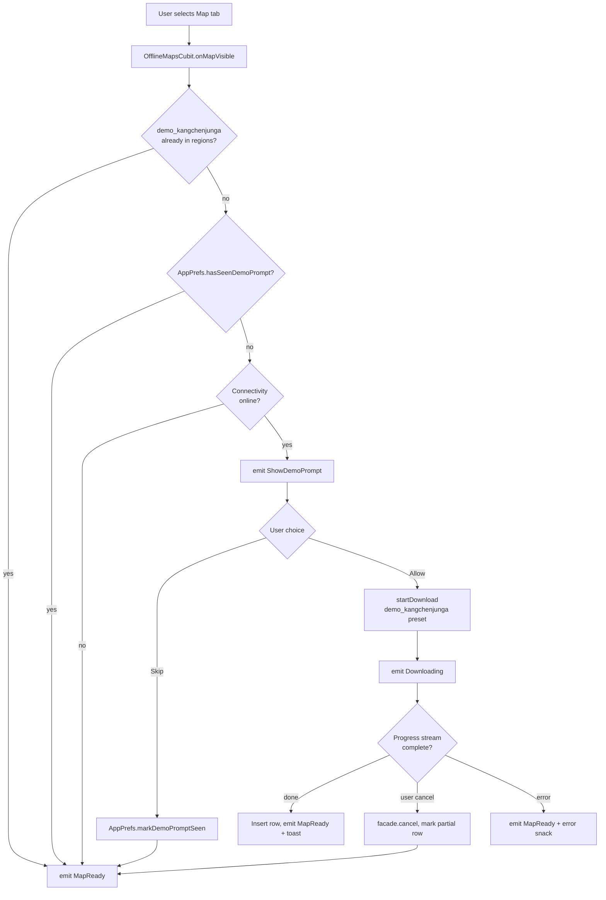
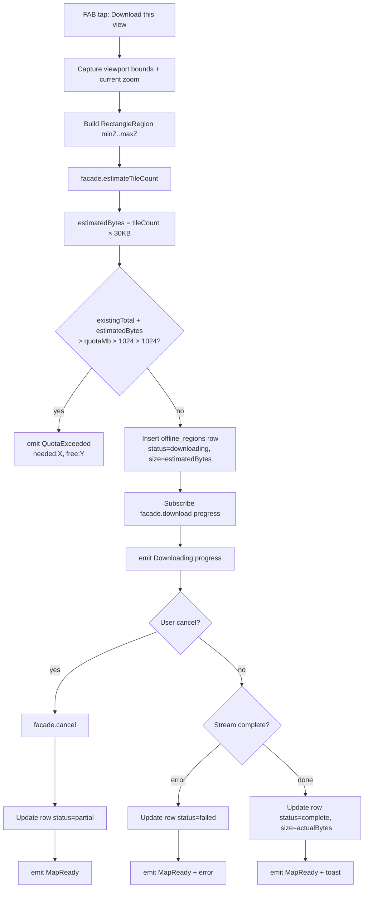
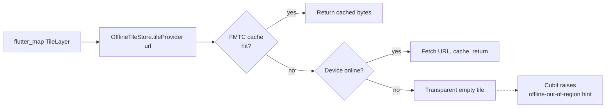

> **Generated by**: /plan | **Model**: Claude Opus 4.7 (1M context) | **Timestamp**: 2026-04-24

# Plan: Offline Maps + SOS — Iteration 2 (Offline Maps MVP)

## 1. Iteration Context
- **Iteration**: 2 of 5 — **Offline Maps MVP**
- **AC Items**: FR-1, FR-2 (viewport-as-bbox), FR-3, FR-4 (simple cancel, no resume yet), FR-6 (enforcement, no UI), FR-7, DS-1 (`offline_regions`), DS-2, V-3, EC-5, EC-6 (persist paused only), EC-7, T-5
- **Deliverable**: User can open a new "Map" tab in the home shell that renders live MapTiler tiles while online. On first Map-tab open, an explicit prompt offers to download the Kangchenjunga demo region (~40 MB, zoom 10-14); tapping Accept runs a background FMTC download with a progress dialog. The floating "Download this view" button captures the current viewport as a new offline region under the 250 MB quota, showing the same progress dialog. When offline, cached tiles are served transparently and an "Offline" chip appears in the app bar; panning beyond cached regions shows a non-blocking hint.
- **Research**: [../research.md](../research.md)
- **Iteration 1 plan (foundation used here)**: [../iteration-1/plan.md](../iteration-1/plan.md)

### New locked decisions (this iteration)

| # | Decision | Choice | Rationale |
|---|----------|--------|-----------|
| 14 | Kangchenjunga auto-download gate | **Prompt user with an explicit Allow/Skip dialog on first Map-tab open** (per user answer, 2026-04-24). | Overrides research.md's "silent download" to avoid burning mobile data without consent. The "seen" flag persists in `AppPrefs` so the prompt fires only once per install. |
| 15 | Map tab position in HomeShell | **Insert at tabIndex=2 (between Mountains and Community)**, shifting Community → 3 and Profile → 4. | Keeps Home at tab 0 for existing `PopScope` back-button contract; Map is near Mountains where the feature is thematically anchored. |
| 16 | FMTC store scoping | **One named store per region** (store name = `region.id`). | Enables Iter 3 per-region delete without walking stores; size tracking per region is a single FMTC stat call; matches research §DS-2 ("region-scoped named stores"). |
| 17 | FMTC plugin wrapped in `OfflineTileStore` facade | **Abstract `OfflineTileStore` in `lib/core/services/` + `FmtcOfflineTileStore` impl**, mirrors the `GeolocatorFacade` / `LocationService` pattern locked in Iter 1. | FMTC uses top-level `FMTCStore('name')` objects that are hard to mock; a facade is the only clean way to hit T-5 (integration test serves cached tiles when offline). |
| 18 | Region naming in Iter 2 | **Auto-named** `"Saved region · YYYY-MM-DD HH:mm"` (local time) for user downloads; fixed id `"demo_kangchenjunga"` + name `"Kangchenjunga"` for the preset. | Plan defers the catalog/edit UI to Iter 3; no user input form in this iteration. |
| 19 | Tile-size estimation for quota pre-flight | **FMTC's `DownloadableRegion.estimateTiles()` count × 30 KB per tile** (MapTiler Outdoor average). | FMTC v9 exposes tile-count estimation without a live download; 30 KB is a safe average for PNG outdoor tiles. We show the user the computed number in the dialog before starting. |
| 20 | FMTC init location | **`lib/main.dart`** before `configureDependencies()`. | FMTC's ObjectBox backend must be initialised on the platform channel before any `FMTCStore(...)` use; DI should not own platform-binding init. |
| 21 | Integration test strategy (T-5) | **Pump the `OfflineMapsPage` with a fake `OfflineTileStore` serving an in-memory tile lookup table + a mocked `ConnectivityService` reporting `isOnline=false`**. Assert tiles render from cache; no live network calls. | FMTC itself is hard to fake at the plugin level; the facade makes the test cheap and reliable. |

---

## 2. Architecture Decision

### Chosen Approach

**A new feature module at `lib/features/offline_maps/` mirroring the existing `mountains` / `checklist` clean-arch split (data / domain / presentation + `di/offline_maps_module.dart`). FMTC is hidden behind an `OfflineTileStore` core-services facade. The offline tile store is the only consumer of FMTC — no other feature module links to it directly.** sqflite writes go through a new `offline_regions_local_data_source.dart`. A single `OfflineMapsCubit` owns the map-page state machine (regions list + current downloads + online/offline flag). The Map tab is inserted into `HomeShell` at index 2.

Rationale:
- Mirrors the exact layer shape of every other feature in the app — zero new patterns, Iter 3 (catalog/polish) slots in without reshaping anything.
- FMTC and sqflite are separated: FMTC owns the *tile bytes*, sqflite owns the *regions metadata*. This lets Iter 3 add the catalog UI by reading sqflite without touching FMTC, and makes per-region deletion (Iter 3) a two-step call that maps cleanly to the repository API.
- The `OfflineTileStore` facade keeps FMTC v9's static-API surface out of every caller — the same isolation play we used for `GeolocatorLocationService` in Iter 1.
- Cubit centralises download-state so the progress dialog can be rebuilt mid-download (e.g. if the user rotates the device or the dialog is dismissed).
- One store per region (decision 16) is the only shape that supports per-region size and delete cleanly; FMTC has no native "sub-region" eviction within a store.

### Alternatives Considered

1. **One global FMTC store for all regions, with region-boundary metadata in sqflite only.** Rejected: FMTC can't selectively evict tiles belonging to a given bbox; deleting a region in Iter 3 would either require walking every tile (slow) or dropping the whole cache (wrong). Per-region stores have modest overhead and are what FMTC's own docs recommend for this pattern.

2. **Skip the `OfflineTileStore` facade and use `FMTCStore(...)` directly from the repository.** Rejected: FMTC's API is a mix of top-level factory constructors and async statics that cannot be mocked without runtime injection. T-5 requires deterministic offline-tile rendering in tests; going through a facade makes it trivial, going direct would require a flaky platform-channel harness or skipping T-5 entirely.

---

## 3. Logic Diagrams

### 3.1 Map-tab entry + Kangchenjunga prompt flow



### 3.2 "Download this view" flow with quota pre-flight



### 3.3 Offline tile serving



---

## 4. Storage Design

### sqflite `offline_regions` — already created in Iter 1 (schema v1)

Iter 2 is the first iteration that writes to this table. No schema change. Usage:

| Column | Iter 2 usage |
|---|---|
| `id` | UUID v4 for user downloads; fixed literal `demo_kangchenjunga` for the preset. |
| `name` | `"Saved region · YYYY-MM-DD HH:mm"` for user; `"Kangchenjunga"` for preset. |
| `bbox_wkt` | `POLYGON((swLng swLat, seLng seLat, neLng neLat, nwLng nwLat, swLng swLat))` — WKT polygon string closed at first point. |
| `min_zoom` / `max_zoom` | 10–14 for the preset; current zoom–1 to current zoom+2 for user downloads (see §5 `startDownloadOfViewport`). |
| `tile_count` | `0` at insert, updated to actual count after FMTC download completes. |
| `size_bytes` | Estimated size at insert (`tileCount × 30 KB`); replaced with FMTC's actual `store.stats.size` when the download completes. |
| `downloaded_at` | `DateTime.now().millisecondsSinceEpoch` set at insert. |
| `status` | `downloading` on insert → `complete` on success, `partial` on user cancel, `failed` on error. |

### New `AppPrefs` key

- `demo_prompt_seen` (bool, default false) — set once when the user accepts or skips the Kangchenjunga prompt.

### Index Strategy

No new indexes this iteration. The existing v1 schema indexes (all on other tables) remain unused here; `offline_regions` reads are always `SELECT *` or `WHERE id = ?` and PK is enough.

---

## 5. API Design

No HTTP/Firestore API changes in this iteration. The "API" is the Dart-level surface Iter 3+ will consume.

### Domain interface: `OfflineMapsRepository`

```dart
abstract class OfflineMapsRepository {
  /// Emits the full region list on every mutation.
  Stream<List<OfflineRegion>> watchRegions();

  Future<Result<OfflineRegion?>> getRegion(String id);

  /// Returns true iff a region with this id exists with status = complete.
  Future<Result<bool>> hasCompletedRegion(String id);

  /// Pre-flight: estimated tile count + byte size for the given bbox/zoom.
  Future<Result<DownloadEstimate>> estimate({
    required LatLngBounds bbox,
    required int minZoom,
    required int maxZoom,
  });

  /// Sum of `size_bytes` across all complete regions.
  Future<Result<int>> totalSizeBytes();

  /// Starts a download. Emits progress; caller cancels by calling
  /// [cancelDownload] with the returned region id.
  Stream<DownloadProgress> download({
    required String regionId,
    required String name,
    required LatLngBounds bbox,
    required int minZoom,
    required int maxZoom,
  });

  Future<Result<void>> cancelDownload(String regionId);

  Future<Result<void>> deleteRegion(String regionId);   // groundwork for Iter 3
}
```

### Domain entity shapes

```dart
class OfflineRegion extends Equatable {
  final String id;
  final String name;
  final LatLngBounds bbox;
  final int minZoom;
  final int maxZoom;
  final int tileCount;
  final int sizeBytes;
  final DateTime downloadedAt;
  final OfflineRegionStatus status;   // downloading | complete | partial | failed
  // ... props
}

class DownloadEstimate extends Equatable {
  final int tileCount;
  final int estimatedBytes;
}

class DownloadProgress extends Equatable {
  final String regionId;
  final int tilesDone;
  final int tilesTotal;
  final int bytesDone;
  final bool isComplete;
  final String? errorMessage;   // set on failure
}
```

### Cubit interface: `OfflineMapsCubit`

```dart
class OfflineMapsCubit extends Cubit<OfflineMapsState> {
  void onMapVisible();                       // triggers demo-prompt logic
  void acceptDemoRegion();                   // downloads Kangchenjunga
  void skipDemoRegion();                     // marks prefs, emits MapReady
  Future<void> startDownloadOfViewport(      // FAB handler
    LatLngBounds bbox, int currentZoom);
  void cancelActiveDownload();
  // (Delete + list UI land in Iter 3; repo method exists for forward-compat.)
}
```

### `OfflineMapsState` (sealed)

```dart
sealed class OfflineMapsState {
  final bool isOnline;
  final List<OfflineRegion> regions;
}

class MapInitial extends OfflineMapsState { ... }
class MapReady extends OfflineMapsState { ... }
class MapShowDemoPrompt extends OfflineMapsState { ... }
class MapDownloading extends OfflineMapsState {
  final DownloadProgress progress;
  final DownloadEstimate estimate;
}
class MapQuotaExceeded extends OfflineMapsState {
  final int neededBytes;
  final int freeBytes;
}
class MapError extends OfflineMapsState {
  final String message;
}
```

### Core-services facade: `OfflineTileStore`

```dart
abstract class OfflineTileStore {
  /// Called once at app startup. Idempotent.
  Future<void> initialise();

  /// Returns a `TileProvider` for flutter_map that serves from cache first,
  /// network second, with the given URL template.
  TileProvider browseTileProvider({
    required String urlTemplate,
    required String storeName,   // region.id for scoped caching
    List<String>? subdomains,
  });

  /// Estimate tile count for a rectangle region at given zoom range.
  Future<int> estimateTileCount({
    required LatLngBounds bbox,
    required int minZoom,
    required int maxZoom,
  });

  /// Starts a foreground download. Progress is emitted on the returned
  /// stream. The store named `storeName` is created if it does not exist.
  Stream<TileDownloadEvent> download({
    required String storeName,
    required LatLngBounds bbox,
    required int minZoom,
    required int maxZoom,
    int parallelThreads = 4,
  });

  Future<void> cancel(String storeName);
  Future<int> sizeBytes(String storeName);
  Future<void> deleteStore(String storeName);
}

class TileDownloadEvent extends Equatable {
  final int tilesDone;
  final int tilesTotal;
  final int bytesDone;
  final bool isComplete;
  final String? errorMessage;
}
```

### Platform/config additions

- `lib/main.dart` gains `await FMTCObjectBoxBackend().initialise();` between `Firebase.initializeApp()` and `configureDependencies()`.
- No new manifest permissions (Iter 1 covered `INTERNET`).

---

## 6. Code Changes

### Files to Create

#### Core services
- `lib/core/services/offline_tile_store.dart` — CREATE — `abstract class OfflineTileStore` + `FmtcOfflineTileStore` impl + `TileDownloadEvent` value type. Wraps FMTC v9 API.

#### Feature: offline_maps — domain
- `lib/features/offline_maps/domain/entities/offline_region.dart` — CREATE — Equatable entity + `OfflineRegionStatus` enum.
- `lib/features/offline_maps/domain/entities/download_estimate.dart` — CREATE.
- `lib/features/offline_maps/domain/entities/download_progress.dart` — CREATE.
- `lib/features/offline_maps/domain/repositories/offline_maps_repository.dart` — CREATE — abstract contract (see §5).
- `lib/features/offline_maps/domain/usecases/watch_regions.dart` — CREATE — `Stream<List<OfflineRegion>> call()`.
- `lib/features/offline_maps/domain/usecases/estimate_download.dart` — CREATE.
- `lib/features/offline_maps/domain/usecases/start_download.dart` — CREATE — returns `Stream<DownloadProgress>`.
- `lib/features/offline_maps/domain/usecases/cancel_download.dart` — CREATE.
- `lib/features/offline_maps/domain/usecases/has_completed_region.dart` — CREATE.
- `lib/features/offline_maps/domain/usecases/total_size_bytes.dart` — CREATE.

#### Feature: offline_maps — data
- `lib/features/offline_maps/data/models/offline_region_model.dart` — CREATE — `fromRow`/`toRow` + bbox WKT serialization helpers.
- `lib/features/offline_maps/data/datasources/offline_regions_local_data_source.dart` — CREATE — abstract + `SqfliteOfflineRegionsLocalDataSource` impl using `LocalDb.db` (Iter 1).
- `lib/features/offline_maps/data/datasources/offline_tile_store_data_source.dart` — CREATE — thin pass-through wrapper over `OfflineTileStore` that exposes the subset needed by the repository (keeps the repository off FMTC/`OfflineTileStore` directly so the data layer owns persistence semantics).
- `lib/features/offline_maps/data/repositories/offline_maps_repository_impl.dart` — CREATE — coordinates the two data sources; maps plugin exceptions to `AppError` subtypes.

#### Feature: offline_maps — presentation
- `lib/features/offline_maps/presentation/cubit/offline_maps_cubit.dart` — CREATE — state machine (see §5); owns connectivity subscription; subscribes to `watchRegions` stream.
- `lib/features/offline_maps/presentation/cubit/offline_maps_state.dart` — CREATE — sealed hierarchy.
- `lib/features/offline_maps/presentation/view/offline_maps_page.dart` — CREATE — `FlutterMap` widget, current-location marker, online/offline chip, FAB, reacts to state for dialogs.
- `lib/features/offline_maps/presentation/view/widgets/download_progress_dialog.dart` — CREATE — modal `AlertDialog` with `LinearProgressIndicator` + tiles/bytes text + Cancel button.
- `lib/features/offline_maps/presentation/view/widgets/demo_region_prompt_dialog.dart` — CREATE — modal `AlertDialog` with Kangchenjunga copy, Allow/Skip actions.
- `lib/features/offline_maps/presentation/view/widgets/offline_badge.dart` — CREATE — reusable `Chip` for the AppBar.

#### Feature: offline_maps — DI
- `lib/features/offline_maps/di/offline_maps_module.dart` — CREATE — `void registerOfflineMapsModule(GetIt)` registering data source, repository, 6 usecases, factory cubit (scoped to the map page per route).

#### Shared / constants
- `lib/features/offline_maps/domain/constants.dart` — CREATE — `kDemoRegionId = 'demo_kangchenjunga'`, preset `LatLngBounds(27.60°N 88.05°E, 27.78°N 88.25°E)`, `kDemoMinZoom = 10`, `kDemoMaxZoom = 14`, `kTileSizeBytesEstimate = 30 * 1024`.

#### Tests
- `test/unit/core/services/offline_tile_store_test.dart` — CREATE — uses a fake `FmtcFacade` seam (or mocks the SDK boundary) to cover: `initialise` idempotency, `estimateTileCount` round-tripping, `download` emits `TileDownloadEvent`s, cancellation forwards.
- `test/unit/features/offline_maps/data/offline_regions_local_data_source_test.dart` — CREATE — uses `sqflite_common_ffi` in-memory DB (same helper as Iter 1's `local_db_test.dart`); covers insert, watchRegions stream, update status, delete.
- `test/unit/features/offline_maps/data/offline_region_model_test.dart` — CREATE — WKT bbox round-trip, fromRow/toRow idempotency.
- `test/unit/features/offline_maps/data/offline_maps_repository_impl_test.dart` — CREATE — mocktail on both data sources; covers: quota enforcement, download orchestration happy path, cancel path, plugin-exception → `AppError` mapping.
- `test/unit/features/offline_maps/presentation/offline_maps_cubit_test.dart` — CREATE — `bloc_test` for every state transition: demo-prompt flow (seen/unseen × online/offline), download flow, cancel, quota-exceeded, connectivity flip → `isOnline` toggle.
- `test/widget/features/offline_maps/download_progress_dialog_test.dart` — CREATE — widget test: progress renders, Cancel tap invokes callback.
- `test/widget/features/offline_maps/demo_region_prompt_dialog_test.dart` — CREATE — widget test: Allow pops `true`, Skip pops `false`, copy pins `"Kangchenjunga"` + `"40"` (MB number).
- `test/widget/features/offline_maps/offline_maps_page_test.dart` — CREATE — **T-5 integration test**: pumps `OfflineMapsPage` with a fake `OfflineTileStore` serving an in-memory lookup table + a mocked `ConnectivityService` reporting `isOnline=false`. Asserts (a) `OfflineBadge` visible, (b) cached tiles render from the fake store, (c) no live network calls happen.

### Files to Modify

- `pubspec.yaml` — **no change required** (all deps added in Iter 1).
- `lib/main.dart` — MODIFY — insert `await FMTCObjectBoxBackend().initialise();` before `configureDependencies()`; add one import.
- `lib/core/di/injector.dart` — MODIFY — register `OfflineTileStore` as lazy singleton after `ConnectivityService`; add `registerOfflineMapsModule(getIt)` call at the end of the feature-module sequence.
- `lib/core/storage/app_prefs.dart` — MODIFY — add `bool hasSeenDemoPrompt()` + `Future<void> markDemoPromptSeen()` with key `demo_prompt_seen`.
- `lib/app/router/routes.dart` — MODIFY — add `static const String map = '/map';`.
- `lib/app/router/app_router.dart` — MODIFY — add `GoRoute(path: Routes.map, builder: (_, __) => _withOfflineMapsCubit(OfflineMapsPage()))`; add `_withOfflineMapsCubit` helper mirroring `_withMountainsCubit`.
- `lib/features/home/presentation/view/home_shell.dart` — MODIFY — (a) insert `OfflineMapsPage` as `IndexedStack.children[2]` wrapped in `BlocProvider<OfflineMapsCubit>` scoped to the tab; (b) insert `NavigationDestination(icon: Icons.map_outlined, selectedIcon: Icons.map, label: 'Map')` at index 2 in the bottomNavigationBar; (c) update the switch on `state.tabIndex` to map `2 → 'Map'`, `3 → 'Community'`, `4 → 'Profile'`.
- `lib/features/home/presentation/cubit/home_state.dart` and `home_cubit.dart` — MODIFY only if they contain hard-coded tab-index bounds (read both files during Phase 5). Most likely no change since today's switch uses `default → 'Mountain Explorer'`.
- `test/unit/core/storage/app_prefs_test.dart` — MODIFY — add 2 cases for `demo_prompt_seen` default-false and mark-true round-trip.

---

## 7. Edge Cases & Error Handling

1. **Map tab opened offline, no regions yet** — map shows the online tile URL; flutter_map draws empty tiles; `OfflineBadge` is visible; no crash; "No offline tiles here" hint overlay via a `BlocBuilder` watching `isOnline && regions.isEmpty`.
2. **User taps FAB while a download is already active** — FAB is disabled in `MapDownloading` state (cubit guards `startDownloadOfViewport` with `if (state is MapDownloading) return`). Dialog shows the existing progress.
3. **Connectivity flips during download** — FMTC v9 surfaces the error on the download stream; repository maps to `DownloadProgress(errorMessage: 'Network lost, download paused')`; cubit emits `MapError` with snack; row marked `partial` (EC-6).
4. **App backgrounded during download** — Android: FMTC's foreground service in-process stays alive for short periods but is not reliable past ~30s. For Iter 2 we accept the download aborting on background (resume arrives in Iter 3's polish). Row marked `partial` on stream error/cancellation.
5. **User rotates device while progress dialog is open** — dialog is rebuilt from `MapDownloading.progress`; no lost state because source of truth is the cubit.
6. **Quota exactly at limit** — pre-flight uses `existingTotal + estimatedBytes > quotaBytes` (strict greater-than). Zero-byte overflow still rejected, matching V-3's language. Error message: `"This region needs X MB; only Y MB free under your 250 MB quota."`
7. **Kangchenjunga preset bbox already exists with status=failed (prior run crashed)** — `onMapVisible` treats any non-`complete` row as absent; re-prompts; cleanup of the failed row happens in `startDownload` (delete + re-insert).
8. **LocalDb not yet open when cubit constructs** — Iter 1 guarantees `LocalDb.open()` resolves inside `configureDependencies()` before any feature registration; `getIt<LocalDb>().db` is safe at cubit construction. Defensive: DAO asserts `db.isOpen` before each statement.
9. **Tile provider key rotation** — `OfflineTileStore.browseTileProvider` substitutes `{apiKey}` from `Env.maptilerApiKey` at construction. Iter 1's env validator already asserts the placeholder is present.
10. **User pans outside any cached region while offline (EC-5)** — `flutter_map` request falls through FMTC cache miss, network fails, tile renders blank. A `Positioned` banner at the top of the map shows "No offline tiles here — pan back to the cached region" when `isOnline == false AND !bbox-contains current-center`.
11. **Cubit disposed mid-download** — stream subscription cancelled in `close()`; repository's `cancelDownload` called with the active region id before super.close.
12. **sqflite write failure during `startDownload`'s status=downloading insert** — repository returns `Failure(UnknownError)`, cubit emits `MapError`; download does NOT start on FMTC (the insert must succeed first).

---

## 8. Security Considerations

- **Input validation**:
  - Region id: generated by `Uuid().v4()` for user downloads; `demo_kangchenjunga` is a compile-time literal. No user-supplied ids land in sqflite.
  - Viewport bbox: sanitized before insert — if `minLat > maxLat` or `minLng > maxLng` the repository rejects with `ValidationError`; LatLng finite checks.
  - Zoom range: clamp to `[0, 18]` before inserting into sqflite (FMTC & MapTiler support <=18).
- **Authorization**: All offline-maps data is device-local in Iter 2. No Firestore writes. No `firestore.rules` change needed.
- **Data sanitization**:
  - sqflite writes use `insert(tableName, {...})` with bound parameters (not `rawInsert` with string concatenation) — mitigates SQL injection even though this iteration has no user-supplied names.
  - WKT serialization is constructed from `double` coordinates only — no string interpolation of user input.
- **Network**: tile URLs constructed server-side template (from MapTiler); we never interpolate user input into the URL template. The `{apiKey}` substitution uses `Env.maptilerApiKey` directly.
- **MapTiler key exposure** (carried over from Iter 1 C1 CRITICAL): **still a known risk** — this iteration does not fix it. The key must be restricted by bundle-id + URL referrer in MapTiler's Cloud console before any release build.
- **Quota DoS prevention**: V-3 pre-flight rejects downloads that would exceed 250 MB; a malicious actor with physical device access can bypass by setting `quotaMb` higher, but that's a local-app decision and outside the threat model.

---

## 9. TDD Test Strategy

Tests are written FIRST in each phase. Framework: `flutter_test` + `bloc_test: ^9.1.7` + `mocktail: ^1.0.4` + `sqflite_common_ffi: ^2.3.3` (test-only).

### Phase 1 Tests — OfflineTileStore facade
**Unit**:
- `offline_tile_store_test.dart`:
  - `initialise()` is idempotent (two calls don't re-init FMTC).
  - `estimateTileCount` returns `> 0` for a non-empty bbox and `0` for an empty/inverted bbox.
  - `download` emits `TileDownloadEvent` with monotonically increasing `tilesDone`.
  - `cancel(storeName)` completes the stream with `isComplete=false`.
  - `sizeBytes`/`deleteStore` round-trip behavior.

### Phase 2 Tests — Data layer
**Unit**:
- `offline_region_model_test.dart`:
  - WKT polygon serialization round-trip: bounds → WKT → bounds (tolerance 1e-9).
  - `fromRow` handles missing/null optional columns.
- `offline_regions_local_data_source_test.dart`:
  - Insert with status `downloading` then update to `complete` — row reflects final state.
  - `watchRegions()` stream emits initial then on every insert/update/delete.
  - Delete by id removes the row.
- `offline_maps_repository_impl_test.dart`:
  - Quota: `estimate` summed with current `totalSizeBytes` <= quota → OK; over quota → `Failure(ValidationError('Quota exceeded'))`.
  - `download` happy path emits progress then complete; row ends `status=complete`, `size_bytes` = FMTC actual size.
  - `download` cancelled mid-stream → row ends `status=partial`; repository emits one `DownloadProgress.cancelled`.
  - `download` FMTC exception → row `status=failed`; repository returns error through stream.
  - `hasCompletedRegion(id)` correctly filters on status.

### Phase 3 Tests — Cubit
**Unit (bloc_test)**:
- `onMapVisible`:
  - no demo seen + online + no region → `[MapReady, MapShowDemoPrompt]`.
  - demo already seen → `[MapReady]`.
  - demo region already complete → `[MapReady]`.
  - offline → `[MapReady]` (no prompt).
- `acceptDemoRegion` → `[MapDownloading]` with progress; final → `[MapReady]`.
- `skipDemoRegion` → `AppPrefs.markDemoPromptSeen` called; `[MapReady]`.
- `startDownloadOfViewport`:
  - over quota → `[MapQuotaExceeded]`.
  - under quota → `[MapDownloading, MapReady]` on completion.
  - cancel mid-stream → `[MapDownloading, MapReady]`.
- Connectivity stream: flip online→offline → `isOnline` field updated without changing sealed-state class.
- Cubit `close()` cancels any active download + connectivity subscription.

### Phase 4 Tests — Presentation widgets
**Widget**:
- `download_progress_dialog_test.dart`: given a progress value, renders "X of Y tiles" + progress bar fill + Cancel button invokes callback.
- `demo_region_prompt_dialog_test.dart`: renders `"Kangchenjunga"`, `"40"` (MB number — exact-match), `"zoom 10"`, tap "Allow" → Navigator pops `true`; "Skip" → pops `false`.

### Phase 5 Tests — HomeShell integration
**Widget**:
- Smoke test for `HomeShell` with Map tab added: select tab index 2 → `OfflineMapsPage` rendered; label displayed as "Map" in app bar.

### Phase 6 Tests — T-5 integration
**Widget** (T-5):
- `offline_maps_page_test.dart`:
  - Pump `OfflineMapsPage` with a `_FakeOfflineTileStore` that serves a hard-coded tile map + `_FakeConnectivityService(online: false)` + an in-memory DAO seeded with one complete region covering the viewport.
  - Assert `OfflineBadge` visible.
  - Assert at least one tile Image is painted from the fake store (verified via `RawImage` finder).
  - Assert no network request is attempted (fake tile store's `browseTileProvider` never calls its network fallback).

---

## 10. Implementation Phases

### Phase 1: OfflineTileStore Facade + FMTC init

**Tests first**:
- `test/unit/core/services/offline_tile_store_test.dart`.

**Then implement**:
1. `lib/core/services/offline_tile_store.dart` — abstract + `FmtcOfflineTileStore` impl wrapping FMTC v9 (`FMTCObjectBoxBackend`, `FMTCStore`, `RectangleRegion`, `FMTCStore.download`).
2. `lib/main.dart` — insert `await FMTCObjectBoxBackend().initialise();` before `configureDependencies()`.
3. `lib/core/di/injector.dart` — register `OfflineTileStore` as lazy singleton after `ConnectivityService`.
4. Targeted test run: all Phase 1 tests green.

### Phase 2: Domain + Data layer

**Tests first**:
- `test/unit/features/offline_maps/data/offline_region_model_test.dart`.
- `test/unit/features/offline_maps/data/offline_regions_local_data_source_test.dart`.
- `test/unit/features/offline_maps/data/offline_maps_repository_impl_test.dart`.

**Then implement**:
1. Create all domain entities (`OfflineRegion`, `DownloadEstimate`, `DownloadProgress`) + enum + `constants.dart`.
2. Create abstract `OfflineMapsRepository` + 6 usecase classes (one public `call()` each, mirroring `get_mountains.dart`).
3. Create `OfflineRegionModel.fromRow/toRow` with WKT helpers (small static helpers in the same file).
4. Create abstract + sqflite impl of `OfflineRegionsLocalDataSource`, using `getIt<LocalDb>().db` for raw queries.
5. Create `OfflineTileStoreDataSource` wrapper (thin pass-through returning `TileDownloadEvent` streams).
6. Create `OfflineMapsRepositoryImpl` coordinating both data sources; map plugin exceptions to `AppError` subtypes (match `mountains_repository_impl.dart` idiom).
7. All Phase 2 tests green.

### Phase 3: Cubit

**Tests first**:
- `test/unit/features/offline_maps/presentation/offline_maps_cubit_test.dart`.

**Then implement**:
1. Create `OfflineMapsState` sealed hierarchy.
2. Create `OfflineMapsCubit` with:
   - Constructor-injected usecases + `AppPrefs` + `ConnectivityService`.
   - `onMapVisible` orchestration (flowchart 3.1).
   - `startDownloadOfViewport` orchestration (flowchart 3.2) with viewport zoom → `minZoom = z-1`, `maxZoom = z+2` clamped to `[0, 18]`.
   - `acceptDemoRegion` / `skipDemoRegion`.
   - Connectivity subscription updating `isOnline` on state's `copyWith`.
   - `close()` cancels active download + connectivity subscription.
3. `lib/features/offline_maps/di/offline_maps_module.dart` — wire everything into `GetIt`; cubit registered with `registerFactory` (scoped per route).
4. `lib/core/di/injector.dart` — MODIFY: append `registerOfflineMapsModule(getIt)` at the end.
5. All Phase 3 tests green.

### Phase 4: Presentation widgets + page

**Tests first**:
- `test/widget/features/offline_maps/download_progress_dialog_test.dart`.
- `test/widget/features/offline_maps/demo_region_prompt_dialog_test.dart`.

**Then implement**:
1. `lib/features/offline_maps/presentation/view/widgets/download_progress_dialog.dart`.
2. `lib/features/offline_maps/presentation/view/widgets/demo_region_prompt_dialog.dart`.
3. `lib/features/offline_maps/presentation/view/widgets/offline_badge.dart`.
4. `lib/features/offline_maps/presentation/view/offline_maps_page.dart` — `FlutterMap` + `TileLayer(tileProvider: offlineTileStore.browseTileProvider(...))`, current-location marker via `LocationService.positionStream` subscribed inside a `StatefulWidget`, FAB, `BlocListener` for `MapShowDemoPrompt`/`MapError`/`MapQuotaExceeded` → `showDialog`/`ScaffoldMessenger`, `BlocBuilder` for `MapDownloading` → inline progress card OR open the dialog.
5. All Phase 4 widget tests green.

### Phase 5: HomeShell integration + routing

**Tests first**:
- `test/widget/features/home/home_shell_with_map_tab_test.dart` (smoke).

**Then implement**:
1. `lib/app/router/routes.dart` — add `Routes.map`.
2. `lib/app/router/app_router.dart` — add `/map` route with `_withOfflineMapsCubit` helper.
3. `lib/features/home/presentation/view/home_shell.dart` — insert Map tab at index 2; wrap with `BlocProvider<OfflineMapsCubit>`; update label switch.
4. `lib/features/home/presentation/cubit/home_state.dart` + `home_cubit.dart` — check for tab-index bounds; extend if any.
5. `lib/core/storage/app_prefs.dart` — MODIFY — add `demo_prompt_seen` key + getter/setter.
6. `test/unit/core/storage/app_prefs_test.dart` — MODIFY — 2 new cases (default-false, mark-true).
7. Smoke test + extended prefs tests green.

### Phase 6: T-5 Integration test + polish

**Tests first**:
- `test/widget/features/offline_maps/offline_maps_page_test.dart` (T-5).

**Then implement**:
1. Fixture builders: `_FakeOfflineTileStore` in the test file, seeded with 4-6 tiles covering a small bbox.
2. `_FakeConnectivityService` returning `isOnline=false`.
3. Pump page, assert `OfflineBadge` + at least one cached tile rendered + no network attempts.
4. `flutter test` — **full suite** green (expected 300 + ~70 new = ~370 tests).
5. `flutter analyze` — zero new warnings.

---

## 11. Reference Files

- [lib/core/services/location_service.dart](../../../lib/core/services/location_service.dart) — template for core-services facade + mock seam (we mirror the `GeolocatorFacade` pattern for FMTC).
- [lib/core/storage/local_db.dart](../../../lib/core/storage/local_db.dart) — `getIt<LocalDb>().db` is the sqflite entry for all DAOs.
- [lib/core/di/injector.dart](../../../lib/core/di/injector.dart) — DI registration order; new services go before feature modules.
- [lib/features/mountains/di/mountains_module.dart](../../../lib/features/mountains/di/mountains_module.dart) — canonical feature-module shape.
- [lib/features/mountains/data/repositories/mountains_repository_impl.dart](../../../lib/features/mountains/data/repositories/mountains_repository_impl.dart) — `FirebaseException` → `AppError` mapping pattern to mirror for FMTC exceptions.
- [lib/features/checklist/presentation/cubit/checklist_cubit.dart](../../../lib/features/checklist/presentation/cubit/checklist_cubit.dart) — stream-subscribe pattern for `watchRegions`.
- [lib/features/community/presentation/cubit/create_post_cubit.dart](../../../lib/features/community/presentation/cubit/create_post_cubit.dart) — form-style state machine (submitting/success/failure) closest analog to download-state machine.
- [lib/features/home/presentation/view/home_shell.dart](../../../lib/features/home/presentation/view/home_shell.dart) — exact file we modify for tab insertion.
- [lib/app/router/app_router.dart](../../../lib/app/router/app_router.dart) — `_withMountainsCubit` helper is the template for `_withOfflineMapsCubit`.
- [test/unit/core/storage/local_db_test.dart](../../../test/unit/core/storage/local_db_test.dart) — sqflite_common_ffi setup; reuse the `setUpAll(...)` in the new DAO test.

---

## 12. TODO Checklist

### Implementation

**Phase 1 — OfflineTileStore facade + FMTC init**
- [ ] Phase 1: Write `test/unit/core/services/offline_tile_store_test.dart`.
- [ ] Phase 1: Create `lib/core/services/offline_tile_store.dart` (abstract + `FmtcOfflineTileStore` impl).
- [ ] Phase 1: Modify `lib/main.dart` — init FMTC before `configureDependencies()`.
- [ ] Phase 1: Modify `lib/core/di/injector.dart` — register `OfflineTileStore`.
- [ ] Phase 1: Phase 1 tests green.

**Phase 2 — Domain + Data layer**
- [ ] Phase 2: Write 3 data-layer test files.
- [ ] Phase 2: Create 3 domain entities + `OfflineRegionStatus` enum + `constants.dart`.
- [ ] Phase 2: Create `OfflineMapsRepository` abstract + 6 usecase classes.
- [ ] Phase 2: Create `OfflineRegionModel` with WKT helpers.
- [ ] Phase 2: Create abstract + sqflite `OfflineRegionsLocalDataSource`.
- [ ] Phase 2: Create `OfflineTileStoreDataSource`.
- [ ] Phase 2: Create `OfflineMapsRepositoryImpl` with error mapping.
- [ ] Phase 2: Phase 2 tests green.

**Phase 3 — Cubit + DI**
- [ ] Phase 3: Write `offline_maps_cubit_test.dart`.
- [ ] Phase 3: Create `OfflineMapsState` sealed hierarchy.
- [ ] Phase 3: Create `OfflineMapsCubit` with orchestration logic.
- [ ] Phase 3: Create `lib/features/offline_maps/di/offline_maps_module.dart`.
- [ ] Phase 3: Modify `injector.dart` to call `registerOfflineMapsModule(getIt)`.
- [ ] Phase 3: Phase 3 tests green.

**Phase 4 — Presentation widgets + page**
- [ ] Phase 4: Write 2 dialog widget tests.
- [ ] Phase 4: Create `download_progress_dialog.dart`.
- [ ] Phase 4: Create `demo_region_prompt_dialog.dart`.
- [ ] Phase 4: Create `offline_badge.dart`.
- [ ] Phase 4: Create `offline_maps_page.dart`.
- [ ] Phase 4: Phase 4 widget tests green.

**Phase 5 — HomeShell + routing**
- [ ] Phase 5: Write HomeShell smoke test.
- [ ] Phase 5: Add `Routes.map` + `GoRoute` in `app_router.dart`.
- [ ] Phase 5: Modify `home_shell.dart` to add Map tab at index 2.
- [ ] Phase 5: Adjust `home_cubit.dart` / `home_state.dart` for new tab count (if needed).
- [ ] Phase 5: Modify `app_prefs.dart` — `demo_prompt_seen` key.
- [ ] Phase 5: Extend `app_prefs_test.dart` with 2 new cases.
- [ ] Phase 5: Phase 5 tests green.

**Phase 6 — T-5 Integration test + smoke**
- [ ] Phase 6: Write `offline_maps_page_test.dart` (T-5).
- [ ] Phase 6: Fixture builders for fake tile store + fake connectivity service.
- [ ] Phase 6: `flutter test` — full suite green.
- [ ] Phase 6: `flutter analyze` — no new warnings.

### Verification
- [ ] Targeted test run: `flutter test test/unit/core/services/offline_tile_store_test.dart test/unit/features/offline_maps/ test/widget/features/offline_maps/`.
- [ ] Full test run: `flutter test`.
- [ ] `flutter analyze` — no new warnings.
- [ ] Manual smoke: launch on a device with `.env` containing `MAPTILER_API_KEY`, tap Map tab, confirm:
  - First-open Kangchenjunga prompt appears (online).
  - Allow → progress dialog → toast when done.
  - FAB "Download this view" works with a smaller bbox.
  - Airplane mode → "Offline" chip appears; cached tiles render; "No offline tiles here" hint when panning far.
