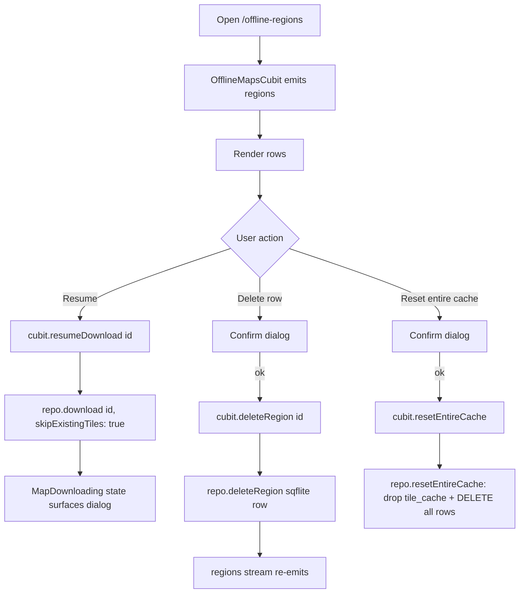
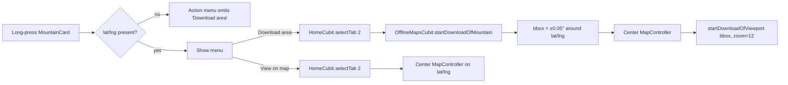

> **Generated by**: /plan | **Model**: Claude Opus 4.7 (1M context) | **Timestamp**: 2026-04-25

# Plan: Offline Maps + SOS — Iteration 3 (Offline Maps Polish)

## 1. Iteration Context
- **Iteration**: 3 of 5 — **Offline Maps Polish**
- **AC Items**: FR-5 (Regions catalog), FR-6 (full settings UI / quota slider), FR-4 (resume paused), mountain `lat`/`lng` backfill, EC-7 reset
- **Deliverable**:
  - `/offline-regions` catalog screen lists every region with name, bbox center, zoom range, size, downloaded date, status; supports delete and resume.
  - `/settings` screen with a 50–1000 MB quota slider and live storage-usage indicator; reachable from the home drawer and from the Profile tab.
  - Resume on partial regions runs the download again with `skipExistingTiles: true` so cache hits don't re-fetch.
  - `Mountain` entity gains optional `lat` / `lng`; `assets/hill_station.json` backfilled with reasonable coordinates for all 46 existing entries.
  - Long-press on a `MountainCard` opens an action menu with **Download area** (10 km square around the mountain) and **View on map**.
  - "Reset entire cache" button in the catalog header drops the shared FMTC `tile_cache` store — the only mechanism that frees tile bytes given FMTC v9's single-store browse limitation.
- **Research**: [../research.md](../research.md)
- **Iter 1 plan (foundation)**: [../iteration-1/plan.md](../iteration-1/plan.md)
- **Iter 2 plan (Offline Maps MVP)**: [../iteration-2/plan.md](../iteration-2/plan.md)

### Locked decisions (this iteration)

| # | Decision | Choice |
|---|----------|--------|
| 22 | Settings location | **New `/settings` route**, drawer entry + Profile tile (per user answer 2026-04-25). |
| 23 | Mountain download trigger | **Long-press on MountainCard** opens an action menu (per user answer). |
| 24 | Per-region "delete" semantics | **Removes the sqflite row only** (tile bytes stay in the shared `tile_cache` store). The Delete dialog explicitly tells the user this; a separate **"Reset entire cache"** action drops the whole FMTC store. Driven by FMTC v9's single-store limitation surfaced in Iter 2. |
| 25 | Resume implementation | **Re-call `repository.download(...)` with the same `regionId`**, threading a new `skipExistingTiles: true` flag through `OfflineTileStore`. The Iter 2 dedupe path (delete non-complete row → re-insert) works unchanged. |
| 26 | Mountain bbox sizing | **Fixed ±0.05° lat / ±0.05° lng around (lat, lng)** ≈ 10 km × 10 km at low–mid latitudes. Simple, predictable, no per-mountain configuration. |
| 27 | Lat/lng data source | **Hand-curated from public sources** (Wikipedia summit/town coordinates) baked into `assets/hill_station.json`. No runtime geocoding. |
| 28 | Quota slider range | **50 MB minimum, 1000 MB maximum, step 50 MB**, default 250 MB (existing). Lower bound 50 MB still allows one Kangchenjunga-class region. |

---

## 2. Architecture Decision

### Chosen Approach

**Three small surface additions on top of Iter 2's offline-maps module, plus a new `lib/features/settings/` feature module**:

1. **Catalog screen** — a `StatelessWidget` page that subscribes to `OfflineMapsCubit.state.regions` (already streamed via `WatchRegions`). New cubit methods `resumeDownload(regionId)`, `deleteRegion(regionId)`, `resetEntireCache()` invoke existing or extended repository APIs. No new state class — re-uses `MapDownloading` for resume progress.

2. **Settings feature module** at `lib/features/settings/` mirroring the existing clean-arch shape (presentation only — there's no domain/data layer needed because all state is in `AppPrefs` and storage stats come via `OfflineMapsRepository.totalSizeBytes`). Single `SettingsCubit` reads/writes `quotaMb` and exposes live total bytes.

3. **Mountain lat/lng** as schema-only changes — entity, model, JSON. Read paths in MountainsRepository unchanged. Long-press handling lives in `MountainCard` itself; tap → `HomeCubit.selectTab(2)` + a callback into `OfflineMapsCubit` to start the bounded download. Cross-feature communication uses an existing `getIt` lookup (consistent with `_withMountainsCubit` in `app_router.dart`).

Rationale:
- Re-uses Iter 2's shared `tile_cache` store + dedupe path → no duplication of download orchestration.
- Settings as a feature module keeps options for Iter 4's SOS contacts (which will live alongside future settings sections).
- Long-press menu vs new mountain-detail page: zero new routes for mountains, zero schema changes outside the entity, and the `MountainCard` already has hit-testing for the like button so adding a `GestureDetector` for long-press is one widget tweak.
- `±0.05°` bbox keeps the tile count predictable (~50 MB at zoom 10–14) so we never trip the new `kMaxTilesPerDownload = 50000` ceiling regardless of mountain location.

### Alternatives Considered

1. **Full per-region tile eviction** (per-region FMTC stores). Rejected: FMTC v9's `TileProvider` is single-store, which we discovered in Iter 2 review. Maintaining N stores while only browsing one defeats the purpose, and bbox-scoped eviction inside a single store isn't supported by FMTC. Iter 3 ships honest "metadata-only" delete + a separate cache-wide reset.
2. **Settings inline on Profile tab**. Rejected per user answer (decision 22) and because Iter 4 will add SOS-contact CRUD which won't fit cleanly inside Profile.
3. **Runtime Nominatim geocoding for mountain coords**. Rejected per research §13.5 ("our app is for remote areas"; Nominatim is rate-limited and network-dependent). Hand-curated coordinates in the asset are deterministic, free, and offline-friendly.

---

## 3. Logic Diagrams

### 3.1 Catalog actions



### 3.2 Mountain long-press → download



---

## 4. Storage Design

### sqflite — no schema change

Iteration 1's v1 schema already has every column the catalog reads (`id`, `name`, `bbox_wkt`, `min_zoom`, `max_zoom`, `tile_count`, `size_bytes`, `downloaded_at`, `status`).

### Mountain JSON — lat/lng additions

`assets/hill_station.json` gains two optional fields per entry:

```json
{
  "name": "Shimla",
  "imageUrl": "...",
  "description": "...",
  "lat": 31.1048,
  "lng": 77.1734
}
```

Backfill scope: **all 46 existing entries** (Wikipedia coordinates, rounded to 4 decimals ≈ 11 m precision). Entries without backfill are valid — `lat`/`lng` stay null, the long-press menu hides "Download area".

### Mountain entity

```dart
class Mountain extends Equatable {
  final String id;
  final String name;
  final String imageUrl;
  final String description;
  final String? region;
  final double? lat;   // NEW
  final double? lng;   // NEW
  // ...
}
```

`MountainModel.fromJson` and `fromFirestore` both call `(json['lat'] as num?)?.toDouble()`. Firestore docs without these fields stay valid; the app reads `null` and the download UX is gracefully suppressed.

### `firestore.rules` — no change

`match /mountains/{mountainId}` reads stay open to authed users; writes are server-side via the seeder. No new field validation needed.

### `AppPrefs` — no new keys

`quotaMb` already exists from Iter 1 (default 250). Settings page reads/writes the existing key.

---

## 5. API Design

No HTTP/Firestore API changes. The Dart-level surface added/extended:

### `OfflineTileStore` (extended)

```dart
Stream<TileDownloadEvent> download({
  required String storeName,
  required LatLngBounds bbox,
  required int minZoom,
  required int maxZoom,
  required String urlTemplate,
  required String userAgentPackageName,
  Map<String, String> additionalOptions = const {},
  int parallelThreads = 4,
  bool skipExistingTiles = false,   // NEW — used by resume
});

Future<void> resetAll();              // NEW — drops the kBrowseStoreName store
```

`FmtcOfflineTileStore.download` forwards `skipExistingTiles` to `FMTCStore.download.startForeground(skipExistingTiles: ...)`. `resetAll` calls `FMTCStore(kBrowseStoreName).manage.delete()` (the same path FMTC uses for full-store eviction).

### `OfflineMapsRepository` (extended)

```dart
Stream<DownloadProgress> download({...});  // existing — Iter 2

/// Resume a partially-downloaded region. Same semantics as `download(...)`
/// except the tile-store is asked to skip cached tiles. Internally calls
/// `download(...)` with the existing row's bbox/zoom — the Iter 2 dedupe
/// path handles delete+re-insert.
Stream<DownloadProgress> resume(String regionId);   // NEW

Future<Result<void>> deleteRegion(String regionId); // existing — Iter 2
Future<Result<void>> resetEntireCache();            // NEW — drops FMTC store + every sqflite row
```

### `OfflineMapsCubit` (extended)

```dart
Future<void> resumeDownload(String regionId);
Future<void> deleteRegion(String regionId);
Future<void> resetEntireCache();
Future<void> startDownloadOfMountain(Mountain m, MapController controller);
```

`startDownloadOfMountain` switches the `HomeCubit` tab to 2 (Map), centres the `MapController` on the mountain, and calls `startDownloadOfViewport` with a `±0.05°` bbox. The `MapController` is shared via dependency injection — see §6.

### `SettingsCubit` (new)

```dart
class SettingsState extends Equatable {
  final int quotaMb;          // current
  final int totalUsedBytes;   // live from repo
  final bool loading;
  final String? error;
}

class SettingsCubit extends Cubit<SettingsState> {
  Future<void> load();
  Future<void> setQuota(int mb);     // validates 50 ≤ mb ≤ 1000
}
```

### Routes (additions)

```dart
class Routes {
  static const String settings = '/settings';
  static const String offlineRegions = '/offline-regions';
}
```

Both reachable from `HomeShell._HomeDrawer` and from `ProfilePage` (via a "Settings" `ListTile`); `/offline-regions` is also linked from the Settings page's Storage section.

---

## 6. Code Changes

### Files to Create

#### Feature: settings (presentation-only module)
- `lib/features/settings/presentation/cubit/settings_state.dart` — sealed/Equatable.
- `lib/features/settings/presentation/cubit/settings_cubit.dart` — depends on `AppPrefs` + `OfflineMapsRepository`.
- `lib/features/settings/presentation/view/settings_page.dart` — slider + usage indicator + link to `/offline-regions`.
- `lib/features/settings/di/settings_module.dart` — `void registerSettingsModule(GetIt)` registers `SettingsCubit` as factory.

#### Feature: offline_maps — catalog + cache reset
- `lib/features/offline_maps/presentation/view/offline_regions_catalog_page.dart` — main page; `BlocBuilder<OfflineMapsCubit, OfflineMapsState>` over `state.regions`; `BlocListener` opens existing `DownloadProgressDialog` when a resume kicks off.
- `lib/features/offline_maps/presentation/view/widgets/offline_region_row.dart` — single-row card (name, status badge, size, date, action menu).
- `lib/features/offline_maps/presentation/view/widgets/reset_cache_dialog.dart` — confirmation copy.
- `lib/features/offline_maps/presentation/view/widgets/delete_region_dialog.dart` — confirmation copy explicitly noting tiles remain in shared cache.

#### Tests
- `test/unit/features/settings/settings_cubit_test.dart` — load, setQuota validation, refresh on regions stream change.
- `test/widget/features/settings/settings_page_test.dart` — slider drag, usage line, navigation links.
- `test/widget/features/offline_maps/offline_regions_catalog_page_test.dart` — empty state, region rows, action menu, reset-all confirm dialog.
- `test/widget/features/offline_maps/widgets/offline_region_row_test.dart` — status badge variants, formatted size string.
- `test/unit/features/offline_maps/data/offline_maps_repository_impl_resume_test.dart` — resume calls `download` with `skipExistingTiles: true`; `resetEntireCache` drops store + DB rows.
- `test/unit/features/mountains/data/mountain_model_test.dart` — `fromJson`/`toJson`/`fromFirestore` round-trip with and without lat/lng.
- `test/widget/features/mountains/widgets/mountain_card_long_press_test.dart` — long-press shows menu when lat/lng present, omits "Download area" when absent.

### Files to Modify

#### Mountain entity / model / asset
- `lib/features/mountains/domain/entities/mountain.dart` — add `final double? lat`, `final double? lng`; extend `props`; extend `copyWith` if present.
- `lib/features/mountains/data/models/mountain_model.dart` — `fromJson` reads `(json['lat'] as num?)?.toDouble()` etc.; `fromFirestore` mirrors.
- `assets/hill_station.json` — add `"lat"` and `"lng"` to all 46 entries (hand-curated from Wikipedia).

#### Mountain card
- `lib/features/mountains/presentation/widgets/mountain_card.dart` — wrap the existing `Stack` content in a `GestureDetector(onLongPress: ...)`; show a Material `showMenu` with two entries; the menu's enable state and item set depend on whether lat/lng is non-null. Adds a callback prop `onDownloadArea(Mountain)` and `onViewOnMap(Mountain)` so the page (not the card) wires up the cubits.

#### Mountains list page
- `lib/features/mountains/presentation/view/mountains_page.dart` — wire `onDownloadArea` and `onViewOnMap` callbacks to `getIt<HomeCubit>().selectTab(2)` + `getIt<OfflineMapsCubit>().startDownloadOfMountain(m, mapController)` / `centerOnMountain(m)`.
  - Note: the cubit needs a way to talk to the `MapController`. Add `OfflineMapsCubit.attachMapController(MapController)` invoked from `_OfflineMapsPageState.initState` so the cubit holds a weak reference; on cubit close, it nulls. Mountain card → cubit → controller, no direct MapController coupling.

#### Offline tile store + repo
- `lib/core/services/offline_tile_store.dart` — extend `download(...)` with `bool skipExistingTiles = false`; add `Future<void> resetAll()`.
- `lib/features/offline_maps/domain/repositories/offline_maps_repository.dart` — add `resume`, `resetEntireCache`.
- `lib/features/offline_maps/data/repositories/offline_maps_repository_impl.dart` — implement both. `resume` reads the existing region row, calls `download` with the same params + `skipExistingTiles: true`. `resetEntireCache` calls `tileStore.resetAll()` then `_ds.deleteAll()`.
- `lib/features/offline_maps/data/datasources/offline_regions_local_data_source.dart` — add `Future<void> deleteAll()` → `db.delete(_table)` then re-emit.
- `lib/features/offline_maps/domain/usecases/` — add `resume_download.dart` and `reset_entire_cache.dart` thin wrappers.

#### Cubit
- `lib/features/offline_maps/presentation/cubit/offline_maps_cubit.dart` — three new methods (resume, deleteRegion, resetEntireCache, startDownloadOfMountain) + `attachMapController`. Reuses `_startDownloadInternal` for resume.

#### Routing + navigation
- `lib/app/router/routes.dart` — `Routes.settings`, `Routes.offlineRegions`.
- `lib/app/router/app_router.dart` — register both routes.
- `lib/features/home/presentation/view/home_shell.dart` — drawer gets a "Settings" `ListTile` and an "Offline regions" `ListTile`.
- `lib/features/home/presentation/view/profile_page.dart` — add "Settings" tile.

#### DI
- `lib/core/di/injector.dart` — call `registerSettingsModule(getIt)` after `registerOfflineMapsModule`.

#### Page wiring (cubit ↔ controller)
- `lib/features/offline_maps/presentation/view/offline_maps_page.dart` — call `cubit.attachMapController(_mapController)` in `initState` after the post-frame `_maybeFireOnVisible`.

---

## 7. Edge Cases & Error Handling

1. **Resume on a region whose tiles were cleared by "Reset entire cache"** — `skipExistingTiles: true` becomes a no-op; download re-fetches everything from the network. Surfaces as a normal `MapDownloading` flow. No special handling.
2. **Resume on a region with `status == 'failed'`** — same code path (Iter 2 dedupe deletes the failed row before re-insert). Status returns to `downloading` then resolves.
3. **Mountain row with lat but no lng** (malformed data) — both null-checks must pass before showing "Download area"; partial coords behave as null. Schema permits both null.
4. **Long-press on a mountain card while a download is already running** — the new `startDownloadOfMountain` checks `state is MapDownloading`; if so, it shows a snackbar "A download is already in progress" and does nothing (matches Iter 2's FAB guard).
5. **Reset entire cache while a download is running** — `resetEntireCache` cancels the active download first (via `cancelActiveDownload`), then drops the store + rows. Confirmation dialog explicitly warns about this.
6. **Quota slider lowered below current usage** — allowed, but new downloads block until usage drops. Settings page shows a yellow warning row when `quotaMb < currentUsageMb`.
7. **Quota slider value set outside [50, 1000]** — `setQuota` clamps; the slider widget already constrains UI input.
8. **`/settings` deep-linked while signed-out** — caught by the existing auth-redirect resolver; user lands on `/login`.
9. **Catalog opened while regions stream still warming up** — first emission is the empty-then-real list; the page's `BlocBuilder` shows a non-shimmer "Loading…" line.
10. **Mountain card long-press inside the like button hit-area** — `GestureDetector` wraps the inner content but the like `IconButton` already eats taps; long-press still propagates correctly.
11. **`MapController` not yet attached when `startDownloadOfMountain` is called** (user long-presses before opening Map tab once) — cubit defers center-on-mountain until controller arrives; download still queues.

---

## 8. Security Considerations

- **Input validation**:
  - `setQuota(int mb)` clamps to `[50, 1000]`. Negative/non-finite values throw `ArgumentError`.
  - Mountain `lat`/`lng` from JSON: `(json['lat'] as num?)?.toDouble()` is null-safe; non-numeric values throw at parse time and are caught by the data source's existing fallback path.
  - `startDownloadOfMountain` reuses the Iter 2 viewport-bbox path which already has tile-count + quota guards.
- **Authorization**: nothing new. `mountains` collection rules unchanged. `firestore.rules` not touched.
- **Data sanitization**: no new SQL fragments. Catalog reads via existing parameterized DAO methods. Asset JSON is trusted-source.
- **Reset entire cache as a partial DoS surface**: a malicious local user with device access can hit the button and lose tile cache, but offline regions metadata is also wiped — this is a deliberate user action behind a confirmation. Within threat model.
- **MapTiler key exposure (carried-over CRITICAL from Iter 1)**: still present, still requires runtime key restriction in MapTiler Cloud console. Iter 3 does not change this.

---

## 9. TDD Test Strategy

Tests precede implementation in each phase. Framework remains `flutter_test` + `bloc_test` + `mocktail` + `sqflite_common_ffi`.

### Phase 1 Tests — Mountain lat/lng + tile-store extension

- `mountain_model_test.dart`: `fromJson` with lat/lng → entity carries them; without → null; non-numeric → throws (caught upstream). `fromFirestore` symmetric. `toJson` round-trips when applicable.
- `offline_tile_store_test.dart` (extend): `TileDownloadEvent` already covered; add `resetAll` smoke test through a stub.

### Phase 2 Tests — Repository + DAO additions

- `offline_maps_repository_impl_resume_test.dart`:
  - `resume(id)` reads `getById(id)`, calls `download(...)` with same bbox/zoom + `skipExistingTiles: true` (verified via mock).
  - `resume` on missing id returns `Failure(NotFoundError)`.
  - `resume` on `complete` row short-circuits with synthetic completion event (Iter 2 behaviour preserved).
  - `resetEntireCache` calls `tileStore.resetAll()` + `ds.deleteAll()`.
  - `resetEntireCache` maps tile-store error → `Failure(UnknownError)`.
- `offline_regions_local_data_source_test.dart` (extend): `deleteAll` removes every row + emits empty list to `watchRegions`.

### Phase 3 Tests — Settings cubit

- `settings_cubit_test.dart`:
  - `load` populates `quotaMb` + `totalUsedBytes`.
  - `setQuota(500)` writes to prefs + emits new state.
  - `setQuota(-10)` rejected, no emit.
  - `setQuota(2000)` clamped to 1000.
  - Regions stream emission triggers usage refresh.

### Phase 4 Tests — Cubit extensions

Extend `offline_maps_cubit_test.dart`:
- `resumeDownload(id)` calls the resume use case + transitions through `MapDownloading`.
- `deleteRegion(id)` calls `repository.deleteRegion(id)`.
- `resetEntireCache` cancels active download (if any) then calls `repository.resetEntireCache()`.
- `startDownloadOfMountain(m, controller)` rejects mountains with null lat/lng (snackbar via state); accepts otherwise + computes ±0.05° bbox.

### Phase 5 Tests — Widgets + page

- `offline_regions_catalog_page_test.dart`: renders empty state when `regions == []`; renders rows when populated; tapping menu→Resume invokes cubit; "Reset entire cache" button shows confirm dialog.
- `offline_region_row_test.dart`: status badge text per status; size formatted to `"X.X MB"`.
- `settings_page_test.dart`: slider value bound to state; drag updates cubit; storage line shows live bytes; "Manage offline regions" button navigates to `/offline-regions`.
- `mountain_card_long_press_test.dart`: long-press shows menu with both items when lat/lng set; only "View on map" when missing; tapping invokes the relevant callback.

---

## 10. Implementation Phases

### Phase 1: Mountain lat/lng + tile-store extension

**Tests first**:
- `test/unit/features/mountains/data/mountain_model_test.dart` (CREATE).
- Extend `test/unit/core/services/offline_tile_store_test.dart` if needed.

**Then implement**:
1. Extend `Mountain` entity with `lat` + `lng`.
2. Extend `MountainModel.fromJson`/`fromFirestore`/`toJson`.
3. Backfill `assets/hill_station.json` with 46 lat/lng pairs (Wikipedia coordinates).
4. Extend `OfflineTileStore.download` with `skipExistingTiles`; add `resetAll()`.
5. Phase 1 tests green.

### Phase 2: Repository + DAO + use cases

**Tests first**:
- `test/unit/features/offline_maps/data/offline_maps_repository_impl_resume_test.dart` (CREATE).
- Extend `test/unit/features/offline_maps/data/offline_regions_local_data_source_test.dart`.

**Then implement**:
1. Add `deleteAll` to DAO.
2. Add `resume` + `resetEntireCache` to repository interface + impl.
3. Add `ResumeDownload` and `ResetEntireCache` use cases.
4. Update `OfflineMapsModule` DI registrations.
5. Phase 2 tests green.

### Phase 3: Settings feature module

**Tests first**:
- `test/unit/features/settings/settings_cubit_test.dart` (CREATE).

**Then implement**:
1. `SettingsState` + `SettingsCubit`.
2. `SettingsPage` with `Slider`, usage row, link to `/offline-regions`.
3. `lib/features/settings/di/settings_module.dart`.
4. Register module in `injector.dart`.
5. Add `Routes.settings` + `GoRoute`.
6. Drawer + Profile entries.
7. Phase 3 tests green.

### Phase 4: OfflineMapsCubit extensions + Catalog screen

**Tests first**:
- Extend `offline_maps_cubit_test.dart`.
- `test/widget/features/offline_maps/offline_regions_catalog_page_test.dart` (CREATE).
- `test/widget/features/offline_maps/widgets/offline_region_row_test.dart` (CREATE).

**Then implement**:
1. Extend `OfflineMapsCubit` with `resumeDownload`, `deleteRegion`, `resetEntireCache`, `startDownloadOfMountain`, `attachMapController`.
2. `OfflineMapsPage._OfflineMapsPageState.initState` calls `cubit.attachMapController(_mapController)`.
3. Catalog page + row + dialogs.
4. Add `Routes.offlineRegions` + `GoRoute`; drawer entry.
5. Phase 4 tests green.

### Phase 5: Mountain card long-press menu

**Tests first**:
- `test/widget/features/mountains/widgets/mountain_card_long_press_test.dart` (CREATE).

**Then implement**:
1. Wrap `MountainCard`'s body in `GestureDetector(onLongPress: ...)`; pass through callbacks `onDownloadArea` + `onViewOnMap`.
2. `MountainsPage` provides callbacks that call `getIt<HomeCubit>().selectTab(2)` + the cubit's mountain methods.
3. Phase 5 tests green.

### Phase 6: Smoke + analyze

1. `flutter test` — full suite green.
2. `flutter analyze` — no new warnings.
3. Manual smoke (with `.env` containing `MAPTILER_API_KEY`):
   - Drawer → Settings → slider works, usage shown.
   - Drawer → Offline regions → list renders, delete row works.
   - Cancel a download, then resume from catalog → MapDownloading dialog shows again.
   - Long-press a mountain card with lat/lng → menu appears, "Download area" centers map and starts download.
   - Long-press a mountain card without lat/lng → menu shows only "View on map".
   - "Reset entire cache" wipes both regions list and tile cache.

---

## 11. Reference Files

- [lib/features/offline_maps/data/repositories/offline_maps_repository_impl.dart](../../../lib/features/offline_maps/data/repositories/offline_maps_repository_impl.dart) — Iter 2 download/cancel/dedupe logic; resume reuses it.
- [lib/features/offline_maps/presentation/cubit/offline_maps_cubit.dart](../../../lib/features/offline_maps/presentation/cubit/offline_maps_cubit.dart) — `_startDownloadInternal` is the resume reuse point.
- [lib/features/offline_maps/presentation/view/offline_maps_page.dart](../../../lib/features/offline_maps/presentation/view/offline_maps_page.dart) — `_handleStateChange` hosts the progress dialog; resume reuses it without changes.
- [lib/features/mountains/data/models/mountain_model.dart](../../../lib/features/mountains/data/models/mountain_model.dart) — pattern for extending Firestore + JSON parsing.
- [lib/features/mountains/presentation/widgets/mountain_card.dart](../../../lib/features/mountains/presentation/widgets/mountain_card.dart) — file we add long-press to.
- [lib/features/home/presentation/view/home_shell.dart](../../../lib/features/home/presentation/view/home_shell.dart) — `_HomeDrawer` is where the "Settings" + "Offline regions" entries land.
- [lib/features/home/presentation/view/profile_page.dart](../../../lib/features/home/presentation/view/profile_page.dart) — Profile gets a Settings tile.
- [lib/core/storage/app_prefs.dart](../../../lib/core/storage/app_prefs.dart) — `quotaMb` getter/setter consumed by SettingsCubit.
- [assets/hill_station.json](../../../assets/hill_station.json) — backfill target.
- [lib/core/services/offline_tile_store.dart](../../../lib/core/services/offline_tile_store.dart) — facade we extend with `skipExistingTiles` + `resetAll`.

---

## 12. TODO Checklist

### Implementation

**Phase 1 — Mountain lat/lng + tile-store extension**
- [ ] Phase 1: Write `mountain_model_test.dart`.
- [ ] Phase 1: Add `lat`/`lng` to `Mountain` entity.
- [ ] Phase 1: Extend `MountainModel.fromJson`/`fromFirestore`/`toJson` with lat/lng.
- [ ] Phase 1: Backfill `assets/hill_station.json` with 46 lat/lng pairs.
- [ ] Phase 1: Extend `OfflineTileStore.download` with `skipExistingTiles`; add `resetAll()`.
- [ ] Phase 1: Phase 1 tests green.

**Phase 2 — Repository + DAO + use cases**
- [ ] Phase 2: Write `offline_maps_repository_impl_resume_test.dart`.
- [ ] Phase 2: Extend DAO with `deleteAll`.
- [ ] Phase 2: Add `resume` + `resetEntireCache` to repository.
- [ ] Phase 2: Add `ResumeDownload` + `ResetEntireCache` use cases.
- [ ] Phase 2: Update `offline_maps_module.dart` DI.
- [ ] Phase 2: Phase 2 tests green.

**Phase 3 — Settings feature module**
- [ ] Phase 3: Write `settings_cubit_test.dart`.
- [ ] Phase 3: Create `SettingsState` + `SettingsCubit`.
- [ ] Phase 3: Create `SettingsPage`.
- [ ] Phase 3: Create `settings_module.dart` + register in `injector.dart`.
- [ ] Phase 3: Add `Routes.settings` + `GoRoute`.
- [ ] Phase 3: Add drawer + Profile entries.
- [ ] Phase 3: Phase 3 tests green.

**Phase 4 — Cubit extensions + Catalog screen**
- [ ] Phase 4: Extend `offline_maps_cubit_test.dart` with new methods.
- [ ] Phase 4: Write `offline_regions_catalog_page_test.dart` + `offline_region_row_test.dart`.
- [ ] Phase 4: Extend `OfflineMapsCubit` (resume, delete, reset, mountain start, attachMapController).
- [ ] Phase 4: Hook `attachMapController` from `OfflineMapsPage.initState`.
- [ ] Phase 4: Create `OfflineRegionsCatalogPage` + `OfflineRegionRow` + dialogs.
- [ ] Phase 4: Add `Routes.offlineRegions` + drawer entry.
- [ ] Phase 4: Phase 4 tests green.

**Phase 5 — Mountain card long-press menu**
- [ ] Phase 5: Write `mountain_card_long_press_test.dart`.
- [ ] Phase 5: Wrap `MountainCard` with `GestureDetector(onLongPress)` + popup menu.
- [ ] Phase 5: Wire callbacks from `MountainsPage` to `HomeCubit` + `OfflineMapsCubit`.
- [ ] Phase 5: Phase 5 tests green.

**Phase 6 — Smoke + analyze**
- [ ] Phase 6: `flutter test` full suite green.
- [ ] Phase 6: `flutter analyze` no new warnings.
- [ ] Phase 6: Manual smoke (settings, catalog, resume, mountain long-press, reset cache).

### Verification
- [ ] Targeted: `flutter test test/unit/features/settings/ test/unit/features/offline_maps/ test/widget/features/offline_maps/ test/widget/features/settings/ test/widget/features/mountains/`.
- [ ] Full: `flutter test`.
- [ ] `flutter analyze` clean.
- [ ] Manual: try every smoke step on a real device.
