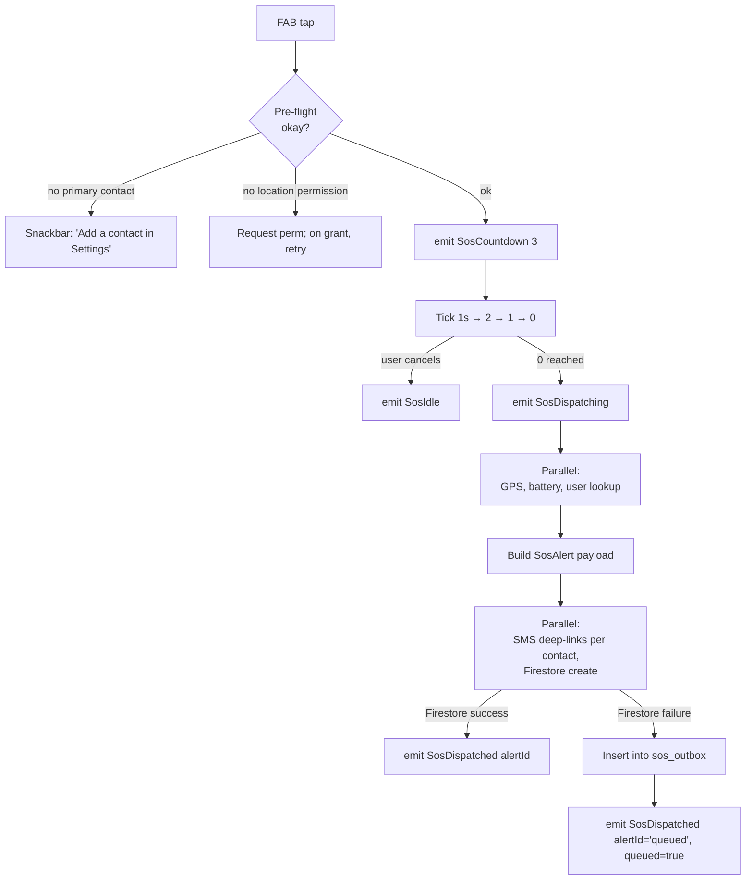
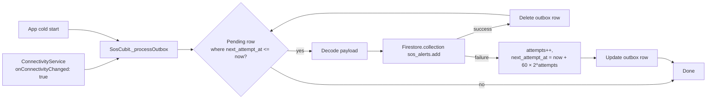
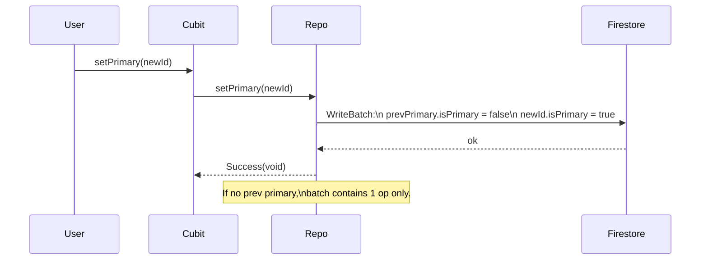

> **Generated by**: /plan | **Model**: Claude Opus 4.7 (1M context) | **Timestamp**: 2026-04-25

# Plan: Offline Maps + SOS — Iteration 4 (SOS MVP, foreground only)

## 1. Iteration Context
- **Iteration**: 4 of 5 — **SOS MVP (foreground only)**
- **AC Items**: FR-9, FR-10, FR-11, FR-12 (single-shot GPS only — breadcrumbs land in Iter 5), FR-13, FR-16, FR-18, API-1, API-3, API-4, AZ-3, AZ-4, V-1, V-2, V-4, SE-3, EC-1, EC-4, EC-9, EC-10, T-6
- **Deliverable**:
  - `lib/features/sos/` feature module (full data/domain/presentation stack).
  - **Emergency contacts CRUD** at `/sos/contacts` backed by `users/{uid}/emergencyContacts/{contactId}` Firestore subcollection. Add / edit via bottom-sheet form, delete via swipe, atomic primary-contact flip via Firestore batch. First-added contact auto-becomes primary.
  - **Global SOS FAB** rendered inside `HomeShell._ShellView`'s `Scaffold.floatingActionButton` only on Home / Mountains / Map tabs (indices 0, 1, 2). Wired to a singleton `SosCubit`.
  - Tap → 3-second countdown dialog with Cancel; on expiry, dispatch.
  - Dispatch payload: single-shot GPS (lat/lng/accuracy/altitude), battery %, user uid/name/email, snapshot of contacts notified at dispatch time, server timestamp, `status: 'active'`.
  - Two channels: per-contact `sms:` deep-link via `url_launcher`, **and** Firestore write to `sos_alerts/{alertId}`.
  - Firestore failure queues the payload in `sos_outbox` (sqflite, schema from Iter 1) and replays it on the next `ConnectivityService.onConnectivityChanged()` true edge.
  - Cancel flow updates the alert doc's `status` to `'cancelled'` (or removes the queued outbox row if the alert never made it to Firestore).
  - **Firestore rules** updated: `sos_alerts/{alertId}` owner-only create/read/update; emergency contacts already covered by the existing `users/{uid}/{document=**}` rule (Iter 1 AZ-4).
  - Firebase emulator scaffolding (`firebase.json` + `.firebaserc`) + `fake_cloud_firestore` dev dep so T-6 rules behavior is testable locally.
- **Research**: [../research.md](../research.md)
- **Iter 1–3 plans**: [../iteration-1/plan.md](../iteration-1/plan.md), [../iteration-2/plan.md](../iteration-2/plan.md), [../iteration-3/plan.md](../iteration-3/plan.md)

### Locked decisions (this iteration)

| # | Decision | Choice |
|---|----------|--------|
| 29 | iOS Firebase config | **Build for both platforms; iOS is documented as blocked at smoke time until you run `flutterfire configure`.** Code is platform-agnostic; tests use `fake_cloud_firestore` (no platform binding). |
| 30 | SMS dispatch shape | **One SMS per contact** — loop and call `url_launcher.launchUrl(Uri.parse('sms:<phone>?body=...'))` per recipient. iOS-safe, cross-platform. |
| 31 | Primary-contact policy | **First contact added auto-becomes primary.** Tapping "Set primary" on a different contact uses a Firestore batch write that flips both rows atomically. |
| 32 | SOS FAB visible tabs | tabIndex ∈ {0, 1, 2} (Home / Mountains / Map). Hidden on Community + Profile per research §FR-10. |
| 33 | Contacts CRUD UI | **Single bottom-sheet form** for add and edit. List page at `/sos/contacts`. Swipe-to-delete with confirmation dialog. |
| 34 | `SosCubit` lifecycle | **Singleton** registered as `getIt.registerLazySingleton<SosCubit>` so the same instance survives across HomeShell rebuilds, the countdown dialog, and outbox-retry timing. |
| 35 | Firestore rules tests (T-6) | **Two layers** — (a) `fake_cloud_firestore` repository tests in `flutter test` (verify writes happen with correct shapes), (b) emulator-driven rules-spec test invoked via `firebase emulators:exec` outside `flutter test` (manual checkpoint). The emulator config is committed; the integration test isn't part of the default suite. |
| 36 | Phone normalization | **Library-free regex normalizer**: strip whitespace and punctuation, accept optional leading `+`, require 8–15 digits remaining. Stored as `+<digits>` when leading `+` is present, else `<digits>`. No country-code inference. |
| 37 | Outbox retry trigger | Retry attempts on (a) `ConnectivityService.onConnectivityChanged()` flip to online, (b) app cold-start. **Silent** — no toast on success/failure. Failure increments `attempts` + reschedules `next_attempt_at` with exponential backoff (60s × 2^attempts, capped at 1h). |

---

## 2. Architecture Decision

### Chosen Approach

**A new `lib/features/sos/` feature module mirroring the existing clean-arch shape, plus three new core wires already in place from prior iterations**:

- `LocationService.getCurrentPosition` (Iter 1) → single-shot GPS for the dispatch payload.
- `BatteryService.level()` (Iter 1) → battery percent.
- `ConnectivityService.onConnectivityChanged` (Iter 1) → drives the outbox retry processor.
- `LocalDb` (Iter 1) → backs the `sos_outbox` table (schema already at v1).
- `AuthCubit` → uid/email/name lookup at dispatch time.

The `SosCubit` is a **singleton** because it owns transient state across navigation — the user can tap the FAB on Home, the countdown dialog opens overlaying any tab, the dispatch happens regardless of which tab is on top, and the outbox processor needs to react to connectivity events even when no SOS UI is mounted. The `EmergencyContactsCubit` is a **factory** scoped to the `/sos/contacts` route (matches the existing `MountainSearchCubit` pattern).

The dispatch flow is split into a short-lived `SosCubit.fire()` (countdown → single-shot GPS → battery → user metadata → SMS deep-links + Firestore write or outbox enqueue) and a long-lived background outbox processor that hangs off `ConnectivityService.onConnectivityChanged` in `SosCubit`'s constructor. Cancellation is handled differently depending on where the alert lives: still in the outbox → row delete; already in Firestore → status update to `cancelled`.

Rationale:
- Mirrors the architecture pattern locked across iterations 2–3.
- Singleton SOS cubit avoids the "dialog vs page provides cubit" coupling that bit Iter 3 (C1 review finding).
- Single bottom-sheet form for contacts add/edit is the same pattern used by the offline-maps "Download this view" dialog in Iter 2 — proven, no new state machine.
- `fake_cloud_firestore` for repo tests sidesteps the emulator setup tax for `flutter test`; the emulator config still ships so rules can be exercised on demand.

### Alternatives Considered

1. **One Firestore document per contact + write to a "primary contact id" field on the user doc.** Rejected: doubles writes for every primary toggle and introduces a divergence target (the `isPrimary` flag on the contact doc could disagree with the pointer on the user doc). The flat `isPrimary: bool` per contact, with a Firestore batch flip, is simpler and atomic.
2. **`flutter_sms` package for one-tap SMS instead of `url_launcher` `sms:` URIs.** Rejected: `flutter_sms` requests SEND_SMS permission and silently sends, which is great UX on Android but is rejected on iOS (silent SMS isn't allowed). One-tap-Send via the system Messages app on iOS plus user-tap on Android is consistent and avoids a permission prompt; it matches Iter 1 / SE-3.

---

## 3. Logic Diagrams

### 3.1 SOS dispatch flow



### 3.2 Outbox retry processor



### 3.3 Primary-contact atomic flip



---

## 4. Storage Design

### Firestore — `sos_alerts/{alertId}` (NEW)

| Field | Type | Notes |
|---|---|---|
| `uid` | string | author; matches `request.auth.uid` at create. |
| `createdAt` | Timestamp | `FieldValue.serverTimestamp()`. |
| `status` | string | `active` \| `cancelled` \| `resolved` \| `timed_out`. Initial = `active`. |
| `lat`, `lng` | double | Required at create. |
| `accuracy`, `altitude` | double? | Optional. |
| `batteryLevel` | int? | 0–100 or null when device can't report. |
| `userName` | string | Snapshot from AuthCubit. |
| `userEmail` | string | Snapshot. |
| `contactsNotified` | array of `{name, phone, isPrimary}` | Snapshot at dispatch time so later contact deletes can't rewrite history (EC-9). |
| `lastSeenAt` | Timestamp? | Same as `createdAt` initially; Iter 5 breadcrumbs will update it. |

### Firestore — `users/{uid}/emergencyContacts/{contactId}` (NEW; covered by existing rule)

| Field | Type | Notes |
|---|---|---|
| `name` | string | 1–80 chars. |
| `phone` | string | E.164-normalized (`+<digits>` or `<digits>`, 8–15 digits). |
| `relationship` | string? | Optional, ≤ 30 chars. |
| `isPrimary` | bool | Exactly one true at a time across the user's contacts. |
| `createdAt` | Timestamp | `FieldValue.serverTimestamp()`. |

### Firestore rules — additions to `firestore.rules`

```firestore-rules
match /sos_alerts/{alertId} {
  // Owner can create with their own uid; rest of the schema is best-effort
  // validated for required keys.
  allow create: if request.auth != null
             && request.resource.data.uid == request.auth.uid
             && request.resource.data.status == 'active'
             && request.resource.data.keys().hasAll(
                  ['uid', 'createdAt', 'status', 'lat', 'lng',
                   'userName', 'userEmail', 'contactsNotified']);
  allow read, update: if request.auth != null
                   && resource.data.uid == request.auth.uid;
  allow delete: if false;
}
```

Emergency contacts are already covered by `match /users/{uid}/{document=**}` at [firestore.rules:18-21](../../../firestore.rules) — no new rule. AZ-4 confirmed.

### sqflite — `sos_outbox` (already at schema v1; first writes in this iteration)

Used by the outbox retry processor. Iter 1 created the table with columns `id, payload_json, kind, attempts, next_attempt_at, created_at` and an index on `next_attempt_at`. Iter 4 writes `kind='alert'` rows.

```dart
{
  'kind': 'alert',
  'payload_json': jsonEncode(alertMap),
  'attempts': 0,
  'next_attempt_at': DateTime.now().millisecondsSinceEpoch,
  'created_at': DateTime.now().millisecondsSinceEpoch,
}
```

### Index Strategy

- `sos_outbox.next_attempt_at` index already exists from Iter 1.
- Firestore: collection-group index on `emergencyContacts.isPrimary` would help the cubit short-circuit primary lookup, but per-user collections are small (≤ ~20 contacts) so a client-side filter is cheaper than a custom index. **No new Firestore indexes.**

### `AppPrefs` — no new keys

---

## 5. API Design

### Firestore writes

#### `POST /sos_alerts/{alertId}` (Firestore `add()` → auto-id)
**Purpose**: Persist the active SOS alert.

**Document body**:
```dart
{
  'uid': String,          // required, == auth.uid
  'createdAt': Timestamp, // FieldValue.serverTimestamp()
  'status': 'active',
  'lat': double,
  'lng': double,
  'accuracy': double?,
  'altitude': double?,
  'batteryLevel': int?,
  'userName': String,
  'userEmail': String,
  'contactsNotified': List<Map<String, Object>>, // [{name, phone, isPrimary}]
  'lastSeenAt': Timestamp,
}
```

**Failure handling**: caught at repo level, queues to `sos_outbox`. Caller sees `Success(SosDispatchResult(alertId: 'pending', queued: true))`.

#### `PATCH /sos_alerts/{alertId}` — cancel
Sets `{'status': 'cancelled', 'lastSeenAt': FieldValue.serverTimestamp()}`. Owner-only rule.

#### `POST /users/{uid}/emergencyContacts/{contactId}`
**Purpose**: Add a new emergency contact.

**Document body**:
```dart
{'name': String, 'phone': String, 'relationship': String?, 'isPrimary': bool, 'createdAt': Timestamp}
```

#### `PATCH /users/{uid}/emergencyContacts/{contactId}` — set primary (batch)
Two ops in one batch:
- `update {prevPrimaryId}.isPrimary = false`
- `update {newPrimaryId}.isPrimary = true`

If no prior primary, batch has only the second op.

### Dart-level Cubit interfaces

#### `EmergencyContactsCubit`

```dart
class EmergencyContactsState extends Equatable {
  final List<EmergencyContact> contacts;
  final bool loading;
  final String? error;
}

class EmergencyContactsCubit extends Cubit<EmergencyContactsState> {
  Future<void> add(EmergencyContact draft);
  Future<void> update(EmergencyContact contact);
  Future<void> delete(String contactId);
  Future<void> setPrimary(String contactId);
}
```

#### `SosCubit`

```dart
sealed class SosState {
  final bool hasPrimaryContact;
  final bool locationPermissionGranted;
}

class SosIdle extends SosState { ... }
class SosCountdown extends SosState {
  final int remainingSeconds; // 3 → 2 → 1
}
class SosDispatching extends SosState { ... }
class SosDispatched extends SosState {
  final String alertId;        // 'pending' if queued
  final bool queued;
  final int contactsCount;
}
class SosCancelled extends SosState {
  final String alertId;
}
class SosError extends SosState {
  final String message;
}

class SosCubit extends Cubit<SosState> {
  void onFabPressed();         // → countdown
  void cancelCountdown();      // → SosIdle
  Future<void> cancelDispatched();  // sets Firestore status=cancelled
}
```

### Routes (additions)

```dart
class Routes {
  static const String emergencyContacts = '/sos/contacts';
}
```

### Permission additions
None. Iter 1 added `INTERNET`, `ACCESS_FINE_LOCATION`, and `POST_NOTIFICATIONS` to Android. iOS gets the location purpose strings already. SMS launches via `sms:` URI scheme — no `SEND_SMS` permission required.

---

## 6. Code Changes

### Files to Create

#### Domain — entities
- `lib/features/sos/domain/entities/emergency_contact.dart` — Equatable (`id`, `name`, `phone`, `relationship`, `isPrimary`, `createdAt`).
- `lib/features/sos/domain/entities/sos_alert.dart` — Equatable.
- `lib/features/sos/domain/entities/sos_dispatch_result.dart` — `({String alertId, bool queued, int contactsCount})`-style value type.

#### Domain — repositories
- `lib/features/sos/domain/repositories/emergency_contacts_repository.dart`
- `lib/features/sos/domain/repositories/sos_repository.dart`
- `lib/features/sos/domain/repositories/sos_outbox_repository.dart`

#### Domain — usecases (one `call()` each, mirroring `GetMountains` shape)
- `lib/features/sos/domain/usecases/watch_contacts.dart`
- `lib/features/sos/domain/usecases/add_contact.dart`
- `lib/features/sos/domain/usecases/update_contact.dart`
- `lib/features/sos/domain/usecases/delete_contact.dart`
- `lib/features/sos/domain/usecases/set_primary_contact.dart`
- `lib/features/sos/domain/usecases/fire_sos.dart`
- `lib/features/sos/domain/usecases/cancel_sos.dart`
- `lib/features/sos/domain/usecases/process_sos_outbox.dart`

#### Domain — utils
- `lib/features/sos/domain/utils/phone_normalizer.dart` — pure function `String normalize(String input)` + `bool isValid(String input)`.

#### Data — datasources
- `lib/features/sos/data/datasources/emergency_contacts_remote_data_source.dart` — abstract + `FirestoreEmergencyContactsRemoteDataSource`. `watch(uid)`, `add(uid, contact)`, `update(uid, contact)`, `delete(uid, contactId)`, `setPrimary(uid, newPrimaryId, prevPrimaryId?)` (uses `WriteBatch`).
- `lib/features/sos/data/datasources/sos_alerts_remote_data_source.dart` — abstract + impl. `create(payload)` returns alert id; `cancel(alertId)`.
- `lib/features/sos/data/datasources/sos_outbox_local_data_source.dart` — abstract + sqflite impl. `enqueue(payloadJson, kind)`, `dueRows(now)`, `markAttempt(id, nextAttemptAt)`, `delete(id)`.
- `lib/features/sos/data/datasources/sms_data_source.dart` — abstract + `UrlLauncherSmsDataSource`. `Future<bool> sendSms(String phone, String body)` — opens `sms:phone?body=encoded` URI.

#### Data — models
- `lib/features/sos/data/models/emergency_contact_model.dart` — `fromFirestore`, `toMap`.
- `lib/features/sos/data/models/sos_alert_model.dart` — `toMap` only (no read in Iter 4).

#### Data — repositories
- `lib/features/sos/data/repositories/emergency_contacts_repository_impl.dart` — coordinates remote DS; auto-primary on first add (count check before insert); `setPrimary` looks up current primary then issues a `WriteBatch`.
- `lib/features/sos/data/repositories/sos_repository_impl.dart` — orchestrates `LocationService` + `BatteryService` + `AuthCubit` + `SmsDataSource` + `SosAlertsRemoteDataSource` + outbox. Returns `Stream<SosDispatchEvent>` for cubit consumption.
- `lib/features/sos/data/repositories/sos_outbox_repository_impl.dart` — wraps the local data source with retry-attempt math.

#### Presentation — cubits & states
- `lib/features/sos/presentation/cubit/emergency_contacts_state.dart`
- `lib/features/sos/presentation/cubit/emergency_contacts_cubit.dart`
- `lib/features/sos/presentation/cubit/sos_state.dart`
- `lib/features/sos/presentation/cubit/sos_cubit.dart` — owns the connectivity subscription and the outbox retry trigger; cancels both in `close()`.

#### Presentation — views
- `lib/features/sos/presentation/view/emergency_contacts_page.dart` — list + FAB to open form; swipe-to-delete with confirmation.
- `lib/features/sos/presentation/view/widgets/contact_form_bottom_sheet.dart` — `Future<EmergencyContact?> show(BuildContext, {EmergencyContact? initial})`. Reused for add and edit.
- `lib/features/sos/presentation/view/widgets/sos_countdown_dialog.dart` — `Future<bool> show(BuildContext)` — true on countdown completion, false on cancel.
- `lib/features/sos/presentation/view/widgets/sos_fab.dart` — extracted FAB widget so HomeShell can render it conditionally.
- `lib/features/sos/presentation/view/widgets/cancel_sos_banner.dart` — visible while a `SosDispatched` state is active; tap → `cancelDispatched()`.

#### DI
- `lib/features/sos/di/sos_module.dart` — `void registerSosModule(GetIt)` registering all repos, usecases, factory `EmergencyContactsCubit`, lazy singleton `SosCubit`.

#### Firebase emulator scaffolding
- `firebase.json` — declares Firestore emulator on port 8080 + rules path.
- `.firebaserc` — local project alias.

#### Tests
- `test/unit/features/sos/domain/utils/phone_normalizer_test.dart`
- `test/unit/features/sos/data/models/emergency_contact_model_test.dart`
- `test/unit/features/sos/data/models/sos_alert_model_test.dart`
- `test/unit/features/sos/data/emergency_contacts_repository_impl_test.dart` — uses `fake_cloud_firestore`; covers add (auto-primary), update, delete, setPrimary batch, watch.
- `test/unit/features/sos/data/sos_repository_impl_test.dart` — mocks LocationService, BatteryService, AuthCubit, SmsDataSource, SosAlertsRemoteDataSource, SosOutboxRepository; covers happy path, Firestore-failure → outbox enqueue, location-permission-denied path.
- `test/unit/features/sos/data/sos_outbox_repository_impl_test.dart` — sqflite_common_ffi.
- `test/unit/features/sos/presentation/emergency_contacts_cubit_test.dart`
- `test/unit/features/sos/presentation/sos_cubit_test.dart` — covers full state machine: pre-flight blocking on no primary, countdown ticks + cancel, dispatch happy path, queued path, cancelDispatched.
- `test/widget/features/sos/contact_form_bottom_sheet_test.dart` — phone validation, submit returns the contact, save while empty disables button.
- `test/widget/features/sos/sos_countdown_dialog_test.dart` — 3 → 2 → 1 → pop true; tap Cancel → pop false.
- `test/widget/features/sos/emergency_contacts_page_test.dart` — empty state, list items, swipe-to-delete confirm, "Set primary" action.
- `test/widget/features/sos/sos_fab_test.dart` — disabled when no primary contact.

### Files to Modify

- `pubspec.yaml` — add `uuid: ^4.4.0` (already in from Iter 2 — confirm), add dev `fake_cloud_firestore: ^3.0.3`.
- `firestore.rules` — append `match /sos_alerts/{alertId} { ... }` block from §4.
- `lib/core/di/injector.dart` — add `registerSosModule(getIt)` after `registerSettingsModule`.
- `lib/app/router/routes.dart` — `static const String emergencyContacts = '/sos/contacts';`.
- `lib/app/router/app_router.dart` — register the `/sos/contacts` route + new `_withEmergencyContactsCubit` helper. The route is **not** wrapped in `SosCubit` provider because that's a singleton accessed via `getIt`.
- `lib/features/home/presentation/view/home_shell.dart` — add `floatingActionButton: state.tabIndex < 3 ? const SosFab() : null` to the `Scaffold`. Drawer entry "Emergency contacts" added.
- `lib/features/settings/presentation/view/settings_page.dart` — Storage section unchanged; add a new "Safety" section with one `ListTile` "Emergency contacts" linking to `/sos/contacts`.
- `lib/features/home/presentation/view/profile_page.dart` — no change (Settings tile from Iter 3 already routes there).

---

## 7. Edge Cases & Error Handling

1. **No primary contact** — FAB disabled with a `Tooltip` "Add a contact in Settings → Safety"; tapping it shows a snackbar pointing the user there. Pre-flight gate in `SosCubit`.
2. **Location permission denied** (EC-10) — pre-flight requests permission; on denial, snackbar and abort. SOS dispatch never reaches Firestore. Single-shot foreground only in Iter 4 — no `ACCESS_BACKGROUND_LOCATION` request.
3. **GPS fix timeout** — `LocationService.getCurrentPosition` already timeouts at 15s and throws `NetworkError`. Caught; surface `SosError` and abort dispatch.
4. **Firestore write fails offline** (EC-1) — caught in `SosRepository.fire()`; payload enqueued in `sos_outbox`; cubit emits `SosDispatched(queued: true)`. Retry processor handles replay.
5. **User cancels within 3-second countdown** (EC-4) — countdown timer cancelled, `SosIdle` emitted, no GPS read, no Firestore touch, no SMS opened.
6. **User cancels SOS after dispatch** — `cancelDispatched()`:
   - Active alert (Firestore round-trip succeeded) → `update {status: 'cancelled', lastSeenAt: FieldValue.serverTimestamp()}`.
   - Queued alert (still in outbox) → delete the outbox row by id.
7. **Contact deleted between countdown start and dispatch** (EC-9) — `contactsNotified` snapshot is captured at the START of `_dispatch()`, then iterated for SMS. Subsequent deletes don't affect the in-flight dispatch.
8. **Phone validation failure on submit** — `ContactFormBottomSheet` validates client-side; submit button disabled until valid.
9. **First-add atomic primary** — `add()` sets `isPrimary: true` if `repo.contacts.isEmpty` at insert time. There is a small race window if two devices add simultaneously and both see empty list — both contacts will be marked primary. Mitigation: `setPrimary` later flips one off, and the SOS dispatch flow tolerates ≥ 1 primary (it sends to **all** contacts, not only the primary). The `isPrimary` flag drives display sorting and the FAB-enable predicate, not delivery scope. Acceptable for Iter 4.
10. **Outbox retry while a dispatch is in flight** — processor checks `attempts > 0` rows only; new in-flight dispatches happen via the live path. If the live path fails, the new outbox row gets `next_attempt_at = now + 60s`.
11. **App killed mid-countdown** — countdown is in-memory only; no recovery on next launch. Acceptable: 3 seconds of in-memory state is not worth persisting. Plan §7 EC-3 covers the longer-running active-alert recovery in Iter 5.
12. **iOS without GoogleService-Info.plist** — `Firebase.initializeApp` succeeds because `firebase_options.dart` will throw `UnsupportedError` for iOS. Surface a clear error in the SOS error path; tag in summary as known iOS gap until `flutterfire configure` runs.

---

## 8. Security Considerations

- **Firestore rules**:
  - `sos_alerts` create requires `request.resource.data.uid == request.auth.uid` and the initial `status == 'active'` so a malicious client can't pre-create a `cancelled` doc to bypass dispatch.
  - read/update restricted to the alert's owner. No delete (alerts are append-only; cancellation flips the status field).
  - Emergency contacts already covered by the existing user-owned `match /users/{uid}/{document=**}` rule. AZ-4 is unchanged.
- **Input validation**:
  - Contact name 1–80 chars; phone 8–15 digits with optional leading `+`; relationship optional, ≤ 30 chars. Validated client-side AND the rules check `keys().hasAll([...])` for shape.
  - `setPrimary` batch is owner-scoped (write to `users/{uid}/emergencyContacts/...`).
- **Authorization**: every read/write is scoped to `request.auth.uid`. Anonymous users cannot access `/sos/contacts` (covered by existing auth redirect resolver — verify in tests).
- **Data sanitization**:
  - SMS body is interpolated from server-controlled (i.e. our app's) strings; the only user-supplied bit is the contact's phone number. The phone is URI-encoded via `Uri.encodeQueryComponent` before being placed in the `sms:` URI path. Body is `Uri.encodeQueryComponent`'d too.
  - sqflite outbox `payload_json` stored via parameterized `insert`.
  - No HTML rendering — Firestore writes are field-by-field, not free-form strings.
- **Sensitive data exposure**:
  - SOS payload contains the user's email + last name. Read protection by Firestore rules. Logged via `Logger` only at debug level; production builds strip debug logs.
  - The MapTiler key risk from Iter 1 is unchanged; not in scope.
- **Rate limiting / abuse**:
  - A user spamming the FAB during countdown is gated by `state is SosCountdown` (already counted down). After dispatch, FAB is replaced by a "Cancel SOS" banner so no second alert can fire.
  - Server-side rate limits for `sos_alerts` are **out of scope** (no Cloud Functions). Acceptable for MVP; if abuse appears, add a Cloud Function check.

---

## 9. TDD Test Strategy

### Phase 1 Tests — domain primitives
- `phone_normalizer_test.dart`:
  - `+91 9876543210` → `+919876543210`.
  - `(987) 654-3210` → `9876543210`.
  - `123` → `null` (too short).
  - `1234567890123456` → `null` (too long).
  - `abc` → `null` (no digits).
- `emergency_contact_model_test.dart`: `fromFirestore` round-trip; missing optional fields default; `toMap` excludes nulls.
- `sos_alert_model_test.dart`: `toMap` shape matches §4 schema.

### Phase 2 Tests — data layer
- `emergency_contacts_repository_impl_test.dart` (uses `fake_cloud_firestore`):
  - `add` on empty list → contact stored with `isPrimary: true`.
  - `add` on populated list → `isPrimary: false`.
  - `setPrimary(newId)` flips both rows in one batch.
  - `setPrimary(newId)` with no prior primary → only newId flipped.
  - `delete(primaryId)` removes the row; remaining contacts have no primary (caller responsibility to promote).
  - `watch(uid)` emits the current snapshot then on every mutation.
- `sos_repository_impl_test.dart`:
  - happy path: GPS + battery + Firestore + 2 SMS launches, returns `(alertId, queued: false, contactsCount: 2)`.
  - Firestore failure → outbox enqueue, returns `(alertId: 'pending', queued: true)`.
  - Location permission denied → throws `PermissionError`; nothing written.
  - GPS timeout → `NetworkError`; nothing written.
- `sos_outbox_repository_impl_test.dart` (sqflite_common_ffi):
  - `enqueue` writes a row with `attempts=0, next_attempt_at=now`.
  - `dueRows` returns rows where `next_attempt_at <= now`.
  - `markAttempt(id, nextAt)` updates the row.
  - `processOutbox` happy path: processes a due row, calls Firestore, deletes on success.
  - `processOutbox` failure path: `attempts++`, new `next_attempt_at = now + 60s × 2^attempts`, capped at 1h.

### Phase 3 Tests — cubits
- `emergency_contacts_cubit_test.dart`:
  - `add` calls usecase, no extra states (DB stream re-emits).
  - `delete` calls usecase.
  - `setPrimary` calls usecase.
  - error from any usecase → state.error populated.
- `sos_cubit_test.dart`:
  - Pre-flight: `onFabPressed` while no primary → `SosError('No emergency contact')`.
  - Pre-flight: location permission denied → `SosError('Location permission required')`.
  - Happy path: `[SosCountdown(3), SosCountdown(2), SosCountdown(1), SosDispatching, SosDispatched(queued: false)]`.
  - Cancel countdown: `[SosCountdown(3), SosIdle]`.
  - Cancel dispatched: `cancelDispatched()` calls `repo.cancel(alertId)` and emits `SosCancelled`.
  - Connectivity flip → online → outbox processor fires.

### Phase 4 Tests — widgets
- `contact_form_bottom_sheet_test.dart`:
  - Submit button disabled until `name` non-empty AND phone valid.
  - Tapping Save returns the contact via `Navigator.pop` with the entity.
  - Edit mode pre-fills the form fields.
- `sos_countdown_dialog_test.dart`:
  - Renders "3" then "2" then "1" then completes (returns true).
  - Cancel button pops with false.
- `emergency_contacts_page_test.dart`:
  - Empty state when contacts list is empty.
  - List renders rows with primary badge + relationship.
  - Tapping row opens form bottom sheet.
  - Swipe + confirm calls `delete`.
- `sos_fab_test.dart`:
  - Disabled when `state.hasPrimaryContact == false`.
  - Enabled when both flags true.

### Phase 5 Tests — Firestore rules (T-6, manual checkpoint)
- `integration_test/firestore_rules_test.dart` — invokable via `firebase emulators:exec --only firestore "flutter test integration_test/firestore_rules_test.dart"`. Tests:
  - Owner can create `sos_alerts/{alertId}` with `uid == auth.uid`.
  - Foreign user create rejected.
  - Owner can update only their own alert.
  - Delete rejected for everyone.
  - Initial `status == 'active'` enforced.
  - Emergency contact create/update under `users/{uid}/...` allowed only for owner.

---

## 10. Implementation Phases

### Phase 1: Foundation — entities, models, phone normalizer, Firestore rules, emulator config
**Tests first**:
- `phone_normalizer_test.dart`
- `emergency_contact_model_test.dart`
- `sos_alert_model_test.dart`

**Then implement**:
1. Add `fake_cloud_firestore` to `pubspec.yaml` dev deps; `flutter pub get`.
2. Append `sos_alerts` rules to [firestore.rules](../../../firestore.rules).
3. Create `firebase.json` + `.firebaserc` for emulator config.
4. Create entities: `EmergencyContact`, `SosAlert`, `SosDispatchResult`.
5. Create models: `EmergencyContactModel`, `SosAlertModel`.
6. Create `phone_normalizer.dart`.
7. Phase 1 tests green.

### Phase 2: Emergency contacts data layer
**Tests first**:
- `emergency_contacts_repository_impl_test.dart` (uses `fake_cloud_firestore`).

**Then implement**:
1. `EmergencyContactsRepository` abstract.
2. `FirestoreEmergencyContactsRemoteDataSource` (watch, add, update, delete, setPrimary).
3. `EmergencyContactsRepositoryImpl` with auto-primary-on-first-add logic and batch primary flip.
4. Five contact use cases.
5. Phase 2 tests green.

### Phase 3: SOS dispatch + outbox
**Tests first**:
- `sos_outbox_repository_impl_test.dart`
- `sos_repository_impl_test.dart`

**Then implement**:
1. `SosAlertsRemoteDataSource` + impl.
2. `SmsDataSource` + `UrlLauncherSmsDataSource` (uses `url_launcher` from Iter 1).
3. `SosOutboxLocalDataSource` + sqflite impl.
4. `SosOutboxRepositoryImpl` with retry-attempt math.
5. `SosRepositoryImpl` orchestrating GPS / battery / SMS / Firestore / outbox.
6. `FireSos`, `CancelSos`, `ProcessSosOutbox` use cases.
7. Phase 3 tests green.

### Phase 4: Cubits + DI
**Tests first**:
- `emergency_contacts_cubit_test.dart`
- `sos_cubit_test.dart`

**Then implement**:
1. `EmergencyContactsState` + `EmergencyContactsCubit`.
2. `SosState` sealed hierarchy + `SosCubit` (singleton; subscribes to `ConnectivityService.onConnectivityChanged`).
3. `lib/features/sos/di/sos_module.dart`.
4. Wire `registerSosModule(getIt)` in `injector.dart`.
5. Phase 4 tests green.

### Phase 5: Widgets + page + HomeShell integration
**Tests first**:
- `contact_form_bottom_sheet_test.dart`
- `sos_countdown_dialog_test.dart`
- `emergency_contacts_page_test.dart`
- `sos_fab_test.dart`

**Then implement**:
1. `ContactFormBottomSheet`.
2. `EmergencyContactsPage`.
3. `SosCountdownDialog`.
4. `SosFab` widget.
5. `CancelSosBanner` widget.
6. Add `Routes.emergencyContacts` + `GoRoute` + `_withEmergencyContactsCubit` helper.
7. Modify `HomeShell._ShellView` to render `SosFab` for tabs 0–2; drawer entry.
8. Modify `SettingsPage` to add a "Safety" section with the contacts link.
9. Phase 5 widget tests green.

### Phase 6: Smoke + analyze + emulator rules test (manual)
1. `flutter test` — full suite green.
2. `flutter analyze` — no new warnings.
3. Manual smoke (Android, with `.env` populated):
   - Open drawer → Emergency contacts → empty state.
   - Add a contact (Auto-primary on first).
   - Add a second contact (not primary). Tap "Set primary" → atomic flip.
   - Tap SOS FAB → countdown → Cancel → returns to idle.
   - Tap SOS FAB → let countdown finish → SMS app opens for each contact → Firestore write succeeds (verify in console).
   - Cancel SOS via banner → Firestore status flips to `cancelled`.
   - Airplane mode → tap SOS → SMS still opens → Firestore failure → outbox row exists. Restore connectivity → row processed.
4. **iOS smoke is deferred** (decision #29) until `flutterfire configure` is run.
5. Manual checkpoint for T-6: install Firebase CLI, `cd` to project, `firebase init firestore` (skip if scaffolding already there), `firebase emulators:exec --only firestore "flutter test integration_test/firestore_rules_test.dart"`. Document this in the summary.

---

## 11. Reference Files

- [lib/features/community/data/datasources/posts_remote_data_source.dart](../../../lib/features/community/data/datasources/posts_remote_data_source.dart) — Firestore CRUD pattern, server timestamps, error handling.
- [lib/features/community/data/repositories/posts_repository_impl.dart](../../../lib/features/community/data/repositories/posts_repository_impl.dart) — `Result<T>` mapping for Firestore errors.
- [lib/features/checklist/presentation/cubit/checklist_cubit.dart](../../../lib/features/checklist/presentation/cubit/checklist_cubit.dart) — list-watching cubit pattern with stream subscription.
- [lib/features/community/presentation/cubit/create_post_cubit.dart](../../../lib/features/community/presentation/cubit/create_post_cubit.dart) — form-style cubit (matches contact-form pattern).
- [lib/core/services/location_service.dart](../../../lib/core/services/location_service.dart) — `getCurrentPosition` is the dispatch GPS source.
- [lib/core/services/battery_service.dart](../../../lib/core/services/battery_service.dart) — `level()` is the dispatch battery source.
- [lib/core/services/connectivity_service.dart](../../../lib/core/services/connectivity_service.dart) — `onConnectivityChanged` drives the outbox retry.
- [lib/core/storage/local_db.dart](../../../lib/core/storage/local_db.dart) — `getIt<LocalDb>().db` for the outbox DAO.
- [lib/features/offline_maps/data/repositories/offline_maps_repository_impl.dart](../../../lib/features/offline_maps/data/repositories/offline_maps_repository_impl.dart) — error sanitization helper `_sanitize` is a pattern worth mirroring for SOS error messages.
- [firestore.rules](../../../firestore.rules) — append-only edit; the `users/{uid}/{document=**}` rule already covers emergency contacts.
- [lib/features/home/presentation/view/home_shell.dart](../../../lib/features/home/presentation/view/home_shell.dart) — `Scaffold` is where the FAB lives; `_HomeDrawer` is where the drawer entry goes.
- [lib/features/settings/presentation/view/settings_page.dart](../../../lib/features/settings/presentation/view/settings_page.dart) — add the Safety section after Storage.

---

## 12. TODO Checklist

### Implementation

**Phase 1 — Foundation**
- [ ] Phase 1: Add `fake_cloud_firestore` dev dep + `flutter pub get`.
- [ ] Phase 1: Append `sos_alerts` rules to `firestore.rules`.
- [ ] Phase 1: Create `firebase.json` + `.firebaserc`.
- [ ] Phase 1: Write 3 model/utility tests (phone normalizer, emergency contact model, sos alert model).
- [ ] Phase 1: Create domain entities (EmergencyContact, SosAlert, SosDispatchResult).
- [ ] Phase 1: Create models (EmergencyContactModel, SosAlertModel).
- [ ] Phase 1: Create `phone_normalizer.dart`.
- [ ] Phase 1: Phase 1 tests green.

**Phase 2 — Emergency contacts data layer**
- [ ] Phase 2: Write `emergency_contacts_repository_impl_test.dart`.
- [ ] Phase 2: Create `EmergencyContactsRepository` abstract.
- [ ] Phase 2: Create `FirestoreEmergencyContactsRemoteDataSource`.
- [ ] Phase 2: Create `EmergencyContactsRepositoryImpl` (auto-primary + batch flip).
- [ ] Phase 2: Create 5 contact use cases.
- [ ] Phase 2: Phase 2 tests green.

**Phase 3 — SOS dispatch + outbox**
- [ ] Phase 3: Write `sos_outbox_repository_impl_test.dart` + `sos_repository_impl_test.dart`.
- [ ] Phase 3: Create `SosAlertsRemoteDataSource` + impl.
- [ ] Phase 3: Create `SmsDataSource` + `UrlLauncherSmsDataSource`.
- [ ] Phase 3: Create `SosOutboxLocalDataSource` + sqflite impl.
- [ ] Phase 3: Create `SosOutboxRepositoryImpl`.
- [ ] Phase 3: Create `SosRepositoryImpl` orchestrating GPS / battery / SMS / Firestore / outbox.
- [ ] Phase 3: Create `FireSos`, `CancelSos`, `ProcessSosOutbox` use cases.
- [ ] Phase 3: Phase 3 tests green.

**Phase 4 — Cubits + DI**
- [ ] Phase 4: Write `emergency_contacts_cubit_test.dart` + `sos_cubit_test.dart`.
- [ ] Phase 4: Create `EmergencyContactsState` + `EmergencyContactsCubit`.
- [ ] Phase 4: Create `SosState` sealed + `SosCubit` (singleton, connectivity sub).
- [ ] Phase 4: Create `sos_module.dart`; wire into `injector.dart`.
- [ ] Phase 4: Phase 4 tests green.

**Phase 5 — Widgets + integration**
- [ ] Phase 5: Write 4 widget tests (contact form, countdown dialog, contacts page, SOS FAB).
- [ ] Phase 5: Create `ContactFormBottomSheet`, `EmergencyContactsPage`, `SosCountdownDialog`, `SosFab`, `CancelSosBanner`.
- [ ] Phase 5: Add `Routes.emergencyContacts` + `GoRoute` + `_withEmergencyContactsCubit` helper.
- [ ] Phase 5: Modify `HomeShell._ShellView` to render `SosFab` on tabs 0–2; add drawer entry.
- [ ] Phase 5: Modify `SettingsPage` to add a Safety section with the contacts link.
- [ ] Phase 5: Phase 5 widget tests green.

**Phase 6 — Smoke + analyze**
- [ ] Phase 6: `flutter test` full suite green.
- [ ] Phase 6: `flutter analyze` clean.
- [ ] Phase 6: Manual smoke on Android per §10 Phase 6.
- [ ] Phase 6: Document iOS smoke as deferred until `flutterfire configure`.
- [ ] Phase 6: Document T-6 emulator rules test as a manual checkpoint with the `firebase emulators:exec ...` command.

### Verification
- [ ] Targeted: `flutter test test/unit/features/sos/ test/widget/features/sos/`.
- [ ] Full: `flutter test`.
- [ ] `flutter analyze` clean.
- [ ] Android manual smoke.
- [ ] iOS manual smoke (after `flutterfire configure`).
- [ ] Optional: `firebase emulators:exec` for rules tests.
