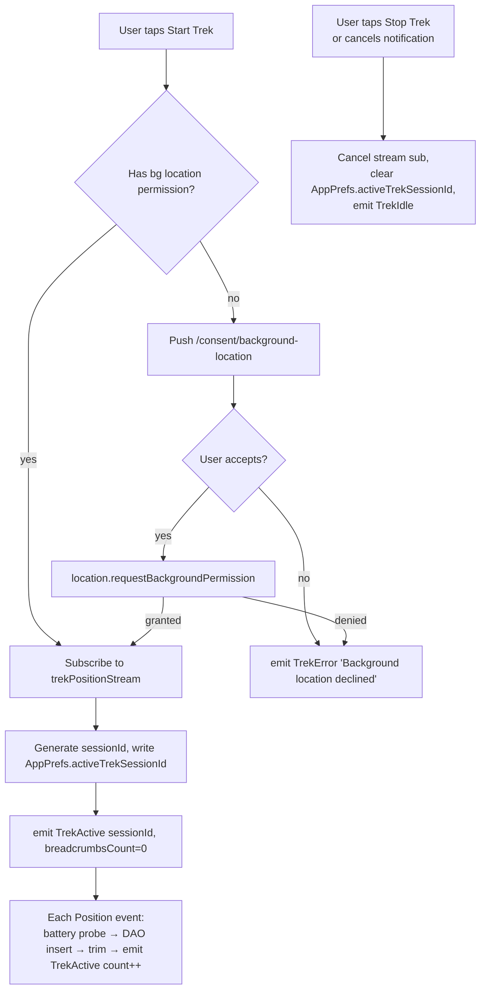
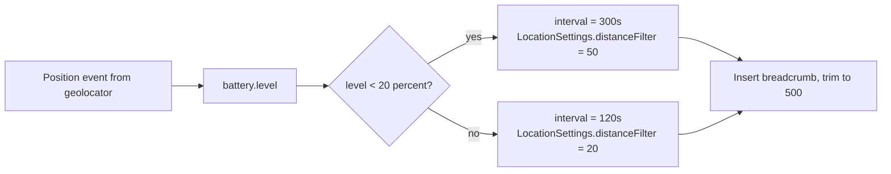
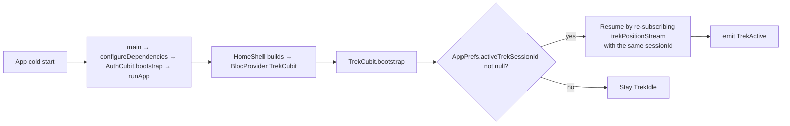

> **Generated by**: /plan | **Model**: Claude Opus 4.7 (1M context) | **Timestamp**: 2026-04-25

# Plan: Offline Maps + SOS — Iteration 5a (Background tracking — Android + Trek session)

## 1. Iteration Context
- **Iteration**: 5a of 5b — **Background tracking foundation (Android + Trek session)**.
- **AC Items**: FR-17 (Trek session Start/Stop, ring buffer, battery-aware cadence), FR-12 final completion (last 50 trek breadcrumbs in SOS payload — was deferred from Iter 4), FR-14 (persistent "Trek active — recording" notification with Cancel), AZ-1 (re-add `ACCESS_BACKGROUND_LOCATION` to manifest), AZ-5 (consent disclosure now gated before bg-permission request), DS-1 (`trek_breadcrumbs` schema first writes — table created in Iter 1), SE-1 (foreground-service notification), SE-2 partial (Android via geolocator's built-in foreground-service config; iOS deferred to 5b).
- **Deferred to Iter 5b**: FR-15 (SOS-active 30s Firestore breadcrumbs), EC-3 (6h client-side timeout), iOS Info.plist `UIBackgroundModes` + parity, EC-2 (sub-5% battery cadence — currently we cap at 5 min @ <20%).
- **Deliverable**:
  - Trek Start/Stop AppBar action on the Map screen.
  - When a trek is active: persistent foreground-service notification "Trek active — recording" with a Cancel action; one breadcrumb every 120 s (or 300 s when battery < 20%) appended to the `trek_breadcrumbs` ring buffer (max 500 rows; oldest trimmed).
  - Trek state survives app restart via `AppPrefs.activeTrekSessionId`.
  - Last 50 trek breadcrumbs are now included in the SOS dispatch payload, completing FR-12.
  - Background-location consent disclosure (Iter 1) is finally wired up: shown the first time a user starts a trek before `LocationService.requestBackgroundPermission` is called.
  - `ACCESS_BACKGROUND_LOCATION` re-added to `AndroidManifest.xml` (Iter 1's H7 review-fix deferred this).
- **Research**: [../research.md](../research.md)
- **Iter 1–4 plans**: [../iteration-1/plan.md](../iteration-1/plan.md), [../iteration-2/plan.md](../iteration-2/plan.md), [../iteration-3/plan.md](../iteration-3/plan.md), [../iteration-4/plan.md](../iteration-4/plan.md)

### Locked decisions (this iteration)

| # | Decision | Choice |
|---|----------|--------|
| 38 | Iter 5 scope | **Split into 5a (this) + 5b** per user answer 2026-04-25. 5a delivers Android-end-to-end Trek session + SOS-payload integration. 5b adds iOS parity, SOS-active Firestore breadcrumbs, and the 6 h timeout. |
| 39 | Background-location strategy | **`geolocator`'s built-in `AndroidSettings.foregroundNotificationConfig`** — no custom Kotlin foreground service. MIT-licensed, no vendor lock-in, much less native code. Iter 1's "custom Kotlin service" decision is superseded. |
| 40 | Trek toggle UX | **AppBar action** on `OfflineMapsPage` — icon-button labelled "Start Trek" / "Stop Trek". Avoids competing with the existing "Download this view" FAB. Already has the offline chip in the same actions slot. |
| 41 | Cadence | **120 s default**, **300 s when battery < 20 %**. Battery is sampled at every emission via `BatteryService.level()`. |
| 42 | Active-trek persistence | New `AppPrefs.activeTrekSessionId` (nullable string). On cold start, if the value is non-null, `TrekCubit.bootstrap()` resumes the foreground service. |
| 43 | Ring buffer trim | Implemented in the DAO: after each insert, `DELETE FROM trek_breadcrumbs WHERE id NOT IN (SELECT id FROM trek_breadcrumbs ORDER BY ts DESC LIMIT 500)`. Single statement, exploits the existing `idx_trek_breadcrumbs_ts_desc` index. |
| 44 | SOS payload integration | Inject `LatestTrekBreadcrumbs(50)` use case into `SosRepositoryImpl.fire`. Each breadcrumb maps to `{ts, lat, lng, accuracy?, altitude?, battery?}` and lands in `sos_alerts.contactsNotified`'s sibling field `trekBreadcrumbs`. Firestore rule unchanged (the field is optional in the payload). |
| 45 | Consent disclosure gating | The Iter 1 `BackgroundLocationDisclosurePage` is **finally used**: `TrekCubit.start()` checks `LocationService.hasBackgroundPermission()` first; if false, navigates to `/consent/background-location`; on Allow, calls `requestBackgroundPermission`; on Skip, surfaces an inline error and aborts. |
| 46 | Notification icon | **Use `@mipmap/ic_launcher` as a temporary fallback** for the foreground-service notification (Android allows it; modern Android prefers a dedicated monochrome `@drawable/ic_notification`, but adding that asset is asset-design work and not blocking). Flag in summary as a polish item for Iter 5b or a separate UX pass. |

---

## 2. Architecture Decision

### Chosen Approach

**Trek lives in its own feature module `lib/features/trek/`** with the standard data/domain/presentation split. The cubit owns a `Stream<Position>` subscription via `LocationService.positionStream` (which forwards `AndroidSettings.foregroundNotificationConfig` so the Android foreground service starts automatically). Each `Position` event triggers a battery probe and a sqflite insert with the ring-buffer trim. State is reflected via a sealed `TrekState` (`TrekIdle`, `TrekActive`, `TrekError`).

The `LocationService` interface gains a new `Stream<Position> trekPositionStream({Duration interval})` method that constructs the Android foreground-service settings. The existing `positionStream` is repurposed for short-lived foreground polling; the new method is for long-running tracking. Both share the same plugin under the hood; they differ only in `LocationSettings.AndroidSettings.foregroundNotificationConfig` being non-null on the trek path.

The SOS-payload integration is a single inject into `SosRepositoryImpl`: a `LatestTrekBreadcrumbs` use case that reads the top 50 rows from `trek_breadcrumbs` and produces a list that gets serialized as part of the alert document. No Firestore rule change — the field is added to the same `sos_alerts/{alertId}` document we already write.

Rationale:
- Geolocator's built-in foreground-service mode is the smallest change that satisfies the AC. The `LocationSettings.AndroidSettings(foregroundNotificationConfig: ...)` shape is documented and tested; we don't need to write Kotlin or maintain a method channel.
- Trek as a feature module mirrors the offline_maps and sos modules; no new architectural pattern.
- The new `trekPositionStream` method on the existing `LocationService` keeps the seam to geolocator in one place — we never touch `Geolocator.getPositionStream` directly outside the service.
- `AppPrefs.activeTrekSessionId` is a single bool/id pref, much simpler than a dedicated `trek_sessions` table.

### Alternatives Considered

1. **Custom Kotlin foreground service + method channel** (Iter 1's locked decision). Rejected: the user explicitly asked for the free alternative, and writing/maintaining a Kotlin service plus a method channel for what geolocator already does is unjustified complexity. Iter 1 decision #2 is hereby superseded by decision #39 above.
2. **`flutter_background_geolocation` (transistorsoft)**. Rejected: paid for production. Battle-tested but adds a license cost and an opaque runtime.
3. **Trek session as a row in a new sqflite table** instead of a single AppPrefs key. Rejected: trek sessions are mutually exclusive (one at a time), and the only metadata we'd track is the start time + id. A single pref is sufficient; we can promote to a table in Iter 5b if multi-session history becomes a feature.

---

## 3. Logic Diagrams

### 3.1 Trek session lifecycle



### 3.2 Cadence selection



(The interval is set on `LocationSettings.AndroidSettings(intervalDuration:)` at stream-creation time. To switch cadence on a battery flip, the cubit cancels and re-subscribes — accepted as a simplification: one battery threshold cross per trek is rare and the re-subscribe is cheap.)

### 3.3 Cold-start resumption



---

## 4. Storage Design

### sqflite — `trek_breadcrumbs` (already created in Iter 1; first writes here)

Iter 1 created the table at schema v1 with:
```sql
CREATE TABLE trek_breadcrumbs (
  id        INTEGER PRIMARY KEY AUTOINCREMENT,
  ts        INTEGER NOT NULL,
  lat       REAL    NOT NULL,
  lng       REAL    NOT NULL,
  accuracy  REAL,
  altitude  REAL,
  battery   INTEGER
);
CREATE INDEX idx_trek_breadcrumbs_ts_desc ON trek_breadcrumbs(ts DESC);
```

This iteration writes via `TrekBreadcrumbsLocalDataSource`. **No schema change.**

A new optional `session_id` column was considered (to associate breadcrumbs with the parent trek session for multi-session history), but the plan does not need it: only one trek can be active at a time, and the SOS payload reads the top-N rows ordered by ts DESC regardless of session. Adding the column would force a sqflite migration. Deferred.

### `AppPrefs` — new key

| Key | Type | Default | Purpose |
|---|---|---|---|
| `active_trek_session_id` | String? | `null` | Holds the UUID of the currently active trek; null when idle. Set on Start, cleared on Stop. Used by `TrekCubit.bootstrap` to resume a session after app restart. |

### Firestore — no change

Iter 4's `sos_alerts/{alertId}` document gains an OPTIONAL `trekBreadcrumbs` field:
```
trekBreadcrumbs: List<Map<String, Object>>  // [{ts, lat, lng, accuracy?, altitude?, battery?}]
```

The `firestore.rules` `keys().hasAll([...])` list does NOT include `trekBreadcrumbs`, and `hasAll` does not enforce equality, so the optional field is accepted unchanged.

### Index Strategy

No new indexes. The existing `idx_trek_breadcrumbs_ts_desc` (Iter 1) handles:
- `LatestTrekBreadcrumbs(50)` query → `ORDER BY ts DESC LIMIT 50`.
- Ring-buffer trim → `id NOT IN (SELECT id FROM trek_breadcrumbs ORDER BY ts DESC LIMIT 500)`.

---

## 5. API Design

No HTTP changes. Dart-level surfaces:

### `LocationService` (extended)

```dart
abstract class LocationService {
  // ... existing methods ...

  /// Long-running background-friendly position stream. On Android,
  /// invoking this starts a foreground service via the geolocator
  /// plugin; on iOS, it requires `UIBackgroundModes: location` (added
  /// in Iter 5b).
  Stream<Position> trekPositionStream({
    required Duration interval,
    required String notificationTitle,
    required String notificationBody,
  });
}
```

### `TrekRepository`

```dart
abstract class TrekRepository {
  /// Starts a new trek session. Returns the session id, or a Failure
  /// if background-location permission is missing or recently denied.
  Future<Result<String>> start();

  /// Stops the active session and persists final state.
  Future<Result<void>> stop();

  /// Emits the active session id (or null) on every change.
  Stream<String?> watchActiveSessionId();

  /// Stream of breadcrumb count for live UI feedback.
  Stream<int> watchBreadcrumbCount();

  /// Used by the SOS dispatch path to attach the most recent trail.
  Future<List<Breadcrumb>> latest({int limit = 50});
}
```

### `TrekCubit`

```dart
sealed class TrekState {
  final bool hasBackgroundPermission;
}

class TrekIdle extends TrekState { ... }
class TrekActive extends TrekState {
  final String sessionId;
  final int breadcrumbCount;
}
class TrekError extends TrekState {
  final String message;
}

class TrekCubit extends Cubit<TrekState> {
  Future<void> bootstrap();              // resumes if AppPrefs has an id
  Future<void> start(BuildContext ctx);  // gates on consent disclosure + bg-perm request
  Future<void> stop();
}
```

### `LatestTrekBreadcrumbs` use case

```dart
class LatestTrekBreadcrumbs {
  Future<List<Breadcrumb>> call({int limit = 50});
}
```

Injected into `SosRepositoryImpl` so `fire()` includes the latest 50 breadcrumbs in the alert payload.

### Routes

No new routes. The existing `/consent/background-location` (Iter 1) is finally consumed.

### `AppPrefs` (extended)

```dart
String? getActiveTrekSessionId();
Future<void> setActiveTrekSessionId(String? id);
```

### Platform — Android manifest

Re-add **`<uses-permission android:name="android.permission.ACCESS_BACKGROUND_LOCATION"/>`** (removed in Iter 1's H7 fix). The Play Console "Location Permissions Declaration Form" must be filled before any release upload — flag in the summary.

---

## 6. Code Changes

### Files to Create

#### Domain — entities
- `lib/features/trek/domain/entities/breadcrumb.dart` — Equatable (`ts`, `lat`, `lng`, `accuracy?`, `altitude?`, `battery?`).
- `lib/features/trek/domain/entities/trek_session.dart` — Equatable (`id`, `startedAt`).

#### Domain — repositories + usecases
- `lib/features/trek/domain/repositories/trek_repository.dart`
- `lib/features/trek/domain/usecases/start_trek.dart`
- `lib/features/trek/domain/usecases/stop_trek.dart`
- `lib/features/trek/domain/usecases/watch_active_session.dart`
- `lib/features/trek/domain/usecases/watch_breadcrumb_count.dart`
- `lib/features/trek/domain/usecases/latest_trek_breadcrumbs.dart` — used by the SOS dispatch path.

#### Data
- `lib/features/trek/data/datasources/trek_breadcrumbs_local_data_source.dart` — abstract + sqflite impl. `insert(Breadcrumb)` runs the ring-buffer trim. `latest({limit})` selects top-N. `count()` returns row count. `clear()` truncates (used on logout / dev tools).
- `lib/features/trek/data/repositories/trek_repository_impl.dart` — orchestrates `LocationService.trekPositionStream` + `BatteryService.level()` + DAO + `AppPrefs`.
- `lib/features/trek/data/models/breadcrumb_model.dart` — `fromRow` / `toRow` / `toJson` (the JSON form is what lands in the SOS Firestore payload).

#### Presentation
- `lib/features/trek/presentation/cubit/trek_state.dart` — sealed.
- `lib/features/trek/presentation/cubit/trek_cubit.dart`
- `lib/features/trek/presentation/view/widgets/trek_toggle_button.dart` — AppBar icon button. Renders different label/icon based on `TrekState`.

#### DI
- `lib/features/trek/di/trek_module.dart` — `void registerTrekModule(GetIt)` registering DAO, repository, 5 use cases, lazy-singleton `TrekCubit` (singleton because trek state must outlive map-tab rebuilds and survive cold-start resumption).

#### Tests
- `test/unit/features/trek/data/breadcrumb_model_test.dart` — round-trip + JSON serialization.
- `test/unit/features/trek/data/trek_breadcrumbs_local_data_source_test.dart` — insert + trim to 500 + latest(N) + count.
- `test/unit/features/trek/data/trek_repository_impl_test.dart` — start/stop, ring-buffer behaviour, cadence flip (battery < 20 %), permission-denied path.
- `test/unit/features/trek/presentation/trek_cubit_test.dart` — bootstrap idle + bootstrap resume, start happy + permission-denied + consent-skipped, stop, breadcrumb-count emissions.
- `test/widget/features/trek/trek_toggle_button_test.dart` — renders Start/Stop based on state; tap dispatches the right cubit method.

### Files to Modify

#### Core service
- `lib/core/services/location_service.dart` — add `trekPositionStream({interval, notificationTitle, notificationBody})`. The Android impl uses `AndroidSettings(foregroundNotificationConfig: ForegroundNotificationConfig(notificationText: ..., notificationTitle: ..., enableWakeLock: true), intervalDuration: interval)`. Update the abstract interface + the test fake.

#### Manifest
- `android/app/src/main/AndroidManifest.xml` — re-add `<uses-permission android:name="android.permission.ACCESS_BACKGROUND_LOCATION"/>`.

#### App prefs
- `lib/core/storage/app_prefs.dart` — add `getActiveTrekSessionId` / `setActiveTrekSessionId`.

#### DI
- `lib/core/di/injector.dart` — `+ registerTrekModule(getIt)` after `registerSosModule`.

#### SOS integration
- `lib/features/sos/data/repositories/sos_repository_impl.dart` — accept an optional `LatestTrekBreadcrumbs` dep; in `fire()`, await the use case and include the result in the alert payload.
- `lib/features/sos/domain/entities/sos_alert.dart` — add `final List<Breadcrumb> trekBreadcrumbs` field (default empty).
- `lib/features/sos/data/models/sos_alert_model.dart` — `toMap` / `toJson` include `trekBreadcrumbs` when non-empty.
- `lib/features/sos/di/sos_module.dart` — pass `getIt<LatestTrekBreadcrumbs>()` into `SosRepositoryImpl`.

#### UI
- `lib/features/offline_maps/presentation/view/offline_maps_page.dart` — add `TrekToggleButton` to `AppBar.actions` (after the `OfflineBadge`). Wrap the page in a `BlocProvider<TrekCubit>.value(value: getIt<TrekCubit>())` so the button can talk to the singleton.

#### `BackgroundLocationDisclosurePage` integration
- The page already exists from Iter 1. No code change. `TrekCubit.start(BuildContext ctx)` calls `context.push(Routes.backgroundLocationConsent)` and awaits the boolean result via the existing `Navigator.pop<bool>(...)` semantics.

#### Tests
- `test/unit/core/services/location_service_test.dart` — extend with a happy-path assertion that `trekPositionStream` builds `AndroidSettings` with `foregroundNotificationConfig != null`.
- `test/unit/features/sos/data/sos_repository_impl_test.dart` — extend the happy-path test with a stubbed `LatestTrekBreadcrumbs` and assert the breadcrumbs appear in the alert.

---

## 7. Edge Cases & Error Handling

1. **User starts a trek, then revokes background-location from system settings** — geolocator's stream errors. `TrekCubit` catches via the stream's `onError`, emits `TrekError('Background permission revoked')`, clears `AppPrefs.activeTrekSessionId`, dismisses the foreground-service notification.
2. **Battery probe throws** — `BatteryService.level()` returns null on failure (Iter 1 contract). The cubit treats null as ≥ 20 % and uses the 120 s cadence.
3. **Cold-start resume but bg permission revoked while app was killed** — `TrekCubit.bootstrap()` checks `LocationService.hasBackgroundPermission()` first; if false, clears the pref and emits `TrekIdle`. No silent re-subscription with stale permissions.
4. **Cadence flip (battery crosses 20 % threshold)** — cubit cancels the current stream sub and re-subscribes with the new interval. Worst case is a single missed breadcrumb during the swap; acceptable.
5. **User taps the foreground-service notification's Cancel action** — geolocator's `ForegroundNotificationConfig` doesn't expose this directly. Workaround: when the user taps the in-app Stop Trek toggle, we cancel the stream which dismisses the notification. The notification's "Cancel" action (if present) only dismisses the notification; geolocator restarts the service on the next position event. Documented limitation; in-app Stop is the canonical path.
6. **Trek active during SOS dispatch** — both flows can be live at once. `SosRepositoryImpl.fire` reads `LatestTrekBreadcrumbs(50)` regardless of trek state; if the trek isn't running, the result is the most recent 50 breadcrumbs from any prior trek (or empty).
7. **App killed mid-breadcrumb-write** — sqflite writes are auto-committed. Worst case is one in-flight breadcrumb lost; the ring buffer is unaffected.
8. **AppPrefs write failure** — `start()` writes the session id before subscribing to the stream. If the pref write fails, the session is not started (returns `Failure(UnknownError)` to the cubit).
9. **Multiple TrekCubit constructions** — the cubit is a lazy singleton (`getIt.registerLazySingleton<TrekCubit>` with `dispose: (c) => c.close()` per Iter 4's H1 fix). Defensive: `bootstrap()` is idempotent (no-op if already `TrekActive`).
10. **Location stream pauses due to OS Doze** — geolocator's foreground service should keep the app alive on Doze. If it doesn't, breadcrumbs gap silently and the ring buffer just contains fewer entries. Acceptable for Iter 5a; deeper Doze tolerance is a 5b polish item.
11. **iOS user taps Start Trek** — until 5b adds `UIBackgroundModes: location`, the foreground-service config is Android-only; on iOS the stream still emits foreground positions but stops when the app backgrounds. UI does NOT distinguish; the cubit still emits `TrekActive` and breadcrumbs are recorded only while the user has the app open. Documented as the iOS gap until 5b.

---

## 8. Security Considerations

- **Background-location permission** — `LocationService.requestBackgroundPermission` already enforces foreground-first (Iter 1). The consent disclosure is now actually shown; this satisfies AZ-5 (Play Store policy) for the first time.
- **Foreground-service notification** — text is hard-coded ("Trek active — recording", "Tap to open Mountain Explorer"). No user input flows in. No PII in the notification.
- **Breadcrumb data at rest** — `trek_breadcrumbs` is plaintext sqflite under the app sandbox path. Same threat model as the Iter 4 `sos_outbox`. Flag (do not enable `android:allowBackup` for release; same advisory).
- **SOS payload extension** — `trekBreadcrumbs` field added to `sos_alerts/{alertId}`. Firestore rules `keys().hasAll([...])` does not require this field but does NOT explicitly disallow it either; rules accept the extra field. The owner-only read/update rules from Iter 4 still apply.
- **Manifest re-addition of `ACCESS_BACKGROUND_LOCATION`** — triggers Play Console's "Location Permissions Declaration Form" for every release. **Document this as a release-blocker.**
- **No new Firestore rules**.

---

## 9. TDD Test Strategy

### Phase 1 Tests — entities + DAO
**Unit**:
- `breadcrumb_model_test.dart` — toRow / fromRow round-trip (with and without optional fields); toJson omits null fields; fromRow tolerates older row shapes.
- `trek_breadcrumbs_local_data_source_test.dart`:
  - `insert` after 500 rows trims oldest by `ts`.
  - `latest(50)` returns rows in DESC ts order.
  - `count()` matches inserted row count.
  - `clear()` removes all.

### Phase 2 Tests — repository
**Unit**:
- `trek_repository_impl_test.dart`:
  - `start` writes the session id to AppPrefs and subscribes to `trekPositionStream` with `interval = 120s` (no battery dip yet).
  - `start` re-subscribes with `interval = 300s` after a battery emission < 20 %.
  - `stop` cancels the subscription, clears AppPrefs, emits null on `watchActiveSessionId`.
  - `start` when `LocationService.hasBackgroundPermission` is false → returns `Failure(PermissionError)`; nothing written.
  - `latest(N)` delegates to DAO.
  - Position stream errors are caught and surfaced via `Failure`.

### Phase 3 Tests — cubit
**Unit (`bloc_test`)**:
- `bootstrap` with no active session → `TrekIdle`.
- `bootstrap` with active session id → `TrekActive(sessionId, count: …)`.
- `start` happy path with bg permission already granted → `TrekActive`.
- `start` without bg permission → consent flow (mocked NavigatorObserver), Allow → `TrekActive`; Skip → `TrekError('Background location declined')`.
- `stop` → `TrekIdle`.
- Permission revoked mid-trek → `TrekError`.

### Phase 4 Tests — widgets
**Widget**:
- `trek_toggle_button_test.dart`:
  - State `TrekIdle` → label "Start Trek", tap dispatches `start`.
  - State `TrekActive` → label "Stop Trek", tap dispatches `stop`.
  - State `TrekError` → label still "Start Trek" (error is surfaced via SnackBar from the page, not the button).

### Phase 5 — SOS payload integration
**Unit**:
- `sos_repository_impl_test.dart` (extend) — happy path includes 50 breadcrumbs in the alert; with no breadcrumbs, the field is empty.

---

## 10. Implementation Phases

### Phase 1: Entities + DAO + manifest

**Tests first**:
- `breadcrumb_model_test.dart`
- `trek_breadcrumbs_local_data_source_test.dart`

**Then implement**:
1. Re-add `ACCESS_BACKGROUND_LOCATION` to `android/app/src/main/AndroidManifest.xml`.
2. Add `getActiveTrekSessionId` / `setActiveTrekSessionId` to `lib/core/storage/app_prefs.dart` + extend its test.
3. Create entities (`Breadcrumb`, `TrekSession`).
4. Create `BreadcrumbModel` (toRow/fromRow/toJson).
5. Create `TrekBreadcrumbsLocalDataSource` abstract + sqflite impl with ring-buffer trim.
6. Phase 1 tests green.

### Phase 2: LocationService extension + Repository

**Tests first**:
- Extend `location_service_test.dart` to assert `trekPositionStream` builds `AndroidSettings(foregroundNotificationConfig: not null)`.
- `trek_repository_impl_test.dart`.

**Then implement**:
1. Extend `LocationService` interface + `GeolocatorLocationService` impl with `trekPositionStream`.
2. Update the test seam fake.
3. Create `TrekRepository` abstract.
4. Create `TrekRepositoryImpl` (start/stop, cadence flip, ring-buffer write, AppPrefs sync, error mapping).
5. Create 5 use cases (start, stop, watchActiveSession, watchBreadcrumbCount, latestTrekBreadcrumbs).
6. Phase 2 tests green.

### Phase 3: Cubit + DI

**Tests first**:
- `trek_cubit_test.dart`.

**Then implement**:
1. `TrekState` sealed hierarchy.
2. `TrekCubit` (bootstrap, start, stop, error handling, consent flow).
3. `lib/features/trek/di/trek_module.dart`.
4. Wire `registerTrekModule(getIt)` in `injector.dart`.
5. Phase 3 tests green.

### Phase 4: UI integration

**Tests first**:
- `trek_toggle_button_test.dart`.

**Then implement**:
1. Create `TrekToggleButton`.
2. Modify `OfflineMapsPage`:
   - Wrap in `BlocProvider<TrekCubit>.value(value: getIt<TrekCubit>())`.
   - Add `TrekToggleButton` to `AppBar.actions` after `OfflineBadge`.
3. Phase 4 tests green.

### Phase 5: SOS payload integration

**Tests first**:
- Extend `sos_repository_impl_test.dart` with breadcrumbs-injection assertions.

**Then implement**:
1. Add `final List<Breadcrumb> trekBreadcrumbs` to `SosAlert`.
2. Extend `SosAlertModel.toMap` + `toJson` to include the field when non-empty.
3. Modify `SosRepositoryImpl` ctor to accept `LatestTrekBreadcrumbs` and call it in `fire()` before building the alert.
4. Update `sos_module.dart` to pass the use case.
5. Phase 5 tests green.

### Phase 6: Smoke + analyze

1. `flutter test` — full suite green.
2. `flutter analyze` — no new warnings.
3. Manual smoke (Android, with `.env` populated):
   - First trek: tap Start Trek → consent screen appears (Iter 1 page) → Allow → bg permission prompt → grant → persistent notification shows → walk around → see breadcrumbs accumulate (in-app counter) → Stop Trek → notification dismissed.
   - Restart app → Start Trek without re-granting (perm already granted) → cubit jumps straight to `TrekActive`.
   - Battery < 20 %: simulate via `adb shell dumpsys battery set level 15` → cadence flips to 300 s.
   - SOS dispatch while trek active: open Mountains tab → tap SOS FAB → verify Firestore alert document contains `trekBreadcrumbs` with up to 50 entries.
   - Cold-start with active trek: kill app → relaunch → AppBar reads "Stop Trek".
4. **iOS smoke is deferred** to Iter 5b (after `flutterfire configure` + `UIBackgroundModes` Info.plist addition).

---

## 11. Reference Files

- [lib/core/services/location_service.dart](../../../lib/core/services/location_service.dart) — extend, mirror existing `positionStream` shape.
- [lib/core/services/battery_service.dart](../../../lib/core/services/battery_service.dart) — `level()` is the cadence input.
- [lib/core/storage/local_db.dart](../../../lib/core/storage/local_db.dart) — `getIt<LocalDb>().db` for DAO.
- [lib/core/consent/background_location_disclosure_page.dart](../../../lib/core/consent/background_location_disclosure_page.dart) — finally consumed.
- [lib/features/sos/data/repositories/sos_repository_impl.dart](../../../lib/features/sos/data/repositories/sos_repository_impl.dart) — extension point in `fire()`.
- [lib/features/sos/data/models/sos_alert_model.dart](../../../lib/features/sos/data/models/sos_alert_model.dart) — payload schema.
- [lib/features/offline_maps/presentation/view/offline_maps_page.dart](../../../lib/features/offline_maps/presentation/view/offline_maps_page.dart) — AppBar host.
- [lib/features/offline_maps/data/repositories/offline_maps_repository_impl.dart](../../../lib/features/offline_maps/data/repositories/offline_maps_repository_impl.dart) — error-mapping pattern to mirror.
- [lib/features/offline_maps/presentation/cubit/offline_maps_cubit.dart](../../../lib/features/offline_maps/presentation/cubit/offline_maps_cubit.dart) — sealed-state + stream-subscription pattern.

---

## 12. TODO Checklist

### Implementation

**Phase 1 — Entities + DAO + manifest**
- [ ] Phase 1: Re-add `ACCESS_BACKGROUND_LOCATION` to `AndroidManifest.xml`.
- [ ] Phase 1: Add `activeTrekSessionId` getter/setter to `AppPrefs` + tests.
- [ ] Phase 1: Create `Breadcrumb`, `TrekSession` entities.
- [ ] Phase 1: Create `BreadcrumbModel`.
- [ ] Phase 1: Create `TrekBreadcrumbsLocalDataSource` abstract + sqflite impl with ring-buffer trim.
- [ ] Phase 1: Phase 1 tests green.

**Phase 2 — LocationService + Repository**
- [ ] Phase 2: Extend `LocationService` with `trekPositionStream` (impl + test seam fake).
- [ ] Phase 2: Create `TrekRepository` abstract + impl with cadence flip.
- [ ] Phase 2: Create 5 use cases.
- [ ] Phase 2: Phase 2 tests green.

**Phase 3 — Cubit + DI**
- [ ] Phase 3: Create `TrekState` sealed.
- [ ] Phase 3: Create `TrekCubit` (bootstrap, start, stop, consent flow).
- [ ] Phase 3: Create `trek_module.dart` + register in `injector.dart`.
- [ ] Phase 3: Phase 3 tests green.

**Phase 4 — UI**
- [ ] Phase 4: Create `TrekToggleButton` + test.
- [ ] Phase 4: Modify `OfflineMapsPage` to host the button + the cubit provider.
- [ ] Phase 4: Phase 4 tests green.

**Phase 5 — SOS payload integration**
- [ ] Phase 5: Add `trekBreadcrumbs` field to `SosAlert` + model.
- [ ] Phase 5: Modify `SosRepositoryImpl` ctor + `fire()`.
- [ ] Phase 5: Update `sos_module.dart`.
- [ ] Phase 5: Phase 5 tests green.

**Phase 6 — Smoke + analyze**
- [ ] Phase 6: `flutter test` full suite green.
- [ ] Phase 6: `flutter analyze` clean.
- [ ] Phase 6: Manual smoke per §10 Phase 6 (Android only; iOS in 5b).
- [ ] Phase 6: Document Play Console "Location Permissions Declaration Form" as a release-blocker.

### Verification
- [ ] Targeted: `flutter test test/unit/features/trek/ test/widget/features/trek/`.
- [ ] Full: `flutter test`.
- [ ] `flutter analyze` clean.
- [ ] Android manual smoke (live device).
- [ ] iOS smoke deferred to Iter 5b.
