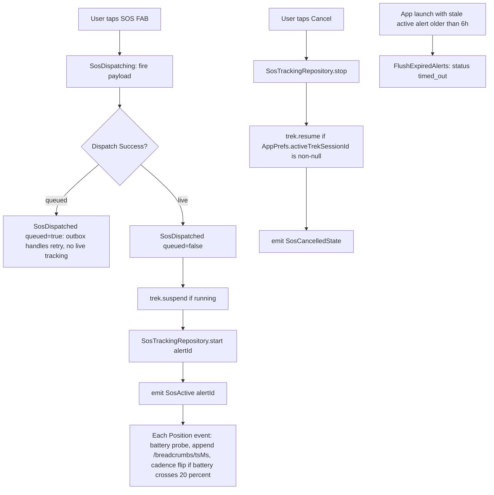
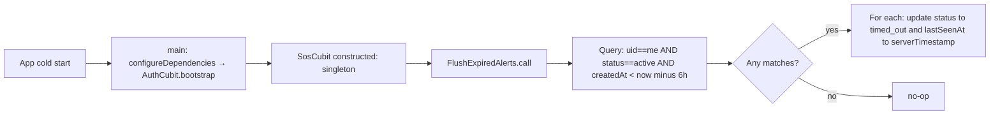
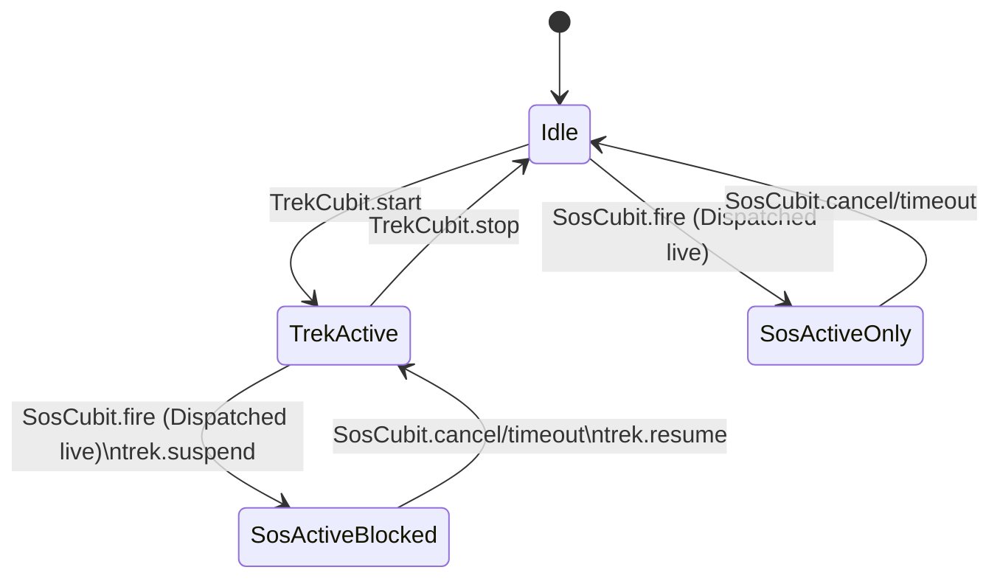

> **Generated by**: /plan | **Model**: Claude Opus 4.7 (1M context) | **Timestamp**: 2026-04-25

# Plan: Offline Maps + SOS — Iteration 5b (iOS parity + live SOS streaming + 6h timeout)

## 1. Iteration Context

- **Iteration**: 5b of 5b (final). Iter 5a covered Android trek + last-50-crumb piggyback; 5b closes out the original Iter-5 AC.
- **AC Items**:
  - **FR-14** (iOS) — lift the iOS fail-closed gate in `TrekCubit`; trek runs on iOS.
  - **FR-15** — during active SOS, write a breadcrumb every 30s (120s when battery < 20%) to `sos_alerts/{alertId}/breadcrumbs/{ts}`.
  - **API-2** — Firestore subcollection `sos_alerts/{alertId}/breadcrumbs/{id}` with fields `{ts, lat, lng, accuracy?, altitude?, battery?}`.
  - **AZ-2** (iOS) — `Info.plist` adds `UIBackgroundModes: [location]` and confirms purpose strings.
  - **AZ-3** (subcollection rules) — Firestore rules extended for the new subcollection (owner-only via `get(...).data.uid == request.auth.uid`).
  - **EC-2** — sub-5%-battery cap (carryover) — addressed by reusing the trek cadence policy on the SOS path (30s/120s).
  - **EC-3** — 6-hour client-side timeout: on app launch, flip status to `timed_out` for the user's still-`active` alerts older than 6h.
  - **SE-2** (iOS) — iOS Background-Modes location enabled; `AndroidSettings`/`AppleSettings` parity verified end-to-end.
- **Out of scope** (deferred or already covered):
  - **SE-1** (`flutter_local_notifications` foreground-service channel + Cancel action) is NOT needed for 5b. Decision #4 below: rely on geolocator's built-in `ForegroundNotificationConfig` and the user's "Tap-to-open only" answer. `flutter_local_notifications` stays in pubspec, unused.
  - HIGH/MEDIUM carryovers logged in [iterations.md](../iterations.md) (outbox plaintext, GDPR erasure, MapTiler key restriction, etc.) are release-hardening, not behavioral AC.
- **Deliverable**:
  - iOS Firebase config regenerated (manual `flutterfire configure` prereq).
  - iOS `Info.plist` declares `UIBackgroundModes: location`; trek + SOS-active streams work in the iOS background.
  - `TrekCubit` no longer fail-closes on iOS.
  - SOS dispatch transitions into a new `SosActive` state that opens a 30s/120s position stream and appends each fix to the Firestore subcollection.
  - The active SOS subscription **suspends** any running Trek session for the duration (mutually exclusive coordination); Trek auto-resumes on cancel/timeout.
  - On every app launch, the user's still-`active` alerts older than 6h are flipped to `timed_out`.
  - Firestore rules extended for the breadcrumbs subcollection (owner-only, shape-validated).
  - Targeted unit + bloc tests cover the new flows; iOS smoke plan documented (no automated iOS tests in CI).
- **Research**: [../research.md](../research.md)
- **Iter 5a plan** (split-source): [../iteration-5/plan.md](../iteration-5/plan.md)

### Locked decisions (this iteration)

| # | Decision | Choice |
|---|----------|--------|
| 47 | Trek + SOS coexistence | **Mutually exclusive.** SOS-active suspends Trek's geolocator subscription for the duration. On cancel/timeout, Trek auto-resumes if `AppPrefs.activeTrekSessionId` is still set. One geolocator stream live at a time, one foreground-service notification at a time. (User answer 2026-04-25.) |
| 48 | iOS Firebase config | **Manual prerequisite.** Plan documents the exact `flutterfire configure` command and the post-run verification. /deliver does not attempt to run it. (User answer 2026-04-25.) |
| 49 | 6h timeout enforcement | **Cold-start scan only.** On every `SosCubit` construction (after auth UID is available), query Firestore for the user's `status == 'active'` alerts older than 6h and flip them to `timed_out`. No live in-app Timer. (User answer 2026-04-25.) |
| 50 | Persistent SOS notification | **Tap-to-open only.** Reuse geolocator's `ForegroundNotificationConfig` for the SOS path with title "SOS active — tracking" and the body "Tap to open Mountain Explorer". No action buttons → no `flutter_local_notifications` wiring needed in 5b. (User answer 2026-04-25.) |
| 51 | Breadcrumb document ID strategy | Use the **epoch-millisecond timestamp as the doc ID** for `sos_alerts/{alertId}/breadcrumbs/{tsMs}`. Matches the research notation literally. Sortable by ID. Collision risk on the 30s cadence is non-existent. |
| 52 | Live tracking lifecycle owner | New **`SosTrackingRepository`** in `lib/features/sos/data/repositories/`, separate from `SosRepository` (dispatch). Cubit holds both; subscription state and battery-cadence flips live in the tracking repo, not the cubit, mirroring the trek-side split. |
| 53 | Suspend / resume mechanism | New methods **`TrekRepository.suspend()`** + **`TrekRepository.resume()`**. `suspend()` cancels the position subscription but **leaves `activeTrekSessionId` in AppPrefs intact**, so `resume()` (and the existing cold-start path) restart the same session id. `TrekCubit` does not need changes — the repo coordinates with itself via its existing internal state. |
| 54 | iOS consent copy | Same disclosure page text, **with one Platform-aware sentence appended on iOS**: "iOS will show its own location prompt next; choose 'Allow While Using App' first, then on the second prompt choose 'Allow Always'." Plain Dart `Platform.isIOS` branch — no UX redesign. |
| 55 | Subcollection rules pattern | Use `get(/databases/$(database)/documents/sos_alerts/$(alertId)).data.uid == request.auth.uid` so subcollection writes are gated by the parent alert's owner. Single Firestore read per write — acceptable tax (1 read amortized over many breadcrumb writes per alert). |
| 56 | Subcollection field validation | Rule enforces `keys().hasOnly(['ts','lat','lng','accuracy','altitude','battery'])` plus `keys().hasAll(['ts','lat','lng'])`. Same shape the breadcrumb-attach payload uses in 5a. |

---

## 2. Architecture Decision

### Chosen Approach

The 5b workload splits into **four independent surfaces** that share the existing Iter 5a substrate:

1. **iOS native enablement (config-only).** Add `UIBackgroundModes: location` to `Info.plist`, regenerate Firebase config via the user's manual `flutterfire configure`, and remove the `Platform.isIOS` early return in `TrekCubit`. No Dart logic changes beyond deleting the gate. iOS smoke is manual (matches Iter 5a's Android-only convention — there is no iOS CI runner in this repo).

2. **Mutually-exclusive tracking coordination.** Add `suspend()`/`resume()` to `TrekRepository`. The new `SosTrackingRepository` calls `_trek.suspend()` before opening its own position subscription and `_trek.resume()` after closing. This is the single integration point — neither cubit needs to know about the other.

3. **Live SOS-active breadcrumb streaming.** A new `SosTrackingRepository` opens a 30s/120s position stream via the existing `LocationService.trekPositionStream` (same API used by trek; only the cadence and notification text differ). Each fix is appended to `sos_alerts/{alertId}/breadcrumbs/{tsMs}` via a new `SosBreadcrumbsRemoteDataSource`. `SosCubit`'s state machine grows a `SosActive(alertId)` state between `SosDispatched` and `SosCancelled`/`SosTimedOut`.

4. **6h timeout flush.** A new `FlushExpiredAlerts` use case runs once per `SosCubit` construction (the cubit is a singleton, so this is once per app launch). It queries `sos_alerts where uid == me && status == 'active' && createdAt < (now - 6h)` and updates each match to `status: 'timed_out'`. Firestore-only operation; no local state.

### Why this shape (rationale)

- **Trek + SOS are mutually exclusive on the radio**, not in the data layer. There is exactly one geolocator subscription owned by exactly one repo at a time. The repo holding the subscription owns the foreground-service notification text.
- **Reusing `LocationService.trekPositionStream`** for SOS-active (with different `interval`/`notificationTitle`/`notificationBody`) means no new `LocationService` method. Plumbing already supports both Android and iOS settings; only the strings differ.
- **`SosTrackingRepository` separate from `SosRepository`** keeps the dispatch path (which is short-lived, fire-and-forget) separate from the tracking path (which is long-running, stateful, and platform-bound). Same pattern as the iter 4 separation between `SosRepository` and `SosOutboxRepository`.
- **Cold-start scan only** for 6h timeout matches the research wording and the typical SOS use case (the user opens the app within hours of an alert). A live in-app Timer would add complexity for a corner case.
- **Tap-to-open notification** lets us keep using geolocator's built-in `ForegroundNotificationConfig` with no `flutter_local_notifications` plumbing. The notification title varies by tracking mode ("SOS active — tracking" vs "Trek active — recording"); the body is "Tap to open Mountain Explorer" in both cases.

### Alternatives Considered

1. **Concurrent Trek + SOS subscriptions.** Rejected: geolocator's foreground service is a single-shot per-app abstraction, and running two Android foreground services (or two `LocationManager` listeners on iOS) is asking for plugin-level race conditions plus a double-notification UX. Mutual exclusion costs one extra method on `TrekRepository` and is trivially testable.
2. **Tracking coordinator service** as a new core layer that owns the single geolocator stream and multiplexes between trek and SOS modes. Rejected: a third architectural layer for a 5-line wrapper, and harder to test in isolation. The two-method `suspend()`/`resume()` API on `TrekRepository` is enough.
3. **Live in-app Timer for 6h timeout** alongside the cold-start scan. Rejected: the Timer fires only when the app is open, but if the app is open the user can also tap Cancel — so the Timer adds nothing the user can't already do. Cold-start is the only real escape hatch.
4. **`flutter_local_notifications` for the SOS-active channel.** Rejected: with no Cancel action button, the geolocator-managed notification is functionally equivalent. Saves a top-level `onDidReceiveBackgroundNotificationResponse` static handler, an isolate callback registry, and one new core service. `flutter_local_notifications` stays in pubspec for any future channel work.

---

## 3. Logic Diagrams

### 3.1 SOS dispatch → live tracking → cancel/timeout



### 3.2 6h timeout flush (cold-start)



### 3.3 Trek + SOS coexistence (state-of-the-radio)



---

## 4. Storage Design

### Firestore — `sos_alerts/{alertId}/breadcrumbs/{tsMs}`

| Field | Type | Required | Notes |
|---|---|---|---|
| `ts` | `int` (epoch ms) | yes | Same value as the document id, kept as a queryable field. |
| `lat` | `double` | yes | Decimal degrees. |
| `lng` | `double` | yes | Decimal degrees. |
| `accuracy` | `double?` | no | Meters; omitted when null. |
| `altitude` | `double?` | no | Meters; omitted when null. |
| `battery` | `int?` | no | 0–100; omitted when null. |

**Document id**: zero-padded epoch ms as a string (e.g. `"1745568123456"`). Doc ids sort lexicographically; numeric ms strings sort correctly without padding because they're all 13 chars in this century.

### Firestore rules — new subcollection block

```
match /sos_alerts/{alertId}/breadcrumbs/{breadcrumbId} {
  allow read: if request.auth != null
           && get(/databases/$(database)/documents/sos_alerts/$(alertId))
                .data.uid == request.auth.uid;
  allow create: if request.auth != null
             && get(/databases/$(database)/documents/sos_alerts/$(alertId))
                  .data.uid == request.auth.uid
             && request.resource.data.keys().hasOnly(
                  ['ts','lat','lng','accuracy','altitude','battery'])
             && request.resource.data.keys().hasAll(['ts','lat','lng'])
             && request.resource.data.ts is int
             && request.resource.data.lat is number
             && request.resource.data.lng is number;
  allow update, delete: if false;
}
```

Each breadcrumb write does one `get(...)` of the parent alert. At 30s cadence over a 6h alert that's ≤ 720 reads — well within free tier and acceptable for SOS critical-path billing.

### sqflite — no schema changes.

### `AppPrefs` — no new keys.

### Index Strategy

No new indexes. The existing `idx_trek_breadcrumbs_ts_desc` (Iter 1) is unaffected. Firestore subcollection queries are by document id (which is `ts`) — Firestore handles automatically.

---

## 5. API Design

No HTTP API. Dart-level surfaces:

### `TrekRepository` (extended)

```dart
abstract class TrekRepository {
  // ... existing (start, stop, watchActiveSessionId, watchBreadcrumbCount, latest)

  /// Cancels the position subscription and dismisses the foreground-service
  /// notification, but leaves AppPrefs.activeTrekSessionId intact so a
  /// later resume() picks up the same session id. Idempotent — calling
  /// suspend() while already suspended is a no-op.
  Future<void> suspend();

  /// Re-subscribes the position stream if AppPrefs.activeTrekSessionId is
  /// non-null. No-op otherwise. Idempotent.
  Future<void> resume();
}
```

### `SosTrackingRepository` (new)

```dart
abstract class SosTrackingRepository {
  /// Opens a 30s (120s when battery < 20%) position subscription and
  /// appends each fix to sos_alerts/{alertId}/breadcrumbs/{tsMs}. Calls
  /// trek.suspend() before opening. Idempotent — second start with the
  /// same alertId is a no-op.
  Future<Result<void>> start(String alertId);

  /// Cancels the subscription and calls trek.resume(). Idempotent.
  Future<Result<void>> stop();

  /// Emits the current alertId being tracked, or null when idle.
  Stream<String?> watchActiveAlertId();
}
```

### `SosBreadcrumbsRemoteDataSource` (new)

```dart
abstract class SosBreadcrumbsRemoteDataSource {
  /// Appends a single breadcrumb to sos_alerts/{alertId}/breadcrumbs/{ts}.
  /// Document id is the breadcrumb's ts (epoch ms) so writes are
  /// idempotent on retry.
  Future<void> append(String alertId, Breadcrumb crumb);
}
```

### `FlushExpiredAlerts` use case (new)

```dart
class FlushExpiredAlerts {
  Future<Result<int>> call(String uid, {Duration ttl = const Duration(hours: 6)});
  // Returns the count of alerts updated to timed_out.
}
```

### `SosState` (extended)

```dart
sealed class SosState extends Equatable { /* unchanged base */ }

// existing: SosIdle, SosCountdown, SosDispatching, SosDispatched,
//           SosCancelledState, SosError

class SosActive extends SosState {
  final String alertId;
  final int breadcrumbsSent;          // local-only counter for UI
  final bool batteryLow;              // true when last battery probe < 20%
  // ...
}

class SosTimedOut extends SosState {
  final String alertId;
  // ...
}
```

`SosDispatched` becomes a transient state (re-emitted as `SosActive` immediately after the live tracking starts). `SosTimedOut` is emitted only when a live in-app SOS hits the 6h boundary while the app is open — but since 5b has no live timer (decision #49), `SosTimedOut` is **only emitted at cold start**, scoped to the cubit's bootstrap.

### Routes — no change.

### Native — `Info.plist` (iOS)

Add inside the existing `<dict>`:

```xml
<key>UIBackgroundModes</key>
<array>
  <string>location</string>
</array>
```

Remove the deferred-comment.

---

## 6. Code Changes

### Files to Create

#### Domain — repositories + use cases (SOS)
- `lib/features/sos/domain/repositories/sos_tracking_repository.dart` — abstract: `start(alertId)`, `stop()`, `watchActiveAlertId()`.
- `lib/features/sos/domain/usecases/start_sos_tracking.dart`
- `lib/features/sos/domain/usecases/stop_sos_tracking.dart`
- `lib/features/sos/domain/usecases/watch_active_sos_alert.dart`
- `lib/features/sos/domain/usecases/flush_expired_alerts.dart`

#### Data — datasources + repository (SOS)
- `lib/features/sos/data/datasources/sos_breadcrumbs_remote_data_source.dart` — abstract + Firestore impl. `append(alertId, crumb)` writes to `sos_alerts/{alertId}/breadcrumbs/{tsMs}`. Doc payload built from a private `_breadcrumbToJson(Breadcrumb)` (mirrors the SOS-local helper added in 5a `sos_alert_model.dart`).
- `lib/features/sos/data/repositories/sos_tracking_repository_impl.dart` — orchestrates `LocationService.trekPositionStream` (30s default, 120s when battery < 20%) + `BatteryService.level()` + `SosBreadcrumbsRemoteDataSource.append` + `TrekRepository.suspend/resume`. Cadence flip via re-subscribe (mirrors `TrekRepositoryImpl._subscribeStream`).

#### Tests
- `test/unit/features/sos/data/sos_breadcrumbs_remote_data_source_test.dart` — uses `fake_cloud_firestore`. Asserts doc id == ts, fields present, optional fields omitted on null.
- `test/unit/features/sos/data/sos_tracking_repository_impl_test.dart` — start/stop/cadence flip/idempotency, plus `trek.suspend()` / `trek.resume()` are called in the right order.
- `test/unit/features/sos/domain/usecases/flush_expired_alerts_test.dart` — fake_cloud_firestore seeded with 4 docs (active+old, active+new, cancelled+old, other-uid+old); asserts only the active+old(uid==me) row is updated.
- `test/unit/features/trek/data/trek_repository_impl_test.dart` (extend) — new tests: `suspend()` cancels the sub but leaves the pref set; `resume()` re-subscribes when pref is non-null; `resume()` is a no-op when pref is null; `suspend()` then `start()` is a no-op (idempotency on the suspended path).
- `test/unit/features/sos/presentation/sos_cubit_test.dart` (extend) — dispatch happy path transitions `SosDispatching → SosDispatched(queued=false) → SosActive`; `SosActive → SosCancelledState` calls `tracking.stop`; queued path stays in `SosDispatched`; cold-start `flushExpiredAlerts` is invoked on construction.

### Files to Modify

#### iOS native config
- `ios/Runner/Info.plist` — add `UIBackgroundModes: [location]`. Drop the "intentionally deferred to Iteration 5" XML comment.
- `lib/firebase_options.dart` — **replaced** by the user's manual `flutterfire configure` run. The current file's iOS branch throws `UnsupportedError`; after the prereq, the iOS case returns a real `FirebaseOptions`.

#### Trek
- `lib/features/trek/domain/repositories/trek_repository.dart` — add `suspend()` and `resume()` to the contract.
- `lib/features/trek/data/repositories/trek_repository_impl.dart` — implement `suspend()` (await `_positionSub?.cancel()`, set `_positionSub = null`, do NOT touch `_prefs`) and `resume()` (no-op if `_prefs.getActiveTrekSessionId() == null` or `_positionSub != null`; otherwise rebuild the position subscription via `_subscribeStream()`).
- `lib/features/trek/presentation/cubit/trek_cubit.dart` — **delete** the `_isUnsupportedPlatform` gate added in 5a's review fix (lines that branch on `Platform.isIOS`). Update consent disclosure copy via decision #54.
- `lib/features/trek/di/trek_module.dart` — no change.

#### SOS
- `lib/features/sos/presentation/cubit/sos_state.dart` — add `SosActive` and `SosTimedOut` sealed members, extend `_rebuild` switch in cubit (see below).
- `lib/features/sos/presentation/cubit/sos_cubit.dart`:
  - Inject `StartSosTracking`, `StopSosTracking`, `WatchActiveSosAlert`, `FlushExpiredAlerts`.
  - In ctor, after `_refreshPermissionFlag()`, fire-and-forget `_flushExpired(uid)` once UID resolves (gated behind `AuthCubit.state` lookup — see edge case 7.1).
  - In `_dispatch` Success branch: if `!result.queued`, call `await _tracking.start(result.alertId)` and emit `SosActive(alertId, ...)` instead of `SosDispatched`. If queued, keep `SosDispatched(queued=true)` (outbox-handled).
  - In `cancelDispatched`: if state is `SosActive`, await `_tracking.stop()` first, then proceed to `_cancel(alertId)` as today.
  - Subscribe to `_tracking.watchActiveAlertId()` to emit `SosTimedOut` if the tracker self-stops on a server-side flip — but for 5b the tracker only stops on user-cancel, so this stream is informational only.
- `lib/features/sos/domain/repositories/sos_repository.dart` — add `flushExpired(uid, ttl)` returning `Future<Result<int>>`.
- `lib/features/sos/data/repositories/sos_repository_impl.dart` — implement `flushExpired` via Firestore `where uid == me, status == 'active', createdAt < Timestamp.fromDate(DateTime.now().subtract(ttl))` + per-doc update to `{status: 'timed_out', lastSeenAt: serverTimestamp()}`. Wraps results in `Result<int>`.
- `lib/features/sos/data/datasources/sos_alerts_remote_data_source.dart` — add a `Stream<List<SosAlert>> watchExpiredActive(String uid, DateTime cutoff)` OR add a `Future<List<String>> findExpiredActiveIds(...)` + `Future<void> markTimedOut(String alertId)` pair — pick the simpler `findExpiredActiveIds` + `markTimedOut`. Used by `FlushExpiredAlerts`.
- `lib/features/sos/di/sos_module.dart`:
  - Register `SosBreadcrumbsRemoteDataSource`, `SosTrackingRepository`, four new use cases (`StartSosTracking`, `StopSosTracking`, `WatchActiveSosAlert`, `FlushExpiredAlerts`).
  - Update the `SosCubit` factory to inject the new use cases.

#### Firestore rules
- `firestore.rules` — append the breadcrumbs subcollection rule block (§4 above) inside the existing `match /sos_alerts/{alertId}` block.

#### Tests
- `test/unit/features/trek/data/trek_repository_impl_test.dart` — extend (4 new tests, see §6 Tests).
- `test/unit/features/sos/presentation/sos_cubit_test.dart` — extend (3 new tests).
- `test/widget/features/trek/trek_toggle_button_test.dart` — sanity-check still passes after the iOS gate removal (no expected change, just re-run).

### Files NOT touched in 5b

- `lib/core/services/location_service.dart` — `trekPositionStream` is reused as-is; the only change is callers passing different `interval`/`notificationTitle` strings.
- `lib/features/trek/presentation/view/widgets/trek_toggle_button.dart` — no change.
- `lib/features/offline_maps/presentation/view/offline_maps_page.dart` — no change.

---

## 7. Edge Cases & Error Handling

1. **Cubit constructed before `AuthCubit.bootstrap` resolves** — `SosCubit` ctor calls `unawaited(_processOutbox())` today without a UID. For `_flushExpired`, we similarly fire-and-forget but defer the actual query until UID is available: pull `AuthCubit.state.userOrNull?.uid` and skip if null. (`SosCubit` already imports `LocationService` and a few cross-cubit deps; pulling auth from `getIt` is consistent.) — `lib/features/sos/presentation/cubit/sos_cubit.dart`
2. **Live SOS tracking starts but the user revokes background permission mid-flight** — geolocator stream errors. `SosTrackingRepositoryImpl` listens via `onError`, emits `Failure(PermissionError)` upstream, calls `trek.resume()` (so trek doesn't stay suspended), and stops the tracker. Cubit transitions to `SosError("Background location revoked")`. — `sos_tracking_repository_impl.dart`
3. **Trek active when SOS dispatches** — `tracking.start(alertId)` calls `trek.suspend()` first. If trek wasn't running, `suspend()` is a no-op. — `sos_tracking_repository_impl.dart`
4. **SOS cancel while trek was suspended** — `tracking.stop()` calls `trek.resume()`. If `AppPrefs.activeTrekSessionId == null` (user stopped trek manually during SOS — not currently possible since UI is hidden, but defensive), `resume()` is a no-op. — `trek_repository_impl.dart`
5. **Battery probe throws during SOS-active stream** — same as 5a contract: null is treated as ≥20%. Cadence stays at 30s. — `sos_tracking_repository_impl.dart`
6. **6h flush race** — two phones logged into the same account simultaneously. Both run cold-start flush; one wins, the other's update is a no-op (the rule still allows the second update because status `timed_out → timed_out` is `affectedKeys().hasOnly(['status','lastSeenAt'])`). — `firestore.rules`
7. **6h flush hits a Firestore failure** — `FlushExpiredAlerts` returns `Failure(NetworkError)`; cubit logs and emits no state change (this is a background hygiene operation, not a primary user flow). — `sos_repository_impl.dart`
8. **Breadcrumb append fails while alert is queued (`pending:`) in outbox** — the `pending:<rowId>` alertId is not a real Firestore doc id, so the `get(...)` rule fails. Solution: do not start tracking on the queued path (decision #50: live tracking gated on `!result.queued`). The 5a payload already includes the last-50 trek crumbs in the queued payload, so no breadcrumb is "lost" while waiting for retry. — `sos_cubit.dart`
9. **iOS app suspended for >5 minutes** — iOS may pause the location stream even with `UIBackgroundModes: location` if the user hasn't been moving. Geolocator's `AppleSettings.pauseLocationUpdatesAutomatically: false` mitigates this. Verified in §10 Phase 6 manual smoke. — `lib/core/services/location_service.dart` (no code change required — geolocator default is `false` for trek mode).
10. **iOS user grants "While Using" but not "Always"** — `LocationService.requestBackgroundPermission` already handles this (Iter 1 contract): returns false if not "Always". Disclosure copy update (decision #54) tells the user to choose "Allow Always" on the second prompt.
11. **Race between SOS-active stream stop and trek resume** — `SosTrackingRepositoryImpl.stop` awaits its own subscription cancel before calling `trek.resume()`. `trek.resume()` is internally guarded by `_positionSub != null` so calling it before suspend completes returns early. Net: at-most-one geolocator subscription at any moment.
12. **App killed during SOS-active streaming** — geolocator's foreground service keeps the process alive, but if the OS still kills it (Doze, low-mem), the stream stops. On next cold-start, `FlushExpiredAlerts` will time-out the alert if >6h has passed; if <6h, the alert remains `active` in Firestore and the user can manually re-cancel. **Documented limitation.** Re-resuming the live stream on cold-start is out-of-scope for 5b (no `AppPrefs.activeSosAlertId` analogue to `activeTrekSessionId`). Flagged for a future iteration if needed.

---

## 8. Security Considerations

- **Firestore rules subcollection** — `keys().hasOnly(['ts','lat','lng','accuracy','altitude','battery'])` prevents breadcrumb-shape tampering. Ownership gate via `get(...).data.uid == request.auth.uid` matches the parent-alert owner-only invariant.
- **Cost amplification** — each breadcrumb write triggers one `get(...)` of the parent alert (rule evaluation). At 30s cadence over a 6h alert that's 720 reads per alert; at 5h average that's 600. Acceptable for SOS critical-path billing; documented.
- **Background-location permission scope** — unchanged. Both trek and SOS reuse the same `LocationService.hasBackgroundPermission()` gate from Iter 1. iOS adds `UIBackgroundModes: location`; Android already has `ACCESS_BACKGROUND_LOCATION` from 5a.
- **Notification text** — hard-coded in two places (trek + SOS). No PII. No user input.
- **`sos_outbox` privacy at-rest carryover** — unchanged from 5a (sqflite plaintext under app sandbox). Release hardening tracked separately.
- **6h flush update permission** — current rules require `affectedKeys().hasOnly(['status','lastSeenAt'])`. Our update writes both fields, so the rule passes.
- **`flutterfire configure` regeneration** — replaces `firebase_options.dart`. The new iOS branch will contain the iOS bundle id + Firebase API key (public-by-design — restricted by Firebase rules + bundle id). No secret leaks.

---

## 9. TDD Test Strategy

### Phase 1 — iOS Native Config (no Dart tests, manual verification)

The iOS prereq is a configuration step with no Dart logic to TDD. Verification gate at end of Phase 1:

- `lib/firebase_options.dart` no longer throws `UnsupportedError` on `TargetPlatform.iOS` — verified by reading the file.
- `Info.plist` contains `UIBackgroundModes` array with `location` — verified by reading the file.

### Phase 2 — Trek suspend/resume (4 unit tests)

`test/unit/features/trek/data/trek_repository_impl_test.dart` — extend:

- `suspend()` cancels the active position subscription but leaves `AppPrefs.activeTrekSessionId` intact.
- `resume()` re-subscribes when AppPrefs has a session id and `_positionSub == null`.
- `resume()` is a no-op when AppPrefs has no session id.
- `resume()` is a no-op when `_positionSub` is already non-null (already running).

### Phase 3 — SOS subcollection write + rules (3 unit tests)

`test/unit/features/sos/data/sos_breadcrumbs_remote_data_source_test.dart` — uses `fake_cloud_firestore`:

- `append(alertId, crumb)` writes to `sos_alerts/{alertId}/breadcrumbs/{tsMs}`; doc id == `crumb.ts.millisecondsSinceEpoch.toString()`.
- Optional fields (accuracy/altitude/battery) are omitted when null on the entity.
- Calling `append` twice with the same `ts` overwrites (idempotent — important for at-least-once delivery).

Firestore rules tests are NOT added in 5b — the existing repo has no Firebase emulator harness (research §"Q&A Summary" notes this is needed for T-6 but was never set up in iters 1–5a). 5b inherits this gap. **Documented as carryover.**

### Phase 4 — `SosTrackingRepository` (5 unit tests)

`test/unit/features/sos/data/sos_tracking_repository_impl_test.dart`:

- `start(alertId)` calls `trek.suspend()` once before opening the position subscription.
- Position events at 30s default cadence trigger `breadcrumbs.append(alertId, crumb)` with the GPS-fix timestamp.
- Battery < 20 → re-subscribe with 120s cadence.
- `stop()` cancels the subscription and calls `trek.resume()` exactly once.
- `start()` called twice with the same alertId is idempotent (no second `trek.suspend()` call).

### Phase 5 — `FlushExpiredAlerts` use case (4 unit tests)

`test/unit/features/sos/domain/usecases/flush_expired_alerts_test.dart` — uses `fake_cloud_firestore`:

- Seeded `active+old(uid=me)` doc → flipped to `timed_out`; return value `Success(1)`.
- Seeded `active+new(uid=me)` doc → untouched; `Success(0)`.
- Seeded `cancelled+old(uid=me)` doc → untouched.
- Seeded `active+old(uid=other)` doc → untouched (rule + query both restrict by uid).

### Phase 6 — `SosCubit` integration (3 new bloc tests)

`test/unit/features/sos/presentation/sos_cubit_test.dart` — extend:

- Successful (non-queued) dispatch: `SosDispatching → SosDispatched(queued=false) → SosActive(alertId)`. Verify `tracking.start(alertId)` called once.
- Queued dispatch: stays in `SosDispatched(queued=true)`; `tracking.start` NOT called.
- `cancelDispatched` while in `SosActive`: `tracking.stop` called once, then `cancel(alertId)` use case fires, then `SosCancelledState` emitted.

`flushExpiredAlerts` invocation on cubit construction is verified by adding a one-line `verify(() => flush(uid)).called(1)` after `await Future<void>.delayed(Duration.zero)`.

---

## 10. Implementation Phases

### Phase 1: iOS native config (manual prereq + Dart wiring)

**Manual prereq (the engineer runs this — /deliver does NOT)**:

```bash
# In the project root, with Firebase CLI authenticated and the iOS
# bundle identifier registered in the Firebase console:
flutterfire configure --project=<your-firebase-project-id> --platforms=ios,android
# Verifies: replaces lib/firebase_options.dart, adds ios/Runner/GoogleService-Info.plist
```

**Tests first**: none (config-only).

**Then implement**:
1. Engineer runs the manual `flutterfire configure` (recorded as TODO).
2. Verify `lib/firebase_options.dart` `TargetPlatform.iOS` branch returns a real `FirebaseOptions` (no longer throws).
3. Edit `ios/Runner/Info.plist` — add `UIBackgroundModes: [location]` array; drop the deferred-comment.
4. Phase 1 verification: `flutter test` still green; manually confirm the two files in §9 Phase 1 verification gate.

### Phase 2: Trek suspend/resume + iOS gate removal

**Tests first**:
- `test/unit/features/trek/data/trek_repository_impl_test.dart` — 4 new tests (§9 Phase 2).
- Run them — they fail (red).

**Then implement**:
1. Add `suspend()` + `resume()` to `lib/features/trek/domain/repositories/trek_repository.dart`.
2. Implement in `lib/features/trek/data/repositories/trek_repository_impl.dart`:
   - `suspend()`: `await _positionSub?.cancel(); _positionSub = null;`
   - `resume()`: idempotent; uses existing `_subscribeStream()` if AppPrefs has a session and `_positionSub == null`.
3. Remove the `_isUnsupportedPlatform` gate in `lib/features/trek/presentation/cubit/trek_cubit.dart` (delete the `Platform.isIOS` branches in both `bootstrap()` and `start()`).
4. Update `lib/core/consent/background_location_disclosure_page.dart` (Iter 1 page) per decision #54: append the iOS-specific sentence in a `Platform.isIOS` branch. (Single-line conditional in the existing widget.)
5. Phase 2 tests green.

### Phase 3: Subcollection datasource + Firestore rules

**Tests first**:
- `test/unit/features/sos/data/sos_breadcrumbs_remote_data_source_test.dart` — 3 new tests (§9 Phase 3).
- Run them — they fail.

**Then implement**:
1. Create `lib/features/sos/data/datasources/sos_breadcrumbs_remote_data_source.dart` (abstract + `FirestoreSosBreadcrumbsRemoteDataSource` impl).
2. Reuse a SOS-local `_breadcrumbToJson` helper (mirrors the one in `sos_alert_model.dart` from 5a — feel free to lift to a shared private helper inside the SOS data layer if duplication bothers).
3. Add the breadcrumbs subcollection rule block to `firestore.rules` (§4 above).
4. Phase 3 tests green.

### Phase 4: `SosTrackingRepository` + use cases

**Tests first**:
- `test/unit/features/sos/data/sos_tracking_repository_impl_test.dart` — 5 new tests (§9 Phase 4).
- Run them — they fail.

**Then implement**:
1. Create `lib/features/sos/domain/repositories/sos_tracking_repository.dart` (abstract).
2. Create `lib/features/sos/data/repositories/sos_tracking_repository_impl.dart` (orchestrator). Mirror `TrekRepositoryImpl`'s position-stream + battery-cadence flip pattern; the only differences are (a) calls `_breadcrumbs.append(alertId, crumb)` instead of inserting into sqflite, (b) calls `_trek.suspend()` in `start()` and `_trek.resume()` in `stop()`, (c) cadence constants are 30s/120s (not 120s/300s), and (d) notification title is "SOS active — tracking".
3. Create 3 use cases (`StartSosTracking`, `StopSosTracking`, `WatchActiveSosAlert`).
4. Wire into `lib/features/sos/di/sos_module.dart` — register the new datasource, repo, and use cases. Inject the new use cases into the `SosCubit` factory.
5. Phase 4 tests green.

### Phase 5: `FlushExpiredAlerts` use case + `SosCubit` integration

**Tests first**:
- `test/unit/features/sos/domain/usecases/flush_expired_alerts_test.dart` — 4 new tests (§9 Phase 5).
- `test/unit/features/sos/presentation/sos_cubit_test.dart` — 3 new tests (§9 Phase 6).
- Run them — they fail.

**Then implement**:
1. Add `flushExpired(uid, ttl)` to `SosRepository`.
2. Implement in `SosRepositoryImpl` via `_alerts.findExpiredActiveIds(uid, cutoff)` + per-id `_alerts.markTimedOut(id)`.
3. Add `findExpiredActiveIds` + `markTimedOut` to `SosAlertsRemoteDataSource` and `FirestoreSosAlertsRemoteDataSource`.
4. Add `SosActive`, `SosTimedOut` to `sos_state.dart`. Extend `SosCubit._rebuild` switch.
5. Modify `SosCubit._dispatch` Success branch to start tracking + emit `SosActive` for the live (non-queued) path.
6. Modify `SosCubit.cancelDispatched` to call `_tracking.stop()` first when state is `SosActive`.
7. Modify `SosCubit` ctor to fire `_flushExpired(uid)` once UID resolves (gated via `getIt<AuthCubit>().state.userOrNull?.uid`).
8. Phase 5 tests green.

### Phase 6: Smoke + analyze + iOS manual

**Targeted tests**:
```bash
flutter test test/unit/features/trek/ test/unit/features/sos/ test/widget/features/trek/
```

**Full suite + analyze**:
```bash
flutter test
flutter analyze
```

Both must be green. Iter 5a's 447-test baseline grows by 19 (4 trek + 3 breadcrumbs + 5 tracking + 4 flush + 3 cubit) → ~466 tests target.

**Manual smoke (Android, with `.env` populated and a Firebase test project)**:
1. Cold-start with no active alert → `FlushExpiredAlerts` no-op (no Firestore writes).
2. Fire SOS → `SosDispatched(queued=false) → SosActive`. Within 30s, observe `sos_alerts/{id}/breadcrumbs/{tsMs}` doc appear in Firestore. Battery the device down to <20% (`adb shell dumpsys battery set level 15`) → cadence flips to 120s.
3. Cancel → `SosCancelledState`; subcollection writes stop; if trek was running pre-SOS, the geolocator notification text reverts to "Trek active — recording".
4. Start trek; fire SOS while trek-active → trek's geolocator notification disappears (suspended); SOS notification "SOS active — tracking" appears. Cancel SOS → trek's notification returns automatically.
5. Manually edit a Firestore alert's `createdAt` to >6h ago in the console; relaunch app → on next launch, that alert flips to `timed_out`.

**Manual smoke (iOS, via Xcode device run after `flutterfire configure` + Apple developer signing)**:
1. Fire SOS → first prompt asks "Allow While Using App" → second prompt asks "Allow Always" (per the disclosure copy). Granting both → SosActive starts.
2. Background the app → lock screen → wait 60s → foreground the app: breadcrumbs continued to flow during background (verify via Firestore console).
3. Force-quit app → relaunch within 6h: alert is still `active`; >6h: alert is `timed_out` (per cold-start flush).
4. Trek Start in foreground, then background the app: trek breadcrumbs stop on iOS while backgrounded with the app NOT being a foreground "tracking app" — geolocator's `AppleSettings(pauseLocationUpdatesAutomatically: false)` must be confirmed in `LocationService._buildTrekSettings()`. **If broken, fix in `location_service.dart` as a Phase 6 follow-up.**

**Documentation tasks (record in summary, do not block /deliver)**:
- Play Console "Location Permissions Declaration Form" required before any release upload that ships `ACCESS_BACKGROUND_LOCATION`.
- App Store review note: declare background-location use in App Privacy → Location → Data Used to Track You = NO (no third-party fan-out in 5b).

---

## 11. Reference Files

- **Iter 5a plan + delivery** — [../iteration-5/plan.md](../iteration-5/plan.md) for the trek-side substrate that 5b extends.
- [lib/features/trek/data/repositories/trek_repository_impl.dart](../../../lib/features/trek/data/repositories/trek_repository_impl.dart) — pattern for `_subscribeStream` + cadence flip; mirror in `SosTrackingRepositoryImpl`.
- [lib/features/sos/data/repositories/sos_outbox_repository_impl.dart](../../../lib/features/sos/data/repositories/sos_outbox_repository_impl.dart) — pattern for separating long-lived state from the dispatch repo.
- [lib/features/sos/data/repositories/sos_repository_impl.dart](../../../lib/features/sos/data/repositories/sos_repository_impl.dart) — extend with `flushExpired`.
- [lib/features/sos/data/models/sos_alert_model.dart](../../../lib/features/sos/data/models/sos_alert_model.dart) — `_breadcrumbToJson` helper to mirror in the breadcrumbs datasource.
- [lib/features/sos/presentation/cubit/sos_cubit.dart](../../../lib/features/sos/presentation/cubit/sos_cubit.dart) — extend the state machine; mirror the existing `_rebuild` switch.
- [lib/core/services/location_service.dart](../../../lib/core/services/location_service.dart) — `trekPositionStream` reused as-is (with different `interval` + notification text); confirm `AppleSettings(pauseLocationUpdatesAutomatically: false)` during Phase 6 iOS smoke.
- [lib/core/consent/background_location_disclosure_page.dart](../../../lib/core/consent/background_location_disclosure_page.dart) — extend with iOS-specific sentence per decision #54.
- [firestore.rules](../../../firestore.rules) — append the breadcrumbs subcollection rule inside the existing `match /sos_alerts/{alertId}` block.
- [ios/Runner/Info.plist](../../../ios/Runner/Info.plist) — add `UIBackgroundModes`.
- [lib/firebase_options.dart](../../../lib/firebase_options.dart) — replaced by manual `flutterfire configure`.

---

## 12. TODO Checklist

### Implementation

**Phase 1 — iOS Native Config**
- [ ] Phase 1: Engineer runs `flutterfire configure --platforms=ios,android` (manual prereq).
- [ ] Phase 1: Verify `lib/firebase_options.dart` iOS branch returns real options.
- [ ] Phase 1: Add `UIBackgroundModes: [location]` to `ios/Runner/Info.plist`; remove deferred-comment.

**Phase 2 — Trek suspend/resume + iOS gate removal**
- [ ] Phase 2: Add `suspend()`/`resume()` to `TrekRepository` interface.
- [ ] Phase 2: Implement in `TrekRepositoryImpl`.
- [ ] Phase 2: Remove `_isUnsupportedPlatform` gate in `TrekCubit`.
- [ ] Phase 2: Append iOS sentence in consent disclosure page.
- [ ] Phase 2: 4 new trek-repo tests green.

**Phase 3 — Subcollection datasource + rules**
- [ ] Phase 3: Create `SosBreadcrumbsRemoteDataSource` (abstract + Firestore impl).
- [ ] Phase 3: Append breadcrumbs subcollection rule block to `firestore.rules`.
- [ ] Phase 3: 3 datasource tests green.

**Phase 4 — `SosTrackingRepository`**
- [ ] Phase 4: Create domain interfaces + 3 use cases.
- [ ] Phase 4: Implement `SosTrackingRepositoryImpl` (mirror trek pattern: cadence flip, idempotent start, awaited cancel).
- [ ] Phase 4: Update `sos_module.dart` to register everything.
- [ ] Phase 4: 5 tracking-repo tests green.

**Phase 5 — `FlushExpiredAlerts` + Cubit integration**
- [ ] Phase 5: Add `flushExpired` to `SosRepository` + impl.
- [ ] Phase 5: Add `findExpiredActiveIds` + `markTimedOut` to `SosAlertsRemoteDataSource`.
- [ ] Phase 5: Create `FlushExpiredAlerts` use case.
- [ ] Phase 5: Add `SosActive` + `SosTimedOut` states; extend `_rebuild` switch.
- [ ] Phase 5: Modify `SosCubit._dispatch` Success branch (live → tracking.start + SosActive).
- [ ] Phase 5: Modify `SosCubit.cancelDispatched` (SosActive → tracking.stop first).
- [ ] Phase 5: Fire `_flushExpired(uid)` in cubit ctor once UID is available.
- [ ] Phase 5: 4 flush-usecase tests + 3 cubit tests green.

**Phase 6 — Smoke + analyze + iOS manual**
- [ ] Phase 6: Targeted `flutter test test/unit/features/trek/ test/unit/features/sos/ test/widget/features/trek/` green.
- [ ] Phase 6: Full `flutter test` green (~466 tests).
- [ ] Phase 6: `flutter analyze` clean (no new findings).
- [ ] Phase 6: Android manual smoke (5 scenarios in §10).
- [ ] Phase 6: iOS manual smoke (4 scenarios in §10) — gated on Apple developer signing.
- [ ] Phase 6: Document Play Console "Location Permissions Declaration Form" + App Store review note in summary.

### Verification

- [ ] Targeted: `flutter test test/unit/features/sos/ test/unit/features/trek/`
- [ ] Full: `flutter test`
- [ ] `flutter analyze` clean
- [ ] Android live-device smoke
- [ ] iOS live-device smoke (after `flutterfire configure`)
- [ ] Per saved preference: no commits / branches.
