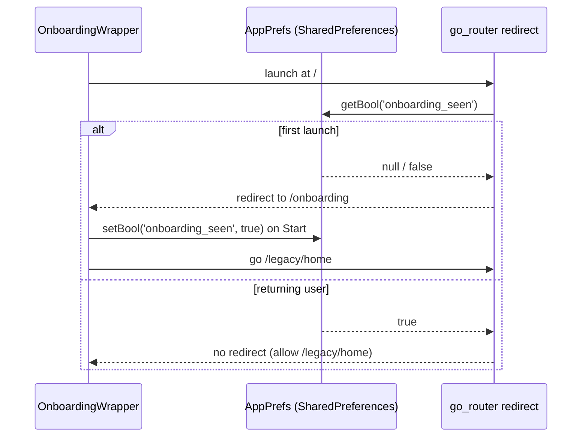

> **Generated by**: /plan | **Model**: Claude Opus 4.7 | **Timestamp**: 2026-04-17 18:36:22 IST

# Plan: Mountain Explorer — Iteration 1 (Foundation)

## 1. Iteration Context

- **Iteration**: 1 of 5
- **AC Items**:
  - Folder structure (`lib/app/`, `lib/core/`, `lib/features/`, `lib/shared/`)
  - Design system tokens + `ThemeData` (Alpine palette, Montserrat typography, spacing, radius)
  - `AppError` hierarchy + hand-rolled `Result<T>` sealed class
  - `get_it` DI skeleton
  - `go_router` config (with legacy `/legacy/*` routes + onboarding first-launch gate)
  - Shared widgets (9 widgets)
  - `firebase_options.dart` (Android-authored from existing values; iOS/macOS stubs documented)
  - `.env` + `flutter_dotenv` for `OPENWEATHER_API_KEY`; `.env.example`; `.env` gitignored
  - `pubspec.yaml` dependency changes
  - `main.dart` reduced to a thin bootstrap
  - Onboarding first-launch gate (wraps existing `introduction_screen`-based `OnboardingPage`, no migration yet)
  - Widget tests for each shared widget; unit tests for `Result<T>`, `AppError`, router guard

- **Deliverable**: App launches with new theme, onboarding shows only on first launch, new routing is in place, DI is wired, all shared widgets exist and are tested. Legacy screens remain reachable at `/legacy/*` so the rest of the app still works while Iterations 2–5 migrate features.

- **Research**: [../research.md](../research.md)
- **Iterations**: [../iterations.md](../iterations.md)

---

## 2. Architecture Decision

### Chosen Approach: Scaffold-first, seam-based foundation

Build the `core/` + `shared/` + `app/` layers in isolation, expose them via `get_it` + `go_router`, and leave every legacy screen reachable under `/legacy/*`. No feature-layer migration yet — each subsequent iteration adds one feature without touching the legacy routes that haven't been migrated.

**Principles**:

1. **Theme = `ThemeData` via Material 3.** Use `ColorScheme.fromSeed(seedColor: AppColors.primary)` and override tokens (primary/secondary/error/surface/background) from `AppColors`. `textTheme` built from `GoogleFonts.montserratTextTheme()`. No widget outside `core/theme/` may reference `Colors.X` or `Color(0xFF...)`.

2. **`Result<T>` is a sealed Dart class, not `dartz`.** `sealed class Result<T>` with subclasses `Success<T>` and `Failure<T>`. Consumers use Dart 3 pattern matching: `switch (result) { Success(:final value) => ..., Failure(:final error) => ... }`. Zero new dependencies, full type safety, first-class tooling support.

3. **`AppError` is a sealed hierarchy** with subtypes: `NetworkError`, `AuthError`, `NotFoundError`, `PermissionError`, `ValidationError`, `UnknownError`. Each carries a user-safe message and an optional debug payload. UI-layer consumers map `AppError → String message` via an extension method in `core/errors/app_error_messages.dart`.

4. **`get_it` is synchronous by default.** A `configureDependencies()` function in `core/di/injector.dart` is called once from `main.dart` before `runApp`. Iteration 1 registers only foundation services (`Logger`, `Env`, `SharedPreferences`). Later iterations register repositories & cubits in the same function.

5. **`go_router` with a top-level `redirect`.** The redirect reads the `onboarding_seen` flag from `SharedPreferences` (held in a lightweight `AppPrefs` wrapper). First-launch routes to `/onboarding`; otherwise `/legacy/home` (until Iteration 3 introduces the new Home). Named-route constants live in `app/router/routes.dart` so no string literals appear in widgets.

6. **Legacy cohabitation via route prefix.** Every legacy screen constructor is wrapped in a `GoRoute` under `/legacy/*`. New code must not import legacy files; legacy files may stay untouched. This gives us a safety net: if a feature iteration ships broken, we can revert a single route.

7. **Tests live next to conventions, not next to files.** `test/unit/` mirrors `lib/` for unit tests. `test/widget/` holds widget tests. `bloc_test` + `mocktail` reserved for later iterations.

### Alternatives Considered

1. **Bundle `firebase_options.dart` generation into the iteration by blocking on `flutterfire configure`.** Rejected: adds a manual CLI step that stalls the whole iteration on user action; we can unblock Android dev today by authoring the Android block from existing known values and documenting the CLI for iOS/macOS later.

2. **Migrate onboarding to a Cubit now.** Rejected: the iteration is already broad (theme, routing, DI, 9 shared widgets, env, Firebase options). Conflating onboarding migration risks scope creep and couples foundation correctness to onboarding details. `iterations.md` explicitly defers this to a later iteration; we respect that.

3. **Use `dartz` for `Either<Failure, T>`.** Rejected: one more dependency and two more concepts (`Left`/`Right`) for the engineer to internalize. Dart 3's sealed classes + pattern matching give us the same ergonomics with zero deps.

4. **Use Riverpod instead of `get_it` for DI.** Rejected: the research and iterations.md explicitly chose `flutter_bloc` + `get_it`. Riverpod blurs the line between DI and state management, which conflicts with Clean Architecture's layer separation.

---

## 3. Logic Diagrams

### App Boot → First Route Decision

```mermaid
flowchart TD
    A[main] --> B[WidgetsFlutterBinding.ensureInitialized]
    B --> C[dotenv.load<br/>reads .env]
    C --> D[Firebase.initializeApp<br/>firebase_options.dart]
    D --> E[configureDependencies<br/>get_it singletons]
    E --> F[runApp App]
    F --> G[MaterialApp.router<br/>theme + router]
    G --> H{go_router redirect}
    H -->|onboarding_seen == false| I[/onboarding]
    H -->|onboarding_seen == true| J[/legacy/home]
    I -->|user taps Start| K[set flag true<br/>go /legacy/home]
    K --> J
```

### Onboarding First-Launch Gate



---

## 4. Storage Design

Iteration 1 introduces **no Firestore / Storage schema changes**. Firestore/Storage/Auth schema design lands in Iterations 2–5.

### Local Storage (`shared_preferences`)

| Key                | Type | Purpose                                                   |
|--------------------|------|-----------------------------------------------------------|
| `onboarding_seen`  | bool | Gates the onboarding page. Set `true` when user completes.|

Accessor: `AppPrefs` wrapper in `core/storage/app_prefs.dart`:

- `Future<bool> hasSeenOnboarding()`
- `Future<void> markOnboardingSeen()`

### Index Strategy

N/A this iteration.

---

## 5. API Design

Iteration 1 does not expose HTTP endpoints. The only external I/O introduced is environment loading:

### Env Contract (`core/env/env.dart`)

```dart
abstract class Env {
  String get openWeatherApiKey; // throws ArgumentError if missing
}
```

`.env` keys expected:

```
OPENWEATHER_API_KEY=<value>
```

`.env.example` committed with placeholder; `.env` gitignored.

---

## 6. Code Changes

### Files to Create

#### Config & Tooling
- `.env` — CREATE (gitignored) — holds `OPENWEATHER_API_KEY` (migrated from `Allmountains.dart:26`).
- `.env.example` — CREATE (committed) — `OPENWEATHER_API_KEY=your_key_here`.
- `.gitignore` — MODIFY — add `.env`.
- `pubspec.yaml` — MODIFY — dependency overhaul (see §6 delta).
- `lib/firebase_options.dart` — CREATE — Android block authored from existing `main.dart` values; iOS/macOS/web throw `UnsupportedError` pointing to `flutterfire configure`.

#### Entry + App Shell (`app/`)
- `lib/main.dart` — MODIFY — reduce to `bootstrap()` + `runApp(const App())`. Loads dotenv, initializes Firebase, configures DI.
- `lib/app/app.dart` — CREATE — `App` widget: `MaterialApp.router`, injects `AppTheme.light`, `AppRouter.instance.config`.
- `lib/app/router/routes.dart` — CREATE — `abstract class Routes { static const onboarding = '/onboarding'; ... static const legacyHome = '/legacy/home'; ... }`.
- `lib/app/router/app_router.dart` — CREATE — `AppRouter` class holds `GoRouter` with top-level `redirect` + legacy route table. One `GoRoute` per legacy screen.

#### Core (`core/`)
- `lib/core/theme/app_colors.dart` — CREATE — Alpine palette constants (primary `#0F766E`, primaryDark `#115E59`, secondary `#F59E0B`, surface `#FFFFFF`, background `#F8FAFC`, onSurface `#0F172A`, onPrimary `#FFFFFF`, error `#DC2626`, success `#16A34A`, slate50–900 neutrals).
- `lib/core/theme/app_typography.dart` — CREATE — Montserrat-based `TextTheme`; display/headline/title/body/label scales mapped to Material 3.
- `lib/core/theme/app_spacing.dart` — CREATE — `class AppSpacing { static const xs = 4.0; static const sm = 8.0; static const md = 12.0; static const lg = 16.0; static const xl = 24.0; static const xxl = 32.0; }`.
- `lib/core/theme/app_radius.dart` — CREATE — `class AppRadius { static const xs = 4.0; static const sm = 8.0; static const md = 12.0; static const lg = 16.0; static const xl = 24.0; }`.
- `lib/core/theme/app_theme.dart` — CREATE — `class AppTheme { static ThemeData get light; }` built from Material 3 `ColorScheme.fromSeed` + palette overrides + `app_typography` + default `elevatedButtonTheme`, `inputDecorationTheme`, `cardTheme`, `appBarTheme`.
- `lib/core/errors/app_error.dart` — CREATE — `sealed class AppError { final String message; final Object? cause; }` + subtypes `NetworkError`, `AuthError`, `NotFoundError`, `PermissionError`, `ValidationError`, `UnknownError`.
- `lib/core/errors/result.dart` — CREATE — `sealed class Result<T>`; `class Success<T> extends Result<T> { final T value; }`; `class Failure<T> extends Result<T> { final AppError error; }`; convenience `.fold`, `.map`, `.flatMap` extension.
- `lib/core/di/injector.dart` — CREATE — `final getIt = GetIt.instance;` + `Future<void> configureDependencies()` registering `Logger`, `Env`, `AppPrefs`.
- `lib/core/env/env.dart` — CREATE — `class DotenvEnv implements Env` using `flutter_dotenv`; factory throws `ArgumentError` on missing `OPENWEATHER_API_KEY`.
- `lib/core/storage/app_prefs.dart` — CREATE — wraps `SharedPreferences`; methods `hasSeenOnboarding()`, `markOnboardingSeen()`.
- `lib/core/utils/logger.dart` — CREATE — thin wrapper around `developer.log`; levels `debug`, `info`, `warn`, `error`. No external package.

#### Shared Widgets (`shared/widgets/`)
- `lib/shared/widgets/app_button.dart` — CREATE — `AppButton.primary | AppButton.secondary | AppButton.gradient` factory constructors. Honors theme; no hardcoded colors. Supports `onPressed`, `isLoading`, `icon`, `fullWidth`.
- `lib/shared/widgets/app_text_field.dart` — CREATE — Themed `TextField` wrapper with label, helper, error, prefix/suffix icon, `onChanged`, validator compatibility.
- `lib/shared/widgets/app_password_field.dart` — CREATE — Extends `AppTextField` with visibility toggle.
- `lib/shared/widgets/app_card.dart` — CREATE — `AppCard` with theme-aware surface, radius `AppRadius.lg`, elevation 1.
- `lib/shared/widgets/feature_card.dart` — CREATE — Image-backgrounded card with title overlay (replaces Home's hand-rolled cards in Iteration 3).
- `lib/shared/widgets/loading_overlay.dart` — CREATE — `Stack` wrapper showing `CircularProgressIndicator` when `isLoading` true (replaces `modal_progress_hud_nsn` in Iteration 2).
- `lib/shared/widgets/empty_state.dart` — CREATE — Illustration + headline + supporting text + optional CTA.
- `lib/shared/widgets/error_view.dart` — CREATE — Icon + headline + message + retry button (takes `VoidCallback? onRetry`).
- `lib/shared/widgets/themed_app_bar.dart` — CREATE — Themed `AppBar` with optional back button + title + actions.
- `lib/shared/widgets/widgets.dart` — CREATE — barrel file re-exporting all shared widgets.

#### Tests
- `test/unit/core/errors/result_test.dart` — CREATE — covers `Success`/`Failure` construction, `.map`, `.flatMap`, `.fold`, pattern-matching exhaustiveness.
- `test/unit/core/errors/app_error_test.dart` — CREATE — covers each subtype construction and `toString`.
- `test/unit/core/storage/app_prefs_test.dart` — CREATE — uses `SharedPreferences.setMockInitialValues` to verify flag read/write.
- `test/unit/app/router/app_router_test.dart` — CREATE — verifies onboarding gate redirects first-launch user to `/onboarding` and returning user to `/legacy/home`; verifies legacy route registration.
- `test/widget/shared/app_button_test.dart` — CREATE — renders primary/secondary/gradient; tap fires `onPressed`; `isLoading` disables tap and shows spinner.
- `test/widget/shared/app_text_field_test.dart` — CREATE — label/helper/error render; `onChanged` fires.
- `test/widget/shared/app_password_field_test.dart` — CREATE — visibility toggle flips obscureText.
- `test/widget/shared/app_card_test.dart` — CREATE — applies theme surface color + radius.
- `test/widget/shared/feature_card_test.dart` — CREATE — renders title over image.
- `test/widget/shared/loading_overlay_test.dart` — CREATE — hides/shows spinner based on `isLoading`.
- `test/widget/shared/empty_state_test.dart` — CREATE — renders headline/message; CTA fires when present.
- `test/widget/shared/error_view_test.dart` — CREATE — retry button calls `onRetry`.
- `test/widget/shared/themed_app_bar_test.dart` — CREATE — back button visibility and title render.

### Files to Modify

- `pubspec.yaml` — MODIFY:
  - **Add**: `flutter_bloc: ^8.1.6`, `equatable: ^2.0.5`, `get_it: ^7.7.0`, `go_router: ^14.2.0`, `flutter_dotenv: ^5.1.0`, `shared_preferences: ^2.3.2`.
  - **Add dev**: `bloc_test: ^9.1.7`, `mocktail: ^1.0.4`.
  - **Keep (for now)**: `firebase_core`, `firebase_auth`, `cloud_firestore`, `firebase_storage`, `firebase_database`, `google_fonts`, `image_picker`, `cached_network_image`, `modal_progress_hud_nsn`, `animated_text_kit`, `lottie`, `carousel_slider`, `smooth_page_indicator`, `flutter_slidable`, `introduction_screen`, `rive`, `animations`, `fluttertoast`, `intl`, `http`, `random_string`, `get`, `provider`.
  - **Remove in Iteration 5**: `get`, `provider`, `modal_progress_hud_nsn`, `firebase_database`, `animated_text_kit`. Do not remove this iteration — legacy screens still depend on them.
  - **Assets**: add `.env` under `flutter.assets` so `flutter_dotenv` can load it.

- `lib/main.dart` — MODIFY — shrink to:
  ```dart
  Future<void> main() async {
    WidgetsFlutterBinding.ensureInitialized();
    await dotenv.load();
    await Firebase.initializeApp(options: DefaultFirebaseOptions.currentPlatform);
    await configureDependencies();
    runApp(const App());
  }
  ```

- `.gitignore` — MODIFY — append `.env` (preserve existing rules).

### Files to Delete

None this iteration. All legacy files remain functional via `/legacy/*`. Deletions begin in Iteration 3 and complete in Iteration 5.

---

## 7. Edge Cases & Error Handling

1. **`.env` missing or `OPENWEATHER_API_KEY` absent** → `DotenvEnv` constructor throws `ArgumentError`; `main.dart` catches at boot, logs via `Logger.error`, and still calls `runApp` so the user sees a themed `ErrorView` instead of a blank screen. Handled in `lib/main.dart` boot try/catch.

2. **Firebase init fails (network, malformed options)** → same pattern: catch, log, show `ErrorView` at the app shell.

3. **`SharedPreferences` unavailable on first call** → `AppPrefs` awaits `SharedPreferences.getInstance()` once during `configureDependencies()`; router redirect reads the already-initialized instance synchronously (no race).

4. **User uninstalls & reinstalls** → `SharedPreferences` cleared, `onboarding_seen` defaults to `false`, onboarding shows again. Expected.

5. **Deep link / cold start to `/legacy/*` before onboarding seen** → redirect forces `/onboarding` first regardless of deep-link target; legacy target preserved as `queryParameters.redirect` and consumed after onboarding completes. Handled in `app_router.dart` redirect.

6. **iOS / macOS / web build attempted** → `DefaultFirebaseOptions.currentPlatform` throws `UnsupportedError` with a message telling the engineer to run `flutterfire configure`. Fails fast and loudly.

7. **Hot restart while onboarding is open** → `onboarding_seen` was not yet set; behavior unchanged, onboarding shows again. Acceptable.

---

## 8. Security Considerations

- **Input Validation**: N/A this iteration (no forms submitted). Form validation baseline lands in Iteration 2.
- **Authorization**: N/A this iteration. Route guards that read `AuthState` land in Iteration 2.
- **Secrets Handling**:
  - OpenWeatherMap API key moves from source (`Allmountains.dart:26`) to `.env` (gitignored).
  - Firebase API key stays client-visible — that is the standard for FlutterFire on Android; protection must come from Firestore rules (Iteration 4) and Firebase App Check (out of scope).
  - `.env.example` documents required keys without leaking values.
- **Dependency Hygiene**: All added packages are well-maintained and widely adopted (`flutter_bloc`, `go_router`, `get_it`, `flutter_dotenv`, `shared_preferences`, `equatable`, `bloc_test`, `mocktail`). No `dependency_override` changes beyond existing.

---

## 9. TDD Test Strategy

Tests are written **before** implementation in each phase. Run `flutter test` after each phase; everything green before moving on.

### Phase 1 (Config & Deps) Tests
No tests; config-only.

### Phase 2 (Core Scaffolding) Tests
- **`test/unit/core/errors/result_test.dart`**:
  - `Success(value).fold(onSuccess, onFailure)` calls `onSuccess` with `value`.
  - `Failure(error).fold(...)` calls `onFailure` with `error`.
  - `.map` transforms value in `Success`, passes through in `Failure`.
  - `.flatMap` chains `Result`s; short-circuits on `Failure`.
  - Exhaustive switch with no `default:` compiles.
- **`test/unit/core/errors/app_error_test.dart`**:
  - Each subtype constructs with message + optional cause.
  - `toString()` includes subtype name + message.
- **`test/unit/core/storage/app_prefs_test.dart`**:
  - `hasSeenOnboarding()` returns `false` when key absent, `true` after `markOnboardingSeen()`.

### Phase 3 (Routing) Tests
- **`test/unit/app/router/app_router_test.dart`**:
  - First-launch (prefs empty): request `/` → router redirects to `/onboarding`.
  - Returning user (prefs.onboarding_seen = true): request `/` → allow → resolves to `/legacy/home`.
  - Deep-link to `/legacy/home` before onboarding seen → redirect to `/onboarding?redirect=/legacy/home`.
  - All legacy route names resolve to a widget (smoke-level — just ensure no 404).

### Phase 4 (Shared Widgets) Tests
- See `test/widget/shared/*` list in §6. Each widget tests render + one interaction.
- Tests wrap widgets in `MaterialApp(theme: AppTheme.light, ...)` so theme-aware rendering is exercised.

### Phase 5 (App Shell Wiring) Tests
No new unit tests — tested via Phase 3 + Phase 4 composition and a manual smoke run.

### Tooling
- `flutter test` for all unit + widget tests.
- `flutter analyze` must be clean.
- Manual smoke: `flutter run` on Android → verify onboarding shows first launch, legacy home loads, hot-restart preserves flag.

---

## 10. Implementation Phases

### Phase 1: Config & Dependencies
**Goal**: project compiles with new deps and `.env` is loadable.

**Tasks**:
1. Update `pubspec.yaml`: add new deps, add `.env` asset entry. Run `flutter pub get`.
2. Create `.env.example` with `OPENWEATHER_API_KEY=your_key_here`.
3. Create `.env` with the existing key `1b330849ea15fcd2609c5a8197a98cda` (moved from `Allmountains.dart:26`).
4. Modify `.gitignore` to include `.env`.
5. Create `lib/firebase_options.dart` with Android block from existing `main.dart` values; other platforms throw `UnsupportedError` with CLI guidance.

### Phase 2: Core Scaffolding (TDD)
**Goal**: foundation services and types exist and are covered by tests.

**Tests first**:
- `test/unit/core/errors/result_test.dart`
- `test/unit/core/errors/app_error_test.dart`
- `test/unit/core/storage/app_prefs_test.dart`

**Then implement**:
1. `lib/core/errors/app_error.dart`
2. `lib/core/errors/result.dart`
3. `lib/core/utils/logger.dart`
4. `lib/core/env/env.dart`
5. `lib/core/storage/app_prefs.dart`
6. `lib/core/theme/app_colors.dart`
7. `lib/core/theme/app_typography.dart`
8. `lib/core/theme/app_spacing.dart`
9. `lib/core/theme/app_radius.dart`
10. `lib/core/theme/app_theme.dart`
11. `lib/core/di/injector.dart` — register `Logger`, `Env` (`DotenvEnv`), `AppPrefs`.

### Phase 3: Routing & First-Launch Gate (TDD)
**Goal**: `go_router` is the single source of navigation truth, with onboarding gate working.

**Tests first**:
- `test/unit/app/router/app_router_test.dart`

**Then implement**:
1. `lib/app/router/routes.dart` — route name constants.
2. `lib/app/router/app_router.dart` — `GoRouter` with top-level redirect + legacy `GoRoute` entries for every legacy screen (Home, Allmountains, MountainSearchScreen, Checklist, LoginScreen, SignupScreen, forgotPassword, communityHome, BlogDetailScreen, AddPost, ScreenOne, OnboardingPage).
3. Wire `OnboardingPage` exit button to `prefs.markOnboardingSeen()` + `context.go('/legacy/home')`. (Minimal hook — no full migration.)

### Phase 4: Shared Widgets (TDD)
**Goal**: 9 reusable widgets, each tested.

**Tests first** (create all files, red):
- 9 widget test files in `test/widget/shared/`.

**Then implement** (pair-by-pair with tests):
1. `AppButton` + test
2. `AppTextField` + test
3. `AppPasswordField` + test
4. `AppCard` + test
5. `FeatureCard` + test
6. `LoadingOverlay` + test
7. `EmptyState` + test
8. `ErrorView` + test
9. `ThemedAppBar` + test
10. `widgets.dart` barrel

### Phase 5: App Shell Wiring
**Goal**: new `main.dart` + `App` boots the app end-to-end.

**Tasks**:
1. Write `lib/app/app.dart` (`MaterialApp.router`, theme, router).
2. Shrink `lib/main.dart` to the bootstrap shown in §6.
3. Launch on Android; verify:
   - Onboarding shows on first launch, sets flag on Start.
   - Subsequent launches route to legacy home.
   - All legacy tiles still navigate to existing screens.

### Phase 6: Verification & Polish
1. `flutter analyze` — zero warnings.
2. `flutter test` — all green.
3. Smoke test on physical/emulated Android.
4. Commit on a feature branch (branch naming handled by `/deliver`).

---

## 11. Reference Files

- `lib/main.dart` — current boot sequence; shrink in place.
- `lib/Screens/onboarding_page.dart` — Iteration 1 only touches its Start/Skip handlers to set the prefs flag.
- `lib/controllers/onboarding_controller.dart` — leave alone (stays GetX for now).
- `lib/Services/weather.dart` — reference for where the API key currently lives; leave untouched this iteration, but note that Iteration 3 will switch it to read from `Env`.
- `lib/Screens/Allmountains.dart:26` — source of the migrated `OPENWEATHER_API_KEY` value.
- `android/app/google-services.json` — confirmed present; Android Firebase init works out of the box.
- No CLAUDE.md exists — this iteration does not create one (noted in research as non-goal).

---

## 12. TODO Checklist

### Phase 1 — Config & Dependencies
- [ ] Update `pubspec.yaml` (add new deps + `.env` asset); run `flutter pub get`.
- [ ] Create `.env.example`.
- [ ] Create `.env` with existing OpenWeatherMap key.
- [ ] Add `.env` to `.gitignore`.
- [ ] Create `lib/firebase_options.dart` (Android-authored; iOS/macOS/web stubbed with UnsupportedError).

### Phase 2 — Core Scaffolding (TDD)
- [ ] Write `test/unit/core/errors/result_test.dart` (red).
- [ ] Write `test/unit/core/errors/app_error_test.dart` (red).
- [ ] Write `test/unit/core/storage/app_prefs_test.dart` (red).
- [ ] Implement `lib/core/errors/app_error.dart`.
- [ ] Implement `lib/core/errors/result.dart`.
- [ ] Implement `lib/core/utils/logger.dart`.
- [ ] Implement `lib/core/env/env.dart` (`DotenvEnv`).
- [ ] Implement `lib/core/storage/app_prefs.dart`.
- [ ] Implement `lib/core/theme/{app_colors,app_typography,app_spacing,app_radius,app_theme}.dart`.
- [ ] Implement `lib/core/di/injector.dart`.
- [ ] All Phase 2 tests green.

### Phase 3 — Routing & First-Launch Gate (TDD)
- [ ] Write `test/unit/app/router/app_router_test.dart` (red).
- [ ] Implement `lib/app/router/routes.dart`.
- [ ] Implement `lib/app/router/app_router.dart` (with legacy routes + onboarding redirect).
- [ ] Hook `OnboardingPage` Start button to `prefs.markOnboardingSeen()` + `context.go('/legacy/home')`.
- [ ] Phase 3 tests green.

### Phase 4 — Shared Widgets (TDD)
- [ ] Write all 9 widget tests (red).
- [ ] Implement `AppButton` + pass test.
- [ ] Implement `AppTextField` + pass test.
- [ ] Implement `AppPasswordField` + pass test.
- [ ] Implement `AppCard` + pass test.
- [ ] Implement `FeatureCard` + pass test.
- [ ] Implement `LoadingOverlay` + pass test.
- [ ] Implement `EmptyState` + pass test.
- [ ] Implement `ErrorView` + pass test.
- [ ] Implement `ThemedAppBar` + pass test.
- [ ] Create `lib/shared/widgets/widgets.dart` barrel.

### Phase 5 — App Shell Wiring
- [ ] Implement `lib/app/app.dart`.
- [ ] Shrink `lib/main.dart` to the bootstrap block.

### Phase 6 — Verification
- [ ] `flutter analyze` is clean.
- [ ] `flutter test` all green.
- [ ] Manual Android smoke: first-launch onboarding → mark seen → legacy home loads → hot-restart stays on home.
- [ ] Commit on the iteration branch (branch name handled by `/deliver`).
