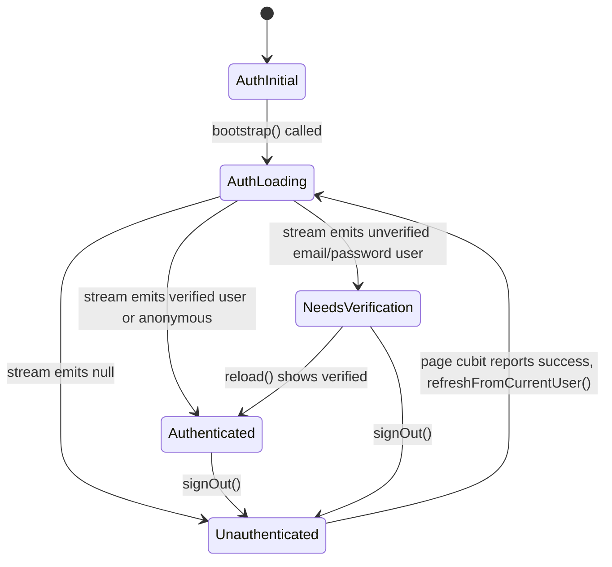
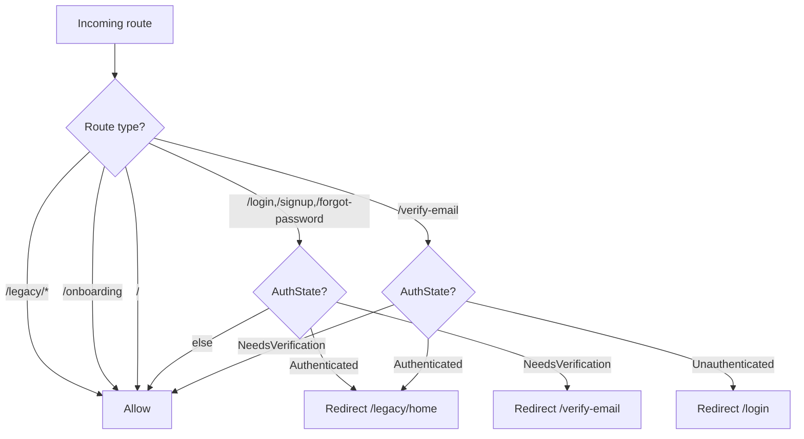
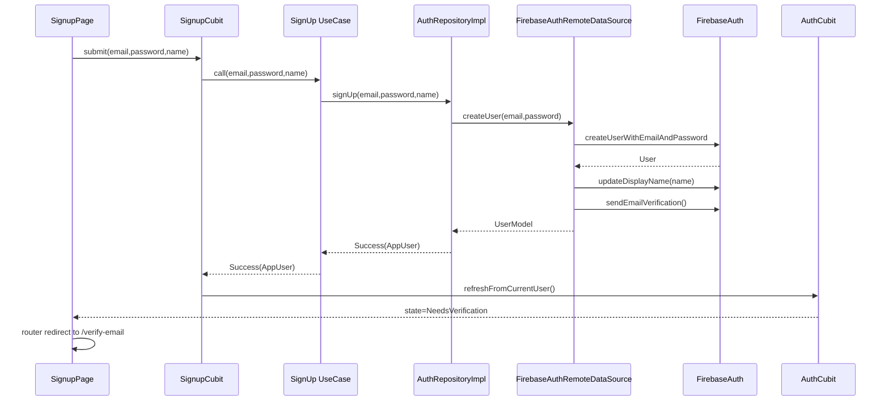

> **Generated by**: /plan | **Model**: Claude Opus 4.7 | **Timestamp**: 2026-04-17 IST

# Plan: Mountain Explorer — Iteration 2 (Auth feature, Clean + MVVM)

## 1. Iteration Context
- **Iteration**: 2 of 5 — Auth feature — Clean + MVVM + expanded providers
- **AC Items**: full Clean layers under `features/auth/`; email+password + Google + Anonymous + Email verification; page-level cubits for Login/Signup/Forgot/Verify; app-wide `AuthCubit` subscribed to `authStateChanges`; go_router guards for new auth routes; legacy auth screens deleted at end of iteration.
- **Deliverable**: A user can sign up (with verification email), sign in (email / Google / Anonymous), reset password (snackbar + auto-return), verify email (manual "I've verified" + Resend), and sign out. Auth state is app-wide via `AuthCubit`; new auth routes are guarded; legacy `Screens/Community/{login,signup,forgot_password}_screen.dart` deleted. Unit + `bloc_test` coverage for every UseCase and Cubit.
- **Research**: [../research.md](../research.md)

## 2. Architecture Decision

### Chosen Approach

**Clean Architecture feature slice** at `lib/features/auth/` with three layers:

1. **Domain** (Dart-only, zero Flutter/Firebase imports):
   - Entity: `AppUser { uid, email, displayName, photoUrl, isAnonymous, isEmailVerified, providerId }`.
   - Contract: `abstract class AuthRepository { ... }` returning `Result<T>` / `Stream<AppUser?>`.
   - UseCases: **8 single-method classes** — `SignInWithEmail`, `SignUp`, `SignOut`, `SignInWithGoogle`, `SignInAnonymously`, `ResetPassword`, `SendEmailVerification`, `WatchAuthState`. Each takes repo in the constructor and exposes one `call(...)` operator.

2. **Data** (only layer touching Firebase + Google):
   - `AuthRemoteDataSource` (abstract) + `FirebaseAuthRemoteDataSource` (impl). Wraps `FirebaseAuth` and `google_sign_in` SDK calls; throws raw `FirebaseAuthException` / platform exceptions upward.
   - `UserModel extends AppUser` — `fromFirebaseUser(User)` factory.
   - `AuthRepositoryImpl implements AuthRepository` — calls the data source inside try/catch, maps `FirebaseAuthException` codes to `AppError` subtypes, returns `Result<T>`.

3. **Presentation** (Flutter + flutter_bloc):
   - **App-wide `AuthCubit`** — registered as a getIt singleton, subscribes to `WatchAuthState`, emits sealed `AuthState` (see §3). The only place that reflects the current auth snapshot. Exposes `signOut()`; everything else is done through page cubits so form state stays local.
   - **Page cubits** for form flows: `LoginCubit`, `SignupCubit`, `ForgotPasswordCubit`, `VerifyEmailCubit`. Each holds an equatable state with form + submission status. Page cubits call `AuthCubit.refreshFromCurrentUser()` after a successful action so the app-wide stream fires without a reload.
   - **Pages** built on shared widgets (`AppTextField`, `AppPasswordField`, `AppButton`, `ErrorView`).

**Why**: Aligns exactly with the target module map in research.md. Separating app-wide auth from page cubits is the idiomatic flutter_bloc pattern for auth flows — it keeps `AuthCubit` small and testable, and page cubits independent. `Result<T>` lives in the repository boundary; UI never sees Firebase types.

### Alternatives Considered

1. **Single fat `AuthCubit` holding every form field and submission state.** Rejected: couples page lifecycle to app-wide auth state, makes `bloc_test` cases balloon, and means every page re-builds on every `authStateChanges` tick.
2. **Skip Clean layers, use a single `AuthService` singleton with static methods** (like the legacy code). Rejected: the whole point of this iteration is to establish Clean + MVVM. Going service-based here would propagate the legacy pattern into the new architecture.

## 3. Logic Diagrams

### 3.1 AuthState state machine



### 3.2 go_router auth guard



### 3.3 Sign-up flow (sequence)



## 4. Storage Design

**No Firestore writes in this iteration.**

Per research.md §Q&A and the Iteration 2 AC, creating `users/{uid}` docs is deferred to whichever iteration first needs them (Iteration 3 for `likedMountains`). Auth information lives entirely in Firebase Auth. `displayName` is written via `User.updateDisplayName(name)` post-signup so downstream features can read it from `FirebaseAuth.currentUser`.

### Index Strategy
N/A for this iteration.

## 5. API Design

External surfaces (consumed by the presentation layer):

### `AuthRepository` (domain contract)

```dart
abstract class AuthRepository {
  Stream<AppUser?> watchAuthState();
  Future<Result<AppUser>> signInWithEmail({required String email, required String password});
  Future<Result<AppUser>> signUp({required String email, required String password, required String displayName});
  Future<Result<AppUser>> signInWithGoogle();
  Future<Result<AppUser>> signInAnonymously();
  Future<Result<void>> sendEmailVerification();
  Future<Result<void>> resetPassword(String email);
  Future<Result<void>> signOut();
  Future<Result<AppUser?>> reloadCurrentUser();
}
```

### `AuthState` (sealed, presentation)

```dart
sealed class AuthState extends Equatable { const AuthState(); }
class AuthInitial extends AuthState { ... }
class AuthLoading extends AuthState { ... }
class Authenticated extends AuthState { final AppUser user; ... }
class NeedsVerification extends AuthState { final AppUser user; ... }
class Unauthenticated extends AuthState { ... }
class AuthFailure extends AuthState { final String message; final AppError? error; ... }
```

### Per-page cubit states (example — LoginCubit)

```dart
class LoginState extends Equatable {
  final String email;
  final String password;
  final FormStatus status; // initial | submitting | success | failure
  final String? errorMessage;
  ...
}
```

### Error mapping (`AuthRepositoryImpl`)

| FirebaseAuthException.code | AppError |
|---|---|
| `invalid-email`, `invalid-credential`, `wrong-password`, `user-not-found`, `user-disabled` | `AuthError` |
| `email-already-in-use`, `weak-password`, `operation-not-allowed`, `requires-recent-login` | `AuthError` |
| `network-request-failed` | `NetworkError` |
| any other / generic | `UnknownError(cause: e)` |
| Google sign-in cancelled (`GoogleSignInAccount` is null) | `AuthError('Sign-in cancelled')` |

## 6. Code Changes

### Files to Create

#### Domain — `lib/features/auth/domain/`
- `entities/app_user.dart` — Equatable entity with `uid, email, displayName, photoUrl, isAnonymous, isEmailVerified, providerId`.
- `repositories/auth_repository.dart` — abstract contract (§5).
- `usecases/sign_in_with_email.dart` — `call({required email, required password}) → Future<Result<AppUser>>`.
- `usecases/sign_up.dart` — `call({required email, required password, required displayName}) → Future<Result<AppUser>>`.
- `usecases/sign_in_with_google.dart`
- `usecases/sign_in_anonymously.dart`
- `usecases/sign_out.dart`
- `usecases/send_email_verification.dart`
- `usecases/reset_password.dart` — `call(email) → Future<Result<void>>`.
- `usecases/watch_auth_state.dart` — `call() → Stream<AppUser?>`.

#### Data — `lib/features/auth/data/`
- `models/user_model.dart` — extends `AppUser`; `factory UserModel.fromFirebaseUser(User)`.
- `datasources/auth_remote_data_source.dart` — abstract + `FirebaseAuthRemoteDataSource` impl (takes `FirebaseAuth` and `GoogleSignIn`); methods mirror the repository but throw raw exceptions.
- `repositories/auth_repository_impl.dart` — implements `AuthRepository`, wraps data source in try/catch, maps exceptions to `AppError` via `_mapFirebaseAuthException`, returns `Result<T>`.

#### Presentation — `lib/features/auth/presentation/`
- `cubit/auth_cubit.dart` + `auth_state.dart` — app-wide cubit; subscribes to `WatchAuthState`; emits sealed state. Methods: `bootstrap()`, `refreshFromCurrentUser()`, `signOut()`.
- `cubit/login_cubit.dart` + `login_state.dart`.
- `cubit/signup_cubit.dart` + `signup_state.dart`.
- `cubit/forgot_password_cubit.dart` + `forgot_password_state.dart`.
- `cubit/verify_email_cubit.dart` + `verify_email_state.dart` — methods `resendVerification()`, `checkVerified()`.
- `view/login_page.dart` — form, Google button, "Continue as guest", Forgot link, Sign up link. BlocListener on LoginCubit for success/failure snackbars; BlocListener on AuthCubit for routing.
- `view/signup_page.dart` — form (name/email/password), submit.
- `view/forgot_password_page.dart` — email form; on success → snackbar + `Timer(2s, () => context.go('/login'))`.
- `view/verify_email_page.dart` — "We sent a verification link to {email}"; buttons: Resend, I've verified, Sign out.

#### DI / routing — root
- `lib/features/auth/di/auth_module.dart` — registers repo, data source, UseCases, `AuthCubit`. Called from `configureDependencies()`.
- **Modify** `lib/core/di/injector.dart` — import `auth_module.dart` and call `registerAuthModule()` after core singletons.
- **Modify** `lib/app/router/routes.dart` — add `login`, `signup`, `forgotPassword`, `verifyEmail` constants.
- **Modify** `lib/app/router/app_router.dart` — register new routes; update `resolveRedirect` to include the auth-guard matrix from §3.2 (signature becomes `resolveRedirect(AppPrefs prefs, AuthState authState, String path)`).
- **Modify** `lib/app/app.dart` — wrap `MaterialApp.router` in a `BlocProvider.value(value: getIt<AuthCubit>())` and a `BlocListener<AuthCubit, AuthState>` that calls `router.refresh()` on state change.

#### `pubspec.yaml`
- Add `google_sign_in: ^6.2.2`.

#### Tests
- `test/unit/features/auth/domain/usecases/sign_in_with_email_test.dart`
- `test/unit/features/auth/domain/usecases/sign_up_test.dart`
- `test/unit/features/auth/domain/usecases/sign_in_with_google_test.dart`
- `test/unit/features/auth/domain/usecases/sign_in_anonymously_test.dart`
- `test/unit/features/auth/domain/usecases/sign_out_test.dart`
- `test/unit/features/auth/domain/usecases/send_email_verification_test.dart`
- `test/unit/features/auth/domain/usecases/reset_password_test.dart`
- `test/unit/features/auth/domain/usecases/watch_auth_state_test.dart`
- `test/unit/features/auth/data/auth_repository_impl_test.dart` — maps `FirebaseAuthException` codes and network errors to `AppError`.
- `test/unit/features/auth/presentation/auth_cubit_test.dart` — `bloc_test`: reacts to stream emissions, `signOut()`.
- `test/unit/features/auth/presentation/login_cubit_test.dart`
- `test/unit/features/auth/presentation/signup_cubit_test.dart`
- `test/unit/features/auth/presentation/forgot_password_cubit_test.dart`
- `test/unit/features/auth/presentation/verify_email_cubit_test.dart`
- `test/unit/app/router/app_router_redirect_test.dart` — updated guard matrix.

### Files to Modify

- `lib/controllers/onboarding_controller.dart` — change `forwardAction` to `context.go(Routes.login)` instead of `Routes.legacyHome` (per AC: onboarding routes to login by default).
- `lib/app/router/routes.dart` — add auth route constants.
- `lib/app/router/app_router.dart` — new redirect signature + auth routes.
- `lib/app/app.dart` — expose `AuthCubit` app-wide, call `router.refresh()` on state change.
- `lib/core/di/injector.dart` — register auth module.
- `lib/main.dart` — call `getIt<AuthCubit>().bootstrap()` after DI.
- `pubspec.yaml` — add `google_sign_in`.
- `test/unit/app/router/app_router_test.dart` — update to new redirect signature.

### Files to Delete (end of iteration only, after cutover)
- `lib/Screens/Community/login_screen.dart`
- `lib/Screens/Community/signup_screen.dart`
- `lib/Screens/Community/forgot_password_screen.dart`

Any legacy file that imports these (communityHome, addPost, HomeScreen, ScreenOne) must be updated to use `context.go(Routes.login)` / `Routes.signup` / `Routes.forgotPassword` instead of `Navigator.push(MaterialPageRoute(LoginScreen()))`.

## 7. Edge Cases & Error Handling

1. **Google sign-in cancelled by user.** `GoogleSignIn.signIn()` returns `null` → data source throws a synthetic `_UserCancelledException`; repo maps to `Failure(AuthError('Sign-in cancelled'))`. LoginCubit treats this as a benign state (no snackbar).
2. **Network offline during email sign-in.** `FirebaseAuthException('network-request-failed')` → `NetworkError('Please check your internet connection.')`. UI shows snackbar with Retry.
3. **Weak password / invalid email at signup.** Mapped to `AuthError(code.message)`; SignupCubit emits `FormStatus.failure` with the human-readable message.
4. **Email already in use on signup.** Same mapping → snackbar "An account already exists with that email."
5. **Resend verification called when already verified.** Repo calls `reloadCurrentUser()` first; if already verified, returns `Success` and AuthCubit transitions away from `NeedsVerification`. No snackbar needed — router redirect handles it.
6. **Sign-out while stream is emitting.** `AuthCubit` cancels old subscription on `close()`; `signOut()` awaits `FirebaseAuth.signOut()` which fires the stream with `null`; idempotent.
7. **Anonymous user opens /login and signs in with email (no linking).** Anonymous session is dropped; current behavior. Account linking is deferred to Iteration 3+.
8. **Reset password with unregistered email.** Firebase returns success anyway (intentional) — UI shows the standard "link sent" snackbar. No enumeration oracle.
9. **AuthCubit close during pending in-flight operation.** Use `emit` guarded by `isClosed` in stream listener; cancel `StreamSubscription` in `close()`.
10. **App launched offline with a previously-signed-in user.** `authStateChanges` emits the cached user; `Authenticated` / `NeedsVerification` based on `emailVerified`. No network call required at bootstrap.

## 8. Security Considerations
- **Input validation**: email via regex (RFC-lite), password ≥ 8 chars with ≥1 letter + ≥1 digit, displayName 1–40 chars. Done client-side in a `AuthValidators` util (lives in `lib/features/auth/presentation/utils/`); **not** a Firebase rule since Firebase Auth password strength is limited to the configured min length.
- **Firebase errors**: raw `FirebaseAuthException.message` strings are user-safe (already human-readable) but logged at info level via `Logger`. No stack traces surfaced in UI.
- **Google sign-in**: only Android in this iteration (iOS / web out of scope per plan). No SHA mismatch handling beyond surfacing the Firebase error.
- **Anonymous scope**: anonymous users remain authenticated for guest flows (checklist, likes gated at the UseCase level in later iterations). AuthCubit emits `Authenticated(user)` with `user.isAnonymous=true`; page-level code decides if that's enough.
- **Defense-in-depth**: this iteration does **not** author Firestore rules (deferred to later iterations that actually write data). Until then, no Firestore writes exist from new code.
- **No secrets added** to `.env` in this iteration — Google sign-in uses `google-services.json` for Android, already present.

## 9. TDD Test Strategy

Follow the existing test layout: `test/unit/features/<feature>/...`. Mocks via `mocktail`. Assertions via `flutter_test` + `bloc_test`.

### Phase 1 Tests (Domain)
**Unit tests** (`test/unit/features/auth/domain/usecases/*_test.dart`):
- Each UseCase test registers a `MockAuthRepository`, stubs the relevant method, and verifies: (a) UseCase delegates correctly, (b) returns `Result<T>` unchanged, (c) doesn't call anything extra.
- Coverage: success path + at least one `Failure(AppError)` path per UseCase.
- `WatchAuthStateTest` verifies stream passthrough with a controller.

### Phase 2 Tests (Data)
**Unit tests** (`test/unit/features/auth/data/auth_repository_impl_test.dart`):
- Mock `AuthRemoteDataSource`. Verify:
  - Happy path returns `Success(AppUser)`.
  - `FirebaseAuthException('network-request-failed')` → `Failure(NetworkError)`.
  - `FirebaseAuthException('invalid-credential')` → `Failure(AuthError)`.
  - `FirebaseAuthException('email-already-in-use')` → `Failure(AuthError)`.
  - Unknown exception → `Failure(UnknownError)` with cause preserved.
  - `_UserCancelledException` from Google → `Failure(AuthError('Sign-in cancelled'))`.
- `UserModel.fromFirebaseUser` maps fields correctly given a fake `User` (via mocktail).

### Phase 3 Tests (Presentation — AuthCubit)
**bloc_test** (`test/unit/features/auth/presentation/auth_cubit_test.dart`):
- `bootstrap()` subscribes to stream; emits `AuthLoading → Authenticated(user)` for verified user.
- Emits `NeedsVerification(user)` for unverified email/password user.
- Emits `Authenticated(user)` for anonymous user.
- Emits `Unauthenticated` when stream emits null.
- `signOut()` calls repo and emits `Unauthenticated` on success, `AuthFailure` on error.
- `refreshFromCurrentUser()` calls repo and updates state.

### Phase 4 Tests (Presentation — Page cubits)
**bloc_test** for each page cubit:
- `LoginCubit` → `submit()` calls UseCase, emits `submitting → success` on Success, `submitting → failure(message)` on Failure. `emailChanged/passwordChanged` updates state. `googleSignIn()`/`continueAsGuest()` call correct UseCases.
- `SignupCubit` → submits, calls SignUp, emits success+routes, maps form validation errors.
- `ForgotPasswordCubit` → submits, emits submitted state with 2s timer note (don't test the timer itself; test that `resetPassword` is called and cubit emits `Success`).
- `VerifyEmailCubit` → `resendVerification()` + `checkVerified()` paths.

### Phase 5 Tests (Routing)
**Unit test** (`test/unit/app/router/app_router_redirect_test.dart`):
- New redirect signature `resolveRedirect(AppPrefs, AuthState, String)`:
  - `Authenticated` at `/login` → redirect `/legacy/home`.
  - `NeedsVerification` at `/login` → redirect `/verify-email`.
  - `NeedsVerification` at `/verify-email` → null.
  - `Unauthenticated` at `/verify-email` → redirect `/login`.
  - `Unauthenticated` at `/login` → null.
  - `Authenticated` at `/legacy/home` → null (legacy stays open).
  - Existing first-launch → `/onboarding` behavior preserved.

### Phase 6 Tests (Integration smoke)
- Existing Iteration 1 tests continue to pass.
- `flutter analyze lib test` exits clean for files in scope.
- Optional: widget test for `LoginPage` rendering form, forgot-password link, and Google button (skip if `GoogleSignIn` dependency is heavy to mock — the cubit test already covers behavior).

## 10. Implementation Phases

### Phase 1: Domain (Foundation)
**Tests first**:
- `test/unit/features/auth/domain/usecases/{sign_in_with_email,sign_up,sign_in_with_google,sign_in_anonymously,sign_out,send_email_verification,reset_password,watch_auth_state}_test.dart`

**Then implement**:
1. `lib/features/auth/domain/entities/app_user.dart`
2. `lib/features/auth/domain/repositories/auth_repository.dart`
3. Eight UseCase files in `lib/features/auth/domain/usecases/`

### Phase 2: Data
**Tests first**:
- `test/unit/features/auth/data/auth_repository_impl_test.dart`

**Then implement**:
1. `lib/features/auth/data/models/user_model.dart`
2. `lib/features/auth/data/datasources/auth_remote_data_source.dart` (abstract + `FirebaseAuthRemoteDataSource`)
3. `lib/features/auth/data/repositories/auth_repository_impl.dart` (with `_mapFirebaseAuthException`)

### Phase 3: App-wide AuthCubit + DI
**Tests first**:
- `test/unit/features/auth/presentation/auth_cubit_test.dart`

**Then implement**:
1. `lib/features/auth/presentation/cubit/auth_state.dart` (sealed + equatable)
2. `lib/features/auth/presentation/cubit/auth_cubit.dart`
3. `lib/features/auth/di/auth_module.dart`
4. Wire from `lib/core/di/injector.dart` (call `registerAuthModule()` after core)
5. Add `google_sign_in: ^6.2.2` to `pubspec.yaml`; `flutter pub get`

### Phase 4: Page cubits + views (TDD)
**Tests first**:
- `test/unit/features/auth/presentation/{login,signup,forgot_password,verify_email}_cubit_test.dart`

**Then implement**:
1. Four cubits + states.
2. Four pages (`login_page.dart`, `signup_page.dart`, `forgot_password_page.dart`, `verify_email_page.dart`) using shared widgets.
3. `lib/features/auth/presentation/utils/auth_validators.dart` (email regex + password strength).

### Phase 5: Router integration + legacy cutover
**Tests first**:
- Update `test/unit/app/router/app_router_test.dart` → `app_router_redirect_test.dart` or rewrite in place with new signature.

**Then implement**:
1. `lib/app/router/routes.dart` — add `login`, `signup`, `forgotPassword`, `verifyEmail` constants.
2. `lib/app/router/app_router.dart` — register new routes; rewrite `resolveRedirect` with the matrix in §3.2.
3. `lib/app/app.dart` — `MultiBlocProvider` exposing `AuthCubit`; `BlocListener` that calls `_router.refresh()` on `AuthState` change.
4. `lib/main.dart` — call `getIt<AuthCubit>().bootstrap()` after `configureDependencies()`.
5. `lib/controllers/onboarding_controller.dart` — change default exit to `/login`.
6. Grep-replace legacy imports/pushes of `LoginScreen`, `SignupScreen`, `forgotPassword` across `lib/**` with `context.go(Routes.login)` etc.
7. Delete `lib/Screens/Community/{login_screen,signup_screen,forgot_password_screen}.dart`.

### Phase 6: Verification
1. `flutter pub get`.
2. `flutter analyze lib/core lib/app lib/shared lib/features lib/main.dart lib/controllers test/unit test/widget` — expect zero issues for the refactor scope.
3. `flutter test test/unit test/widget` — expect all green.
4. Manual Android smoke (optional at plan level; /deliver decides): fresh install → onboarding → login → signup with verification email → reset password → Google sign-in → anonymous sign-in → sign out.

## 11. Reference Files

- `lib/Screens/Community/login_screen.dart` — legacy UX reference (email/password form, "Signup" / "Forgot password" links). Not a pattern to replicate; a behavior contract.
- `lib/Screens/Community/signup_screen.dart` — legacy reference for which fields to collect (name/email/password).
- `lib/Screens/Community/forgot_password_screen.dart` — legacy reference; success path must be replaced with snackbar + 2s auto-return (per AC).
- `lib/core/errors/app_error.dart`, `lib/core/errors/result.dart` — existing sealed hierarchies to use verbatim.
- `lib/shared/widgets/widgets.dart` — the only source of UI primitives for auth pages; do NOT re-roll `AppButton`/`AppTextField`.
- `lib/app/router/app_router.dart` — existing `resolveRedirect` pattern to extend; **do not** split into multiple redirect passes.
- `lib/core/di/injector.dart` — existing getIt registration style (singleton, idempotent). Follow the same pattern for auth module.
- `test/unit/core/storage/app_prefs_test.dart` — mocktail-free test style to follow where Firebase types aren't involved.
- `test/unit/app/router/app_router_test.dart` — current redirect test shape; update for new signature.

## 12. TODO Checklist

### Implementation
- [ ] **Phase 1**: 8 UseCase tests + entity + contract + 8 UseCases
- [ ] **Phase 2**: repository-impl test + UserModel + data source + repository impl with exception mapping
- [ ] **Phase 3**: AuthCubit test + AuthState + AuthCubit + auth DI module + pubspec `google_sign_in` dep
- [ ] **Phase 4**: 4 page-cubit tests + 4 cubits + 4 pages + validators util
- [ ] **Phase 5**: router redirect test + routes constants + router guards + app.dart BlocProvider/Listener + main.dart bootstrap + onboarding exit change + legacy import cutover + delete 3 legacy files
- [ ] **Phase 6**: analyze + tests + (optional) Android smoke

### Verification
- [ ] `flutter analyze` clean on refactor scope
- [ ] `flutter test test/unit test/widget` — all pass (~60–70 tests total after this iteration)
- [ ] Commit once user approves (per standing instruction: NO commits until asked)
