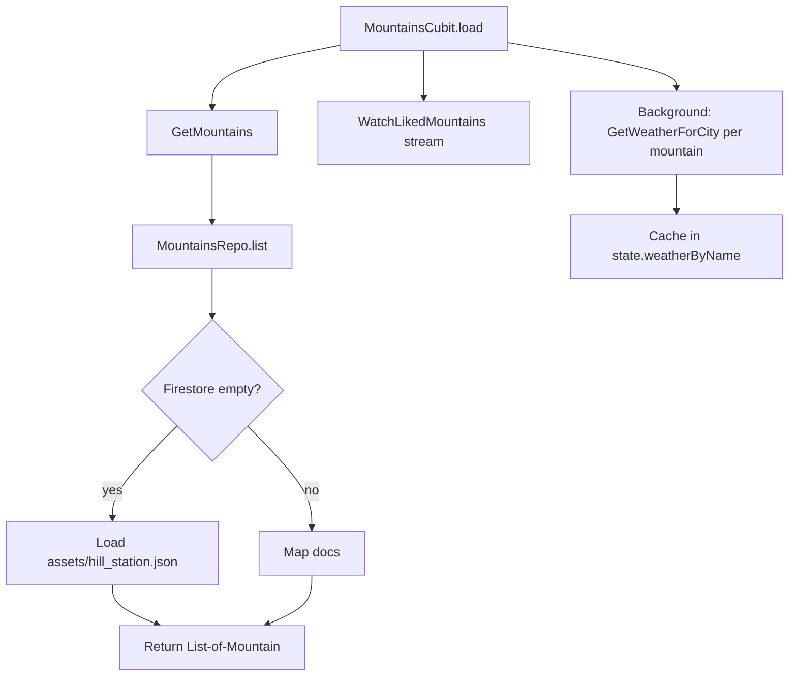
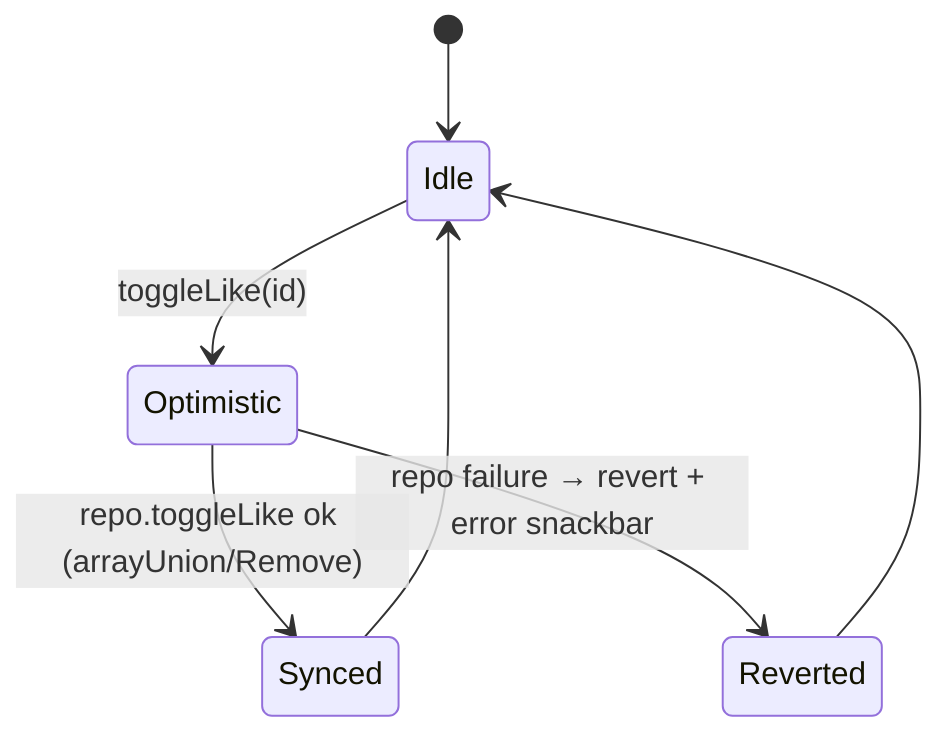

> **Generated by**: /plan (condensed) | **Model**: Claude Opus 4.7 | **Timestamp**: 2026-04-17 IST

# Plan: Iteration 3 — Mountains + Weather + Search + new Home

## 1. Iteration Context
- **Iteration**: 3 of 5
- **AC Items (from iterations.md)**: Firestore-backed mountains list (with JSON fallback), OpenWeatherMap per-card weather (session cache), local search filter (Nominatim/Overpass removed), per-user liked mountains at `users/{uid}/private/likedMountains`, new HomeScreen with bottom nav + trimmed drawer, LikedMountainsPage, ProfilePage, responsive layout (no 380/330/350 fixed widths).
- **Deliverable**: Browse → search → weather → like works end-to-end in Clean + MVVM. Anonymous users can browse but not like. Legacy `Screens/{Home,Allmountains,MountainSearchScreen}`, `Services/{Mountainjson,database,weather}`, `Widgets/{LikedHillsList,appBarWidget}` deleted.

## 2. Architecture Decision

### Chosen Approach
Three Clean-architecture feature slices — `features/mountains/`, `features/weather/`, `features/home/` — plus a Profile page that piggybacks on `AuthCubit`.

- **Mountains data source** tries Firestore `mountains` collection first, falls back to `assets/hill_station.json` if the collection is empty. This unblocks dev without forcing the seed script to run.
- **Liked mountains** live at `users/{uid}/private/likedMountains` with shape `{ mountainIds: [String] }`. Repository exposes `toggleLike(id)` using `FieldValue.arrayUnion`/`arrayRemove` for atomicity.
- **Weather** hits OpenWeatherMap. Caching is owned by `MountainsCubit`: once a mountain's weather loads, subsequent list rebuilds reuse it.
- **HomeScreen** is a stateful shell (`PageView` or `IndexedStack` driven by `HomeCubit`). Tabs: Home / Mountains / Community / Profile. Community tab for this iteration is a placeholder pointing at legacy `/legacy/community` (full rewrite lands in Iter 4). Drawer = Profile + Liked Mountains + Logout.
- **Default authed route** flips from `/legacy/home` → `/home` (the new shell). `/legacy/home` stays reachable as a fallback for debug.

Why: Mirrors Iteration 2's shape (domain/data/presentation with `Result<T>` and UseCase classes). Keeps the legacy community screen reachable so we can delete it cleanly in Iter 4 without an orphan tab.

### Alternatives Considered
1. **Rewrite the community tab now** — rejected; doubles iteration scope.
2. **Single MountainsCubit owning weather too** — ✅ used. Lifting weather into its own cubit adds BlocListener plumbing for no real benefit (one screen consumes it).

## 3. Storage Design

```
mountains/{id}: { name, imageUrl, description, region? }        // read by any authed user (+ guest); writes admin-only
users/{uid}/private/likedMountains: { mountainIds: string[] }   // self-only read/write
```

Rules (authored later, not deployed this iteration):
- `mountains/**`: read if request.auth != null (guests allowed), write denied.
- `users/{uid}/private/**`: read+write if request.auth.uid == uid.

## 4. Logic Diagrams

### 4.1 Mountains load flow


### 4.2 Like flow


## 5. API / Contracts

### Domain repositories
```dart
abstract class MountainsRepository {
  Future<Result<List<Mountain>>> getMountains();
  Future<Result<void>> toggleLike({ required String uid, required String mountainId });
  Stream<Set<String>> watchLikedMountainIds(String uid);
}

abstract class WeatherRepository {
  Future<Result<Weather>> getWeatherForCity(String city);
}
```

### UseCases (1 method each)
- `GetMountains()` → `Future<Result<List<Mountain>>>`
- `SearchMountains(List<Mountain>, String query)` → `List<Mountain>` (pure)
- `ToggleLikeMountain({uid, mountainId})` → `Future<Result<void>>`
- `WatchLikedMountainIds(String uid)` → `Stream<Set<String>>`
- `GetWeatherForCity(String city)` → `Future<Result<Weather>>`

### Cubit states (sealed)
- `MountainsState { Loading | Loaded(mountains, likedIds, weatherByName) | Error(message) }`
- `HomeState { tabIndex: int }`
- `MountainSearchCubit` holds list + query + filtered.

## 6. Code Changes — files to CREATE

### `lib/features/mountains/`
- `domain/entities/mountain.dart` — Equatable (id, name, imageUrl, description, region?)
- `domain/repositories/mountains_repository.dart`
- `domain/usecases/{get_mountains,search_mountains,toggle_like_mountain,watch_liked_mountain_ids}.dart`
- `data/models/mountain_model.dart` — fromJson + fromFirestore
- `data/datasources/mountains_remote_data_source.dart` — Firestore + asset fallback
- `data/datasources/liked_mountains_remote_data_source.dart` — `users/{uid}/private/likedMountains`
- `data/repositories/mountains_repository_impl.dart`
- `di/mountains_module.dart`
- `presentation/cubit/mountains_cubit.dart` + `mountains_state.dart`
- `presentation/cubit/mountain_search_cubit.dart` + `mountain_search_state.dart`
- `presentation/view/mountains_page.dart` — responsive carousel
- `presentation/view/mountain_search_page.dart`
- `presentation/view/liked_mountains_page.dart`
- `presentation/widgets/mountain_card.dart` — themed, responsive

### `lib/features/weather/`
- `domain/entities/weather.dart` — Equatable (city, temperatureC, condition)
- `domain/repositories/weather_repository.dart`
- `domain/usecases/get_weather_for_city.dart`
- `data/models/weather_model.dart` — fromJson (OpenWeatherMap shape)
- `data/datasources/weather_remote_data_source.dart` — http + apiKey from Env
- `data/repositories/weather_repository_impl.dart`
- `di/weather_module.dart`

### `lib/features/home/`
- `presentation/cubit/home_cubit.dart` + `home_state.dart`
- `presentation/view/home_shell.dart` — new `/home` root; bottom nav + drawer
- `presentation/view/home_tab.dart` — greeting, feature cards
- `presentation/view/profile_page.dart` — avatar/email/provider/sign-out

### Tests (~25 test files)
- Each UseCase: 1 happy + 1 failure
- Each Cubit: `bloc_test` with core transitions
- Mountains repo impl: Firestore success, Firestore empty → asset fallback, liked-stream mapping
- Weather repo impl: happy + HTTP-error → NetworkError, 4xx → AuthError
- Widget test: `MountainCard` renders name + like icon state

### Legacy DELETES (end of iteration, after cutover)
- `lib/Screens/Home.dart`
- `lib/Screens/Allmountains.dart`
- `lib/Screens/MountainSearchScreen.dart`
- `lib/Services/Mountainjson.dart`
- `lib/Services/database.dart`
- `lib/Services/weather.dart`
- `lib/Widgets/LikedHillsList.dart`
- `lib/Widgets/appBarWidget.dart`
- `lib/models/weatherModel.dart` (renamed/replaced)

### Files to MODIFY
- `lib/app/router/routes.dart` — add `home`, `mountains`, `mountainSearch`, `likedMountains`, `profile`
- `lib/app/router/app_router.dart` — flip default authed target from `/legacy/home` to `/home`; route new pages; **/legacy/home stays open for fallback**
- `lib/core/di/injector.dart` — wire `registerMountainsModule`, `registerWeatherModule`
- `lib/controllers/onboarding_controller.dart` — no change (still → /login)
- `pubspec.yaml` — keep `http`, `carousel_slider`, `cached_network_image`
- Legacy legacy-host references: update `communityHome` behaviour to still be reachable via `/legacy/home` for the Community tab

## 7. Edge Cases
1. **Firestore `mountains` empty on first run** → data source falls back to asset JSON; IDs become deterministic `slug` of the name.
2. **User has no `likedMountains` doc yet** → stream emits empty set; first `toggleLike` creates the doc via `set(merge: true)`.
3. **Weather fetch fails for one mountain** → logged via `Logger`; card still renders without the temp chip; other mountains continue.
4. **Anonymous user taps like** → Cubit rejects with a benign `ValidationError`; UI disables the button for guests so this is a safety net only.
5. **User signs out while MountainsPage is open** → router guard redirects to `/login`; existing stream subscription cancels with cubit `close()`.
6. **Search query empty/whitespace** → show full list.
7. **Offline on launch** → Loaded may still show JSON fallback; likes stream is empty until back online.

## 8. Security Considerations
- Liked mountains live under the user's own subtree; enforced by rules in a later iteration. In-app we gate via `AuthCubit.user.uid`.
- Weather API key is read from `Env` (Iteration 1 groundwork) — still bundled as asset (Iter 1 debt, tracked).
- No secret keys added by this iteration.

## 9. TDD Test Strategy (summary)

Per phase we write tests first, then make them pass:
- Phase 1: UseCase tests (5 files) + entity tests (small)
- Phase 2: Repo-impl tests — Firestore mock via `fake_cloud_firestore` if available; otherwise hand-rolled abstract. Weather repo uses `http` `MockClient`.
- Phase 3: 3 cubit tests via `bloc_test` + mocktail.
- Phase 4: At least one widget test for `MountainCard` and responsive `MountainsPage` scaffolding.

## 10. Implementation Phases

1. **Domain + UseCase tests** — mountains + weather.
2. **Data layer** — models, data sources (with JSON-asset fallback in Mountains), repo impls + tests.
3. **Presentation cubits** — MountainsCubit, MountainSearchCubit, HomeCubit + bloc_tests.
4. **Views** — HomeShell, MountainsPage, SearchPage, LikedMountainsPage, ProfilePage + one widget test.
5. **Router + DI + legacy cutover** — delete 8 legacy files.
6. **Verify** — `flutter analyze` scoped, `flutter test`.

## 11. Reference Files
- `lib/Screens/Allmountains.dart` — current behaviour reference (Firestore likes on shared doc — to be replaced per-user).
- `lib/Screens/MountainSearchScreen.dart` — Nominatim/Overpass path being deleted; replace with local filter only.
- `lib/Services/weather.dart`, `lib/models/weatherModel.dart` — OpenWeatherMap JSON shape.
- `assets/hill_station.json` — seed + fallback source.
- `lib/features/auth/` — pattern reference for Clean layering, sealed states, `Result<T>` mapping.
